[TOC]


# ¿Qué es Angular?

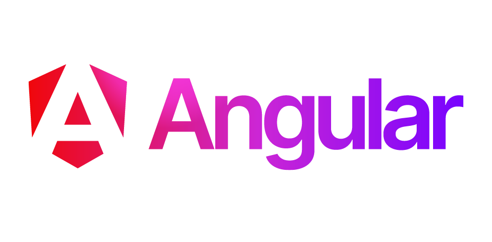

**Angular, es un** **framework** para aplicaciones web desarrollado **en** **TypeScript**, de código abierto, mantenido por Google, **que se utiliza para crear** y mantener **aplicaciones web de una sola página** (*SPA, single page application*).

Su objetivo es aumentar las aplicaciones basadas en navegador con capacidad de Modelo Vista Controlador (MVC), en un esfuerzo para hacer que el desarrollo y las pruebas sean más fáciles.

Angular se basa en clases tipo “Componentes”, cuyas propiedades son las usadas para hacer en enlace de los datos (data binding). En dichas clases tenemos propiedades (atributos) y métodos (funciones).

Angular es la evolución de AngularJS, el cual fue lanzado en 2010 por Google y se desarrolló en JavaScript. Debido a las limitaciones del lenguaje y el cambio radical de funcionamiento se volvió a escribir desde 0, naciendo un framework nuevo más que una nueva versión de este. AngularJS no es compatible con las versiones de Angular2 en adelante.

# Características de Angular

⚡**Velocidad y rendimiento**

- **Compilación optimizada (AOT)**: Angular compila las plantillas a JavaScript en tiempo de construcción (Ahead-of-Time), reduciendo el trabajo en el navegador y mejorando el tiempo de carga y ejecución.

- **Renderizado del lado del servidor (SSR)**: Permite generar la vista inicial en el servidor (por ejemplo con Node.js), enviando HTML ya renderizado al cliente. Esto mejora el tiempo de carga inicial y facilita el posicionamiento SEO.

- **Carga diferida (Lazy Loading)**: Angular permite dividir la aplicación en módulos o rutas que se cargan bajo demanda, evitando descargar todo el código desde el inicio y mejorando el rendimiento en aplicaciones grandes.

- **Reactividad eficiente (Signals)**: Angular incorpora un sistema de reactividad basado en signals que permite actualizar la interfaz de forma más precisa y con menos coste que enfoques tradicionales.

 📈**Productividad**

- **Plantillas declarativas**: Angular utiliza HTML ampliado con directivas (como `@if`, `@for`) que permiten definir la interfaz de forma clara y mantenible sin lógica compleja en el DOM.

- **Angular CLI**: Proporciona comandos para crear proyectos, generar componentes, servicios o rutas, ejecutar la aplicación y construir versiones optimizadas, estandarizando la estructura del proyecto. **Estos comandos serán los mismos para cualquier IDE en cualquier plataforma.**

- **Soporte de TypeScript**: Angular está basado en TypeScript, lo que permite tipado estático, autocompletado y detección temprana de errores durante el desarrollo.

- **Ecosistema de librerías**: Permite integrar fácilmente librerías externas como Tailwind, Bootstrap o componentes UI como Angular Material o PrimeNG sin configuraciones complejas.

🗓️**Herramientas de desarrollo**

- **Testing integrado**: Angular incluye soporte para pruebas unitarias y de integración (por ejemplo con Karma/Jasmine o alternativas modernas), facilitando la validación del código.

- **Animaciones**: Dispone de un sistema propio de animaciones basado en estados y transiciones, integrado con el ciclo de vida de los componentes.

- **Accesibilidad (a11y)**: Facilita la creación de interfaces accesibles mediante buenas prácticas y compatibilidad con atributos ARIA, especialmente al usar librerías como Angular Material.

# Primeros pasos

## Node JS

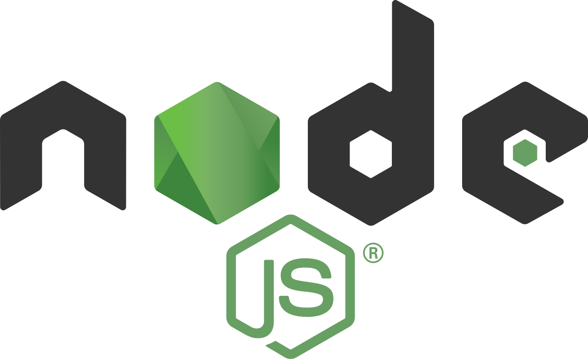

**Node.js es un entorno en tiempo de ejecución**, de código abierto y multiplataforma, para la capa de servidor (aunque no exclusivamente) basado en JavaScript. Su propósito es similar al de Apache en JavaEE o Tornado en Python. 

**Nos servirá para poder crear, ejecutar, depurar y compilar aplicaciones** de Angular, creando un servidor en caliente que se reinicia en cada cambio que se aplique al código, pudiendo ver de forma instantánea cada cambio en la aplicación **sin necesitar de reiniciar el proyecto o recargar el navegador**.

Podemos descargarla gratuitamente de [https://nodejs.org/es](https://nodejs.org/), eligiendo la versión más nueva disponible si es para probar o aprender, o la última LTS (*Long Term Support*) si es para desarrollo de una aplicación para producción.

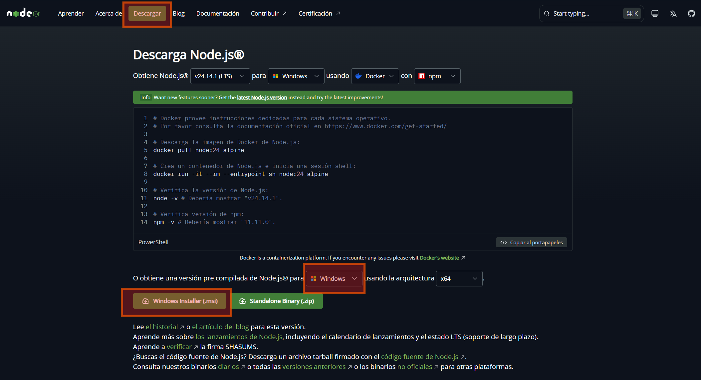{.rounded}

> [!NOTE]
>
> La instalación es muy simple, pulsamos siguiente, siguiente y listo. 

> [!warning]
>
> No instalar las “Tools for Native Modules” durante la instalación. No es necesario.

Una vez instalado no tenemos que hacer nada más. Seguimos al siguiente paso.

## Angular CLI

Una de las principales características de Angular respecto a AngularJS es la incorporación de una interfaz de línea de comandos (*CLI – Command Line Interface*). 

Su principal ventaja es que **nos va a facilitar** el proceso de **creación de una aplicación**, el **añadir componentes**, compilar la aplicación y dejarla preparada para producción, preparar los archivos que deben subirse al servidor en la etapa de Testing, entre otras muchas opciones.

AngularCLI es una herramienta de NodeJS, por lo que para poder instalarla necesitaremos contar con NodeJS instalado en nuestro sistema operativo. 

Una vez que hemos instalado NodeJS, nuestro siguiente paso será instalar [AngularCLI](https://cli.angular.io/) en NodeJS. Para ello abriremos la consola de comandos de nuestro sistema operativo. Para abrirla en Windows, podemos usar la [aplicación Terminal](https://www.microsoft.com/store/productId/9N0DX20HK701), o bien pulsamos tecla <kbd>Windows + R</kbd>, escribimos `cmd` y pulsamos <kbd>intro</kbd>. Nos aparecerá una ventana como la siguiente:

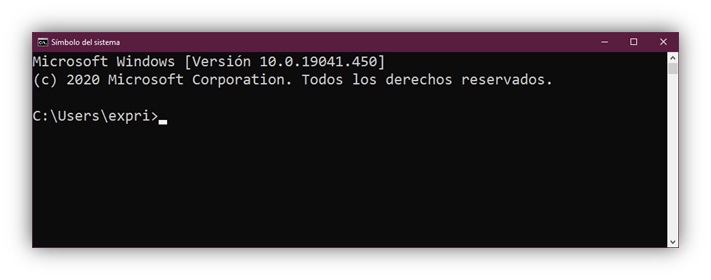

> [!important]
>
> Podemos escribir los comandos de AngularCLI en el Símbolo del sistema, PowerShell, Gitbash, etc. En el temario usaremos el Símbolo del sistema como referencia.

Aparecerá `C:\Users\tu nombre de usuario`. Y a partir de ahora podremos escribir directamente ahí los siguientes comandos de NodeJS. 

```shell
npm install -g npm@latest
npm uninstall -g @angular/cli
npm install -g @angular/cli@latest
```

Cada línea anterior hace lo siguiente:

- Instalamos el instalador de paquetes `npm`. Con `-g` lo hacemos de forma global.
- (Opcional) Desinstalamos cualquier posible versión anterior de Angular CLI antes de instalar la última, pero recomendable en equipos compartidos que pueden tener versiones anteriores.
- Instalamos la última versión disponible de Angular CLI.

Para comprobar que todo está correcto, ejecutamos la siguiente línea:

```shell
ng version
```

Nos debería salir una pantalla como la siguiente:

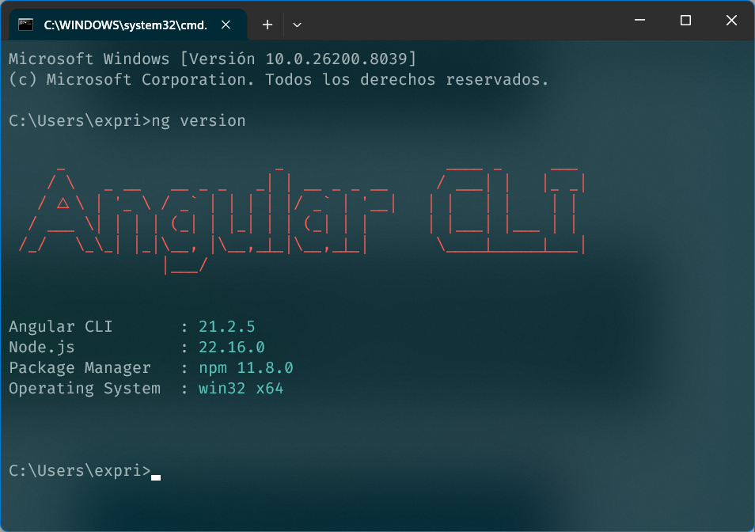{.rounded}

> [!caution]
>
> Todos los pasos que se explican a lo largo del tutorial están actualizados y probados para la versión de AngularCLI 21.2.5, actualizadas al 01/04/2026. Pueden existir diferencias en próximas actualizaciones de Angular.

Una vez instalado NodeJS y AngularCLI, ya tenemos las herramientas necesarias para poder crear un proyecto Angular con su estructura funcional en cuestión de segundos. Vamos al turrón.

# ¿Qué es TypeScript?

Hemos comentado que Angular está desarrollado en TypeScript, pero **¿podré enterarme de todo si no conozco TypeScript?** La respuesta es sí. El curso está pensado para aprender Angular conociendo sólo JavaScript e **iremos explicando de forma transversal las novedades y mejoras** que trae TS respecto a JS.

**TypeScript es un super set de JavaScript**, por lo que podemos decir que es JavaScript con novedades y añadidos. Si conoces JavaScript tienes el 80% del camino andado. Veamos algunas de las características más destacables.

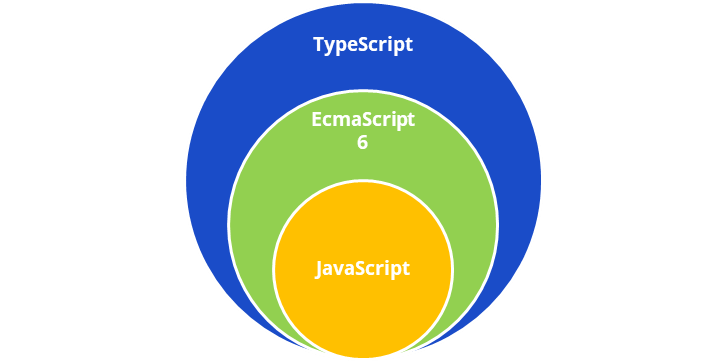

- Es un super set de JavaScript.
- Está mantenido por Microsoft. Y Angular por Google 😉.
- Es un lenguaje fuertemente tipado y flexible a la vez. Todos los tipos de datos [aquí en la documentación oficial](https://www.typescriptlang.org/docs/handbook/2/everyday-types.html).
- Permite las características de POO más modernas, como clases, objetos, constructores, métodos, interfaces, etc.
- Permite inyección de dependencias, como Spring Framework de Java.
- Permite los decoradores, muy usados en Angular.
- La mayoría de IDES soportan autocompletado inteligente de código.

 Toda la documentación oficial y actualizada de TypeScript la [tienes disponible en este enlace](https://www.typescriptlang.org/docs/handbook/intro.html).

# Primer proyecto en Angular. ¡¡¡HOLA MUNDO!!!

## Crear un proyecto

 Antes de nada, dos consejos:

> [!important]
>
> Antes de crear un proyecto, debemos situarnos en la carpeta donde queramos que se genere.
>
> No es necesario crear manualmente la carpeta del proyecto, ya que Angular CLI la creará automáticamente.
>
> Por ejemplo, si queremos crear un proyecto llamado `mi-proyecto` dentro de una carpeta `ProyectosGuays`, primero nos colocaremos en la carpeta `ProyectosGuays` desde la línea de comandos y, desde ahí, ejecutaremos el comando de creación.

> [!tip]
>
> Una forma fácil de entrar en la línea de comandos desde una carpeta concreta en Windows, es crear y situarnos en esa carpeta desde el explorador de archivos, hacer clic en la barra de direcciones, borrar su contenido y escribir `cmd` y pulsar <kbd>intro</kbd>. Se abrirá una ventana de la línea de comandos directamente en esa carpeta.

Para crear nuestro primer proyecto usando AngularCLI, es tan fácil como escribir un par de comandos en la consola.

```shell
ng new
```

Con esto se iniciará un asistente y nos preguntará (en el mismo orden):

1. El nombre del proyecto. Creará una carpeta con ese nombre y creará en su interior todo el *scaffolding* (andamiaje) de un proyecto con Angular. Escribiremos **`hola-mundo`** y pulsamos <kbd>intro</kbd>.

   > [!caution]
   >
   > Puedes usar el nombre que quieras, pero no uses espacios en blanco ni caracteres especiales.

2. El tipo de sistema para hojas de estilo (css) que usará nuestro proyecto. Elegiremos **`CSS`**.

   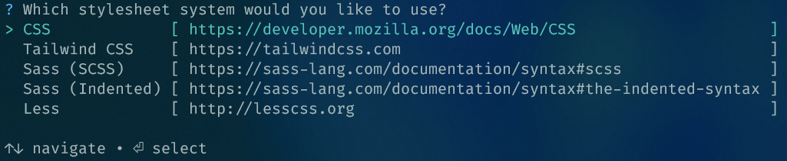{.rounded}

3. Después pregunta si queremos habilitar SSR/SSG. Esto permite renderizar la aplicación en el servidor o generar páginas estáticas para mejorar la carga inicial y el SEO. Para este primer proyecto, podemos dejar la opción en **`No`**, ya que trabajaremos como una aplicación tradicional en el navegador.

4. Y por último, Angular puede preguntar si queremos configurar herramientas de IA. Estas ayudan en la generación de código o sugerencias durante el desarrollo. Seleccionamos **`No`**. 

5. Se creará la estructura de proyecto y se descargarán las librerías necesarias durante unos minutos. Aparecerá en pantalla `Installing packages (npm)...`.

6. Una vez terminado todo el proceso, aparecerán las siguientes líneas y nos devolverá el control a la línea de comandos.

   `√ Packages installed successfully.`

    `Successfully initialized git.`

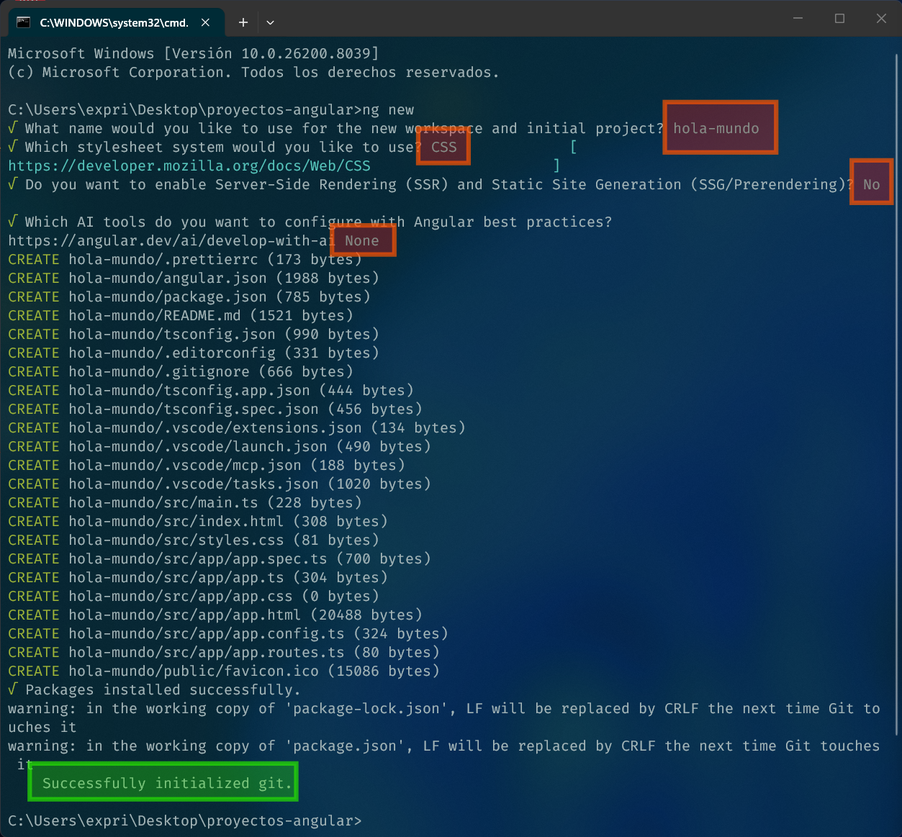{.rounded}

**¡¡Y listo!!** Ya tendremos nuestro proyecto creado. Tan sólo nos queda abrir la carpeta con nuestro IDE favorito y a programar nuestro proyecto, aunque antes de tocarlo, vamos a ejecutarlo y ver su estructura básica de carpetas y archivos.

> [!tip]
>
> El `warning` que aparece es debido al símbolo de salto de línea que se usa en Windows respecto en Linux. Si quieres eliminar dicho `warning` podemos hacerlo escribiendo lo siguiente en el CLI.
>
> ```shell
> git config --global core.autocrlf true
> ```
>
> Esto corregirá el símbolo de salto de línea (LF en Linux/macOS y CRLF en Windows) de forma automática según proceda. 

> [!warning]
>
> Estos pasos pueden cambiar (y cambiarán) entre distintas actualizaciones de Angular. Esto demuestra la constante evolución del framework.

## Ejecutar el proyecto

Ahora que ya tenemos el proyecto creado, nos queda ejecutarlo. Para ello hacemos lo siguiente:

Primero tenemos que entrar en la carpeta donde se ha creado el proyecto. Sustituye `hola-mundo` por el nombre del proyecto que hayas creado :

```shell
cd hola-mundo
```

Y una vez posicionados en la carpeta del proyecto, escribimos el siguiente comando para arrancar el proyecto:

```shell 
ng serve
```

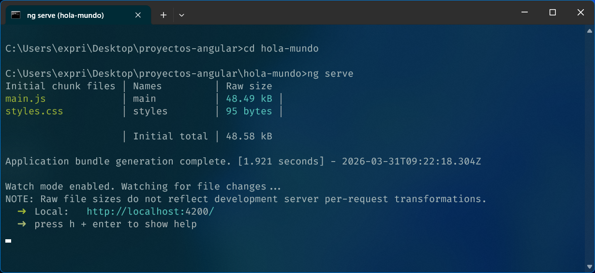{.rounded}

Ya tenemos el proyecto ejecutándose en un servidor para desarrollo, y para verlo sólo tendremos que abrir nuestro navegador preferido y escribir la url que nos ha indicado. En nuestro caso http://localhost:4200/.

> [!important]
>
> No cerrar la ventana de la terminal mientras queramos seguir ejecutando la aplicación.

 Al abrir el navegador en esa url, nos mostrará una aplicación como ésta:

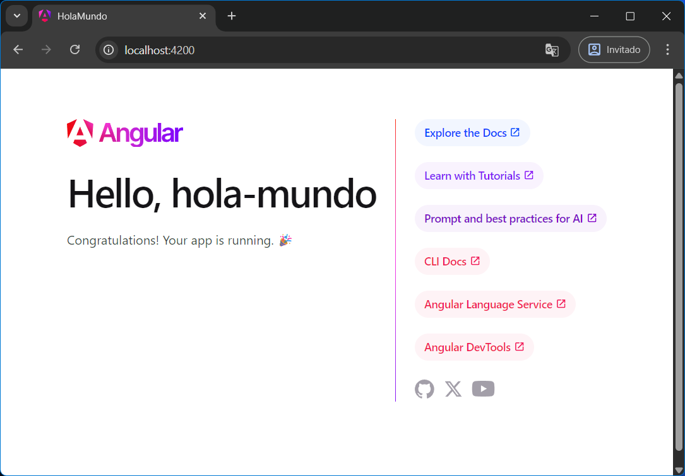{.rounded}

La aplicación no hace nada, son un conjunto de enlaces a la documentación oficial y un poco de ayuda sobre como añadir componentes, material, dependencias, etc. Ya lo veremos todo más adelante. Ahora mismo nos sirve para **comprobar que todo funciona correctamente** y ver la aplicación ejecutándose en vivo.

Ahora nos queda echarle un vistazo a lo que hay debajo del capó y ver la estructura de proyecto que nos creó AngularCLI y los archivos que contiene.

# Bajo el capó

## Visual Studio Code

Hemos visto como crear y ejecutar un proyecto Angular, **sin tocar ni ver una línea de código**. Ahora vamos a mancharnos las manos y vamos a ver que hay bajo el capó.

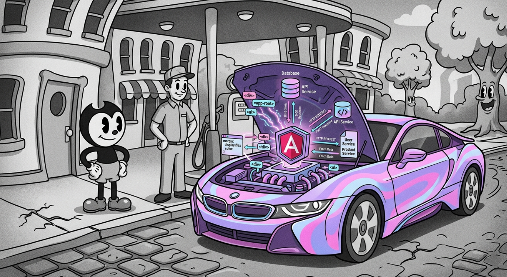{.rounded-5}

En el tutorial usaremos como IDE la aplicación de Microsoft ***Visual Studio Code***, que es gratuito y multiplataforma: 

🌐https://code.visualstudio.com/download

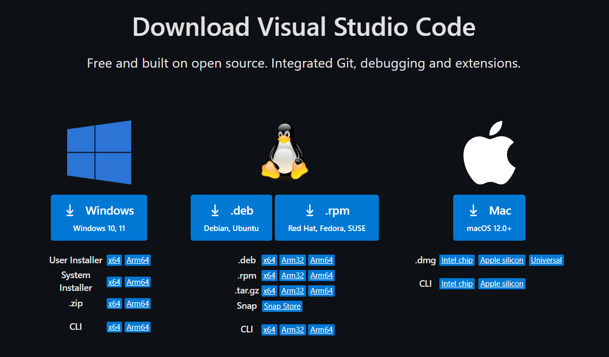{.rounded}

> [!tip]
>
> Una vez instalado VSC, le instalamos la siguiente extensión, que proporciona una experiencia de edición avanzada para plantillas de Angular
>
> 🪄**Angular Language Service:** https://marketplace.visualstudio.com/items?itemName=Angular.ng-template
>
> Y la siguiente proporciona una mejora visual para distinguir mucho mejor los distintos elementos de una aplicación (iconos para cada carpeta y extensión del proyecto):
>
> 📂**Material Icons:** https://marketplace.visualstudio.com/items?itemName=PKief.material-icon-theme

## Estructura básica de un proyecto en Angular

Vamos a abrir el proyecto `hola-mundo` con *Visual Studio Code* para conocer el *scaffolding* (andamiaje) básico de una aplicación Angular.

> [!tip]
>
> En Windows, si *Visual Studio Code* se ha instalado con el instalador oficial, se puede abrir una carpeta de proyecto haciendo clic derecho sobre la carpeta y seleccionando `Abrir con Code`. 
>
> También es posible abrirla desde la terminal con el comando `code nombre-de-la-carpeta`, (siempre que el comando esté disponible en el PATH del sistema).
>
> 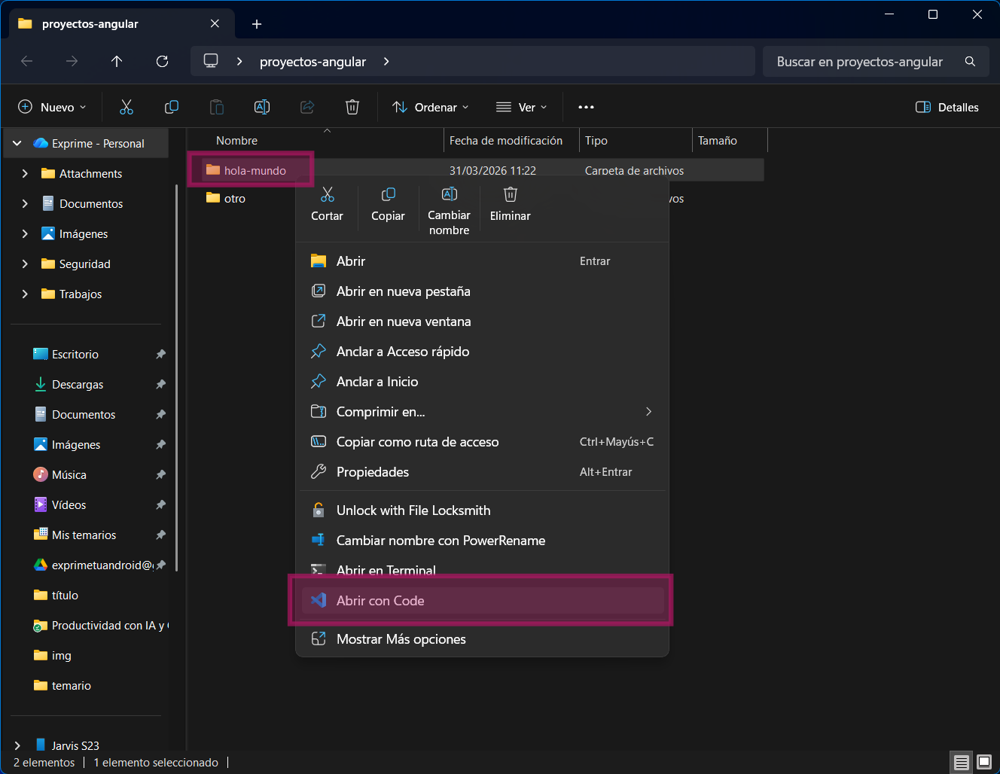{.rounded}

Al abrir el proyecto con VSC verás que tiene la siguiente estructura básica:

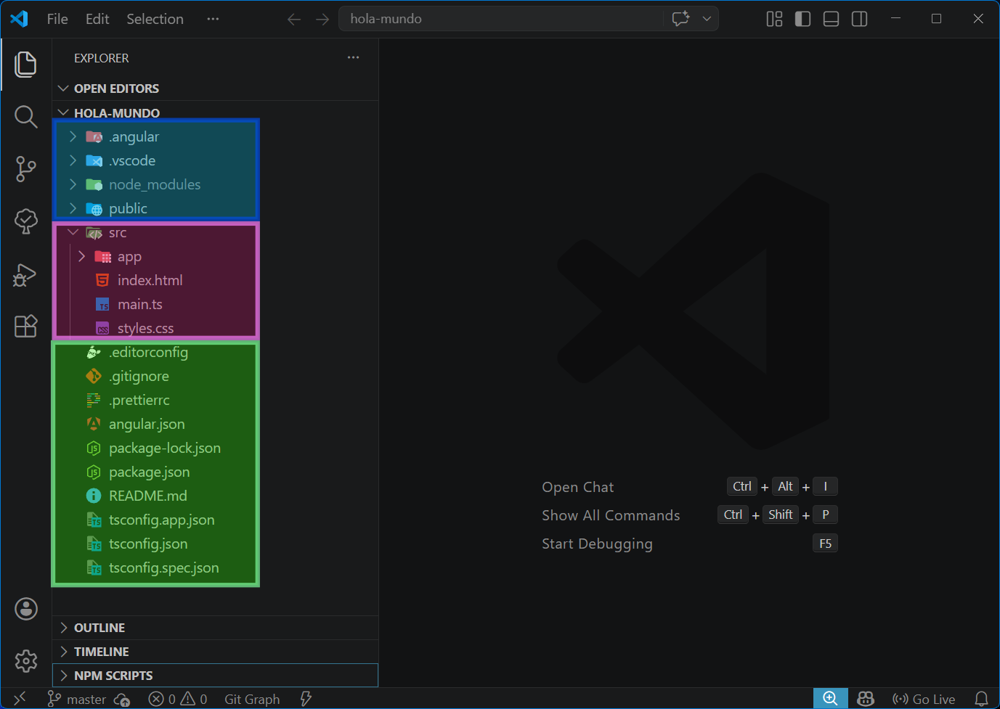{.rounded}

Verás una gran cantidad de archivos y carpetas, algunos quizás te suenen y otros no. Así que vamos a centrarnos en los pocos archivos principales que forman parte de la aplicación y ya se irán viendo poco a poco el resto según nos vaya haciendo falta. 

En la captura están divididos en tres sectores por colores para diferenciarlos mejor:

---

🟢📂 **`/`** → **Carpeta raíz**. Aquí se incluyen varios archivos de configuración. Explicaremos para que sirven, pero por lo general no tocaremos salvo en contadas ocasiones:

 - **`angular.json`** → Configuración del proyecto Angular (build, assets, estilos, etc.). Tocaremos solo cuando haga falta.
 - **`package.json`** → Define las dependencias del proyecto y scripts de ejecución (y `package-lock.json` bloquea versiones exactas de las dependencias instaladas).
 - **`tsconfig.json` / `tsconfig.*.json`** → Configuración de TypeScript. No tocaremos nada salvo cuando haga falta.
 - **`.editorconfig`** → Define reglas de estilo de código (indentación, espacios, etc.). No tocaremos nada.
 - **`.gitignore`**  → Indica qué archivos no deben subirse al repositorio Git. No tocaremos nada, salvo que queramos explícitamente.
 - **`.prettierrc`**  → Configuración del formateador de código Prettier. No tocaremos nada.
 - **`README.md`** → Archivo markdown con la documentación del proyecto. Es lo primero que se lee cuando se sube a un repositorio en GitHub.

---

🔵📂 **`/node_modules`** → Contiene todas las dependencias del proyecto instaladas mediante npm.  ⛔ **PROHIDO TOCAR MANUALMENTE** ⛔. Se puede borrar y para volver a generarla, usamos el comando `npm install` o `npm i`.

🔵📂 **`/public`** → Contiene recursos estáticos (imágenes, iconos, etc.) que se sirven directamente sin procesamiento. Por ejemplo, aquí encontraremos el `favicon.ico` de la aplicación. 

Si colocamos por ejemplo una imagen en `/public/logo.png`, podremos referenciarla como ``, sin indicar su ruta completa. 

---

🟣📂 **`/src`**→ Es la carpeta más interesante (por eso la dejamos para el final), ya que será donde irá todo el código fuente del proyecto. Dentro podemos encontrar:

- **`/src/index.html`** → Es la página principal que se carga en el navegador. Angular inyecta la aplicación y todos sus componentes dentro de este archivo.
- **`/src/main.ts`** →  Punto de entrada de la aplicación. Aquí se arranca Angular y se bootstrappea la aplicación. En otras palabras, no se toca 😉.
- **`/src/styles.css`** →  Archivo global de estilos que se aplica a toda la aplicación, aunque cada componente tendrá su propio archivo de css.

- **`/src/app`** →  Contiene toda la lógica de la aplicación, en ella se situarán los componentes, los servicios y las rutas. También algo de configuración de TypeScript. **Aquí podemos decir que estará “todo lo gordo”**.

  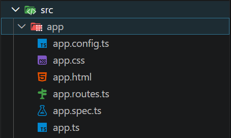{.rounded-5}

  - **`/src/app/app.routes.ts`** → Configuración de las rutas de la aplicación. Aquí se definen las vistas y navegación entre componentes. Lo veremos más adelante.
  - **`/src/app/app.config.ts`** → Configuración global de la aplicación. Se utiliza para registrar providers, servicios y otras dependencias a nivel de aplicación. Por ahora no tocamos nada.
  - Componente raíz llamado **`app`** que está formado por:
    - ⭐**`/src/app/app.html`** → Plantilla del componente raíz. Define la estructura visual utilizando la sintaxis de Angular (bindings, directivas, control flow, etc.). 
    - ⭐**`/src/app/app.ts`** → Define el componente raíz de la aplicación. Contiene la lógica principal (propiedades, métodos y señales) y está basado en componentes standalone.
    - ⭐**`/src/app/app.css`** → Estilos específicos del componente raíz. Angular aplica encapsulación de estilos, por lo que estos estilos afectan únicamente a este componente.
    - **`/src/app/app.spec.ts`** → Archivo de pruebas unitarias del componente raíz. Permite validar que el componente se crea correctamente y su comportamiento básico. Podemos borrarlo para simplificar ya que por ahora no usaremos nada de testing.

> [!important]
>
> Por ahora, la parte más importante del proyecto son `app.html`, `app.css` y `app.ts`. Podemos decir que ahí está el código HTML, CSS y JS/TS de nuestra aplicación, separado y estructurado para ir creciendo de forma controlada.

> [!note]
>
> 🤓Para más información sobre la estructura de un proyecto, puedes consultar la documentación oficial en https://angular.dev/reference/configs/file-structure.

# Resumen

{.rounded-5}

En estos primeros pasos hemos preparado todo lo necesario instalando Node.js y Angular CLI, y hemos creado nuestro primer proyecto **`hola-mundo`**. 

Después hemos echado un vistazo al código que genera Angular por defecto para ir familiarizándonos con su estructura y entender, a grandes rasgos, cómo se organiza una aplicación.

Con esto ya tenemos el entorno listo y una primera toma de contacto, así que en el siguiente bloque empezaremos a ver los conceptos básicos que nos permitirán empezar a trabajar de verdad con Angular.
