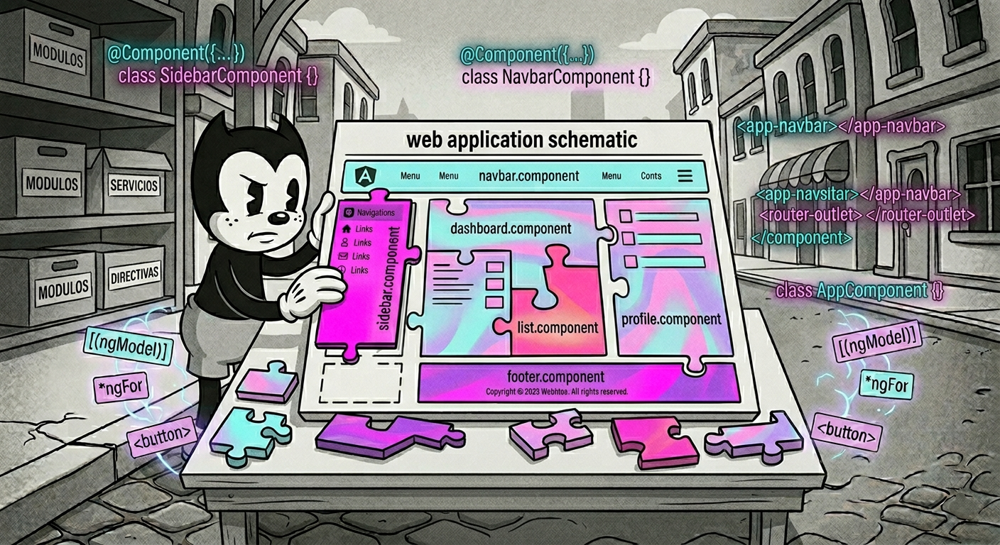
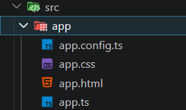
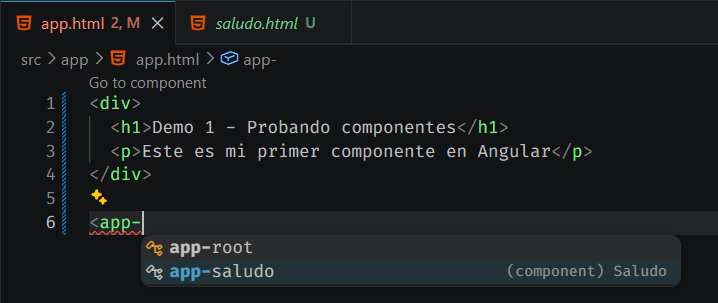
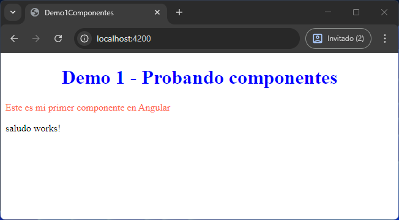
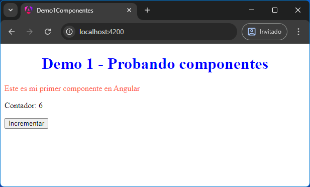
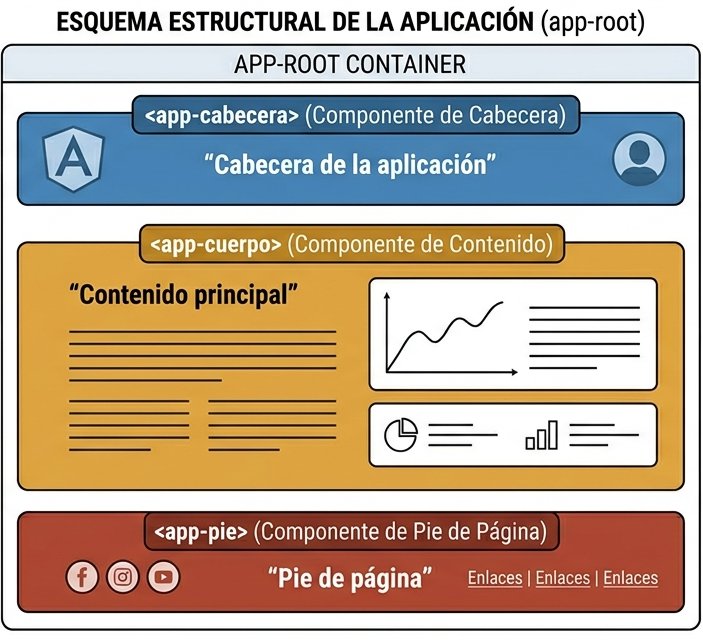

[TOC]

# Introducción

{.rounded-5}

Una aplicación en Angular se construye a partir de componentes. Incluso la aplicación más sencilla tiene al menos un componente: el componente raíz, a partir del cual se van añadiendo otros componentes que forman la interfaz.

De forma similar a HTML, donde todo el contenido se incluye dentro de la etiqueta `<body>`, en Angular toda la aplicación se organiza a partir de ese componente raíz.

Al crear un componente, estamos definiendo un nuevo elemento personalizado que podremos usar como si fuera una etiqueta HTML. Cada componente tiene:
- Una plantilla (HTML) que define la vista
- Un archivo de estilos (CSS)
- Un archivo TypeScript donde se define la lógica y el comportamiento

Los componentes son la pieza fundamental de Angular y aportan varias ventajas:

- 🗂️ **Organización**: Cada componente agrupa su lógica, vista y estilos, normalmente en archivos separados.
- 🛠️ **Mantenibilidad**: Al dividir la aplicación en piezas pequeñas, es más fácil entender, modificar y escalar el código.
- 🔁 **Reutilización**: Cada componente tiene un selector (su “nombre” como etiqueta HTML) que permite reutilizarlo en distintas partes de la aplicación, tantas veces como queramos.

> [!note] 
> Angular no sigue estrictamente el patrón MVC clásico. Se acerca más a un enfoque basado en componentes con ideas similares a MVVM (Model-View-ViewModel), donde la plantilla (HTML) actúa como la vista y el archivo TypeScript como el intermediario que gestiona los datos y la lógica. Aun así, Angular se define principalmente como un framework basado en componentes.

# Entendiendo los componentes

> [!caution]
>
> 🙊No edites ningún archivo por ahora. La intención ahora es ENTENDER la estructura de los compontes y como funcionan. En la siguiente sección empezaremos a tocar código.

En lugar de abrir nuestro proyecto anterior `hola-mundo`, vamos a crear un nuevo proyecto y entender como funcionan los componentes en Angular. 

Podríamos crearlo tal y como visto anteriormente, pero quiero hacerlo más simple todavía y de paso vemos nuevas formas de crear proyectos.

1. Creamos un nuevo proyecto con `ng new`. Pero ahora lo vamos a hacer con un único comando:

   ```shell
   ng new demo1-componentes --style=css --ssr=false --ai-config=none --skip-tests --routing=false
   ```

2. Con este comando le estamos diciendo al Angular CLI del tirón, que me cree un proyecto con el nombre `demo1-componentes`, que lo haga con `CSS`, sin SSR, sin IA, sin tests y sin routing, respectivamente (ya veremos que es el routing más adelante).

3. Abrimos el proyecto con Visual Studio Code.

4. Abrimos la carpeta `src/app/` y tendremos algo parecido a:

   {.rounded}

> [!tip]
>
> 🤓Si tienes tiempo, te aconsejo que crees el proyecto primero tal y como vimos anteriormente, con el asistente. Lo abras con VSC y veas la estructura. Es la misma que con el comando completo pero tiene un par de archivos más que puedes obviar. Después puedes borrar el proyecto y hacerlo de nuevo con el comando completo.
>
> De esta forma mecanizamos por repetición la creación de proyectos.
>
> La idea es centrar el foco en los componentes y obviar el resto que ahora mismo no nos hace falta.

Lo que estamos viendo es la estructura básica del componente raíz de nuestra aplicación.

En Angular moderno, un componente se divide en varios archivos, cada uno con una responsabilidad clara:

- **`app.html`** → Es la plantilla del componente, es decir, lo que se muestra en pantalla. Todo el contenido visual parte de aquí.
- **`app.css`** → Contiene los estilos asociados a este componente. Estos estilos solo afectan a este componente (no a toda la aplicación).
- **`app.ts`** → Define el componente. Aquí se encuentra la lógica (propiedades, métodos, etc.) y la configuración básica del componente.

> [!important]
>
> Es importante entender que estos tres archivos forman un único componente. Angular los trata como una sola unidad.

Por otro lado, tenemos el archivo:

- **`app.config.ts`** → Este archivo no forma parte directa del componente, sino de la configuración global de la aplicación. Aquí es donde Angular registra servicios, rutas u otras configuraciones necesarias para que la aplicación funcione correctamente.

De momento no es necesario modificar este archivo, pero más adelante veremos cómo se utiliza.

# Editando el componente

Antes de tocar nada, para ver los cambios que vayamos haciendo en vivo, vamos a arrancar la aplicación. Abrimos una terminal en la ruta de la aplicación y escribimos el comando:

```shell
ng serve
```

Y ya podremos abrir nuestra aplicación en http://localhost:4200.

----

Ahora que ya sabemos cómo está estructurado un componente, vamos a modificarlo para ver cómo afectan los cambios en tiempo real.

1. Abrimos el archivo `app.html` dentro de `src/app/`.

2. Sustituimos todo su contenido por algo sencillo como:

   ```html
   <div>
     <h1>Demo 1 - Probando componentes</h1>
     <p>Este es mi primer componente en Angular</p>
   </div>
   ```

3. Si tenemos el servidor arrancado con `ng serve`, veremos automáticamente el resultado en el navegador sin necesidad de recargar la página.

   > [!note]
   >
   > 🤓Esto ocurre gracias al servidor de desarrollo de Angular, que detecta cambios en los archivos y actualiza la aplicación automáticamente.

4. Ahora vamos a modificar los estilos. Abrimos el archivo `app.css` y añadimos, por ejemplo:

   ```css
   h1 {
     color: blue;
     text-align: center;
   }
   
   p {
       color: tomato;
   }
   ```

5. Guardamos (si no tenemos el auto guardado) y comprobamos cómo el estilo se aplica directamente en el navegador.

---

🧠 **Qué estamos aprendiendo**

- Nuestra aplicación tiene un componente raíz llamado `app`.
- `app.html` controla lo que vemos (vista)
- `app.css` controla cómo se ve (estilos)
- Los cambios se reflejan en tiempo real gracias a `ng serve`

 Sin tocar todavía TypeScript, ya podemos modificar completamente la interfaz del componente.

# Creando un nuevo componente

Hasta ahora solo hemos trabajado con un único componente: el componente raíz `app`.  
Vamos a crear un nuevo componente para ver cómo Angular nos permite dividir la aplicación en piezas más pequeñas.

1. Abrimos una terminal en la raíz del proyecto y ejecutamos el siguiente comando:

   ```shell
   ng generate component saludo
   ```

2. Angular CLI creará automáticamente una nueva carpeta dentro de `src/app/` llamada `saludo/` con varios archivos.

3. Si abrimos esa carpeta (`src/app/saludo/`), veremos algo muy familiar:

   - `saludo.html`
   - `saludo.css`
   - `saludo.ts`

   🧩Es decir, **otro componente con la misma estructura que `app`**.

4. Ahora vamos a usar este nuevo componente dentro de nuestra aplicación. Abrimos el archivo `app.html` y le añadimos la siguiente línea al final del contenido:

   ```html
   <app-saludo></app-saludo>
   ```

   {.rounded}

5. Veremos que el IDE nos ayudará mostrando todos los componentes de la aplicación.

6. Una vez colocado el componente, veremos que la aplicación muestra el componente raíz `app` y debajo, el nuevo componente `saludo`.

   {.rounded}

> [!important]
>
> 🤓Fíjate que cada componente encapsula su propio CSS, de forma que los estilos aplicados al componente `app` no se aplican al componente `saludo`.

> [!tip]
>
> Prueba a repetir el componente `saludo` varias veces.

------

**🧠 Qué estamos aprendiendo**

- Podemos crear nuevos componentes fácilmente con Angular CLI
- Cada componente tiene su propia estructura (`html`, `css`, `ts`)
- Los componentes se pueden usar dentro de otros mediante su selector (como si fueran etiquetas HTML)

<div style="padding: 1rem; background-color: #d1ecf1; border: 1px solid #bee5eb; border-radius: 4px; color: #0b3e48; margin: 1rem 0;">
<span style="font-weight: bold; color: #0b3e48;">🧙‍♂️</span> Este es el concepto clave de Angular: construir la aplicación combinando componentes.
</div>

# Entendiendo el archivo TypeScript del componente

En el paso anterior hemos usado una etiqueta como `<app-saludo>`, pero… ¿de dónde sale?

La respuesta está en el archivo `saludo.ts`. 

Abre el archivo `saludo.ts` y tendrá el siguiente contenido:

```typescript
//saludo.ts
import { Component } from '@angular/core';

@Component({
  selector: 'app-saludo',
  imports: [],
  templateUrl: './saludo.html',
  styleUrl: './saludo.css',
})
export class Saludo {}
```

> [!note]
>
> La línea 1 con `//saludo.ts` no aparece en el archivo original, se incluirá siempre en los códigos para ubicar que dicho contenido es del citado archivo.


- **Imports:** Importa la funcionalidad necesaria para poder crear un componente en Angular.

- **@Component:** Es un decorador que convierte la clase en un componente (ya veremos los decoradores más adelante). Aquí se indica su configuración:

  - **`selector: 'app-saludo'`** ➡️ Indica el nombre de la etiqueta HTML que queremos usar para identificar este componente. Podemos cambiarlo y usar el que queramos. Gracias a esto podemos usarlo así:

    ```html
    <app-saludo></app-saludo>
    ```

  - **`imports: []`** ➡️ Se utiliza para importar otros componentes, directivas o funcionalidades que este componente necesite. Por ahora está vacío porque no estamos usando nada adicional.

  - **`templateUrl: './saludo.html'`** ➡️Indica qué archivo HTML contiene la estructura visual del componente.

  - **`styleUrl: './saludo.css'`**➡️ Indica qué archivo CSS contiene los estilos del componente.
  
  - **`export class Saludo {}`** ➡️Define la clase del componente. Aquí es donde irá la lógica (constructores, atributos, métodos, etc.). Por ahora está vacía porque solo estamos mostrando contenido estático.
  

<div style="padding: 1rem; background-color: #d1ecf1; border: 1px solid #bee5eb; border-radius: 4px; color: #0b3e48; margin: 1rem 0;">
<span style="font-weight: bold; color: #0b3e48;">🧠</span> El archivo <code>.ts</code> actúa como el “cerebro” del componente, conectando la plantilla (HTML) y los estilos (CSS), y permitiendo que podamos usarlo como una etiqueta personalizada en nuestra aplicación.
</div>


## Variantes del TS

El código visto es el generado por el Angular CLI y, en la mayoría de los casos, se trabajará con la estructura habitual de tres archivos separados (TypeScript, HTML y CSS). Sin embargo, Angular permite cierta flexibilidad en la organización de los componentes, pudiendo simplificar su estructura en algunos casos.

Por ejemplo, es posible definir directamente la plantilla HTML y los estilos dentro del propio archivo TypeScript, evitando la necesidad de archivos externos. Además, en lugar de un único archivo de estilos, también se puede trabajar con un array de archivos CSS si se desea mantener los estilos separados pero agrupados en la configuración del componente.

A continuación, se muestra un ejemplo en el que componente ficticio llamado `verificacion` utiliza esa aproximación simplificada:

```typescript
// verificacion.ts
import { Component } from '@angular/core';

@Component({
    selector: 'app-verificacion',
    template: 
        `
        <h1>Petición aceptada</h1>
        <p>Su correo ha sido eliminado de nuestra base de datos</p>
        <p>No volverá a recibir más spam</p>
        `,
    styles: ['h1 { color: green; }']
})
export class Verificacion {}
```

> [!warning]
>
> 😵‍💫Te lo explicamos por si algún día ves un componente así que no te extrañe, pero lo normal es tener 3 archivos separados para mejorar la escalabilidad y el mantenimiento del código.

## Atributos y métodos

<div style="padding: 1rem; background-color: #fff3cd; border: 1px solid #ffeeba; border-radius: 4px; color: #7b5e00; margin: 1rem 0; font-size:1.1rem">
  <p style="font-size: 1.5rem; text-align:center"><strong>💡 Recomendación 💡</strong></p>
  <p>
    Aunque en el temario se incluye todo el código listo para copiar y pegar, es <strong>muy recomendable</strong> que lo escribas manualmente en lugar de copiarlo directamente.
  </p>
  <p>Escribir el código te ayudará a:</p>
  <ul>
    <li>Entender mejor la lógica de lo que estás haciendo</li>
    <li>Familiarizarte con la sintaxis de Angular y TypeScript</li>
    <li>Detectar errores y aprender a corregirlos</li>
  </ul>
  <p><strong>
    Copiar y pegar puede parecer más rápido, pero reduce mucho el aprendizaje real. En cambio, escribir el código paso a paso te permitirá asimilar los conceptos de forma mucho más sólida.
    </strong>
  </p>
<blockquote style="background-color: #8c8c8920; color: #7b5e00 ">
  <ul style="list-style-type: none;">
    <li>
      
      <em>¿Es más fuerte el Reverso Tenebroso?</em>
    </li>
    <li>
      
      <em>No, no... no. Más rápido, más fácil, más seductor.</em>
    </li>
  </ul>
</blockquote>
</div>

Para ver cómo funciona realmente un componente y darle algo de chicha al ejemplo, vamos a añadir algo de lógica.

En este caso, crearemos un contador que se incrementa cada vez que pulsamos un botón.

En el archivo `saludo.ts`, a la clase `Saludo` le añadimos un **atributo** (`contador`) y un **método** (`incrementar()`).

```typescript
//saludo.ts
//...
export class Saludo {
  contador = 0;

  incrementar(){
    this.contador = this.contador + 1;
  }
}
```

Al archivo `saludo.html` le sustituimos el contenido por lo siguiente:

```html
<!-- saludo.html -->
<p>Contador: {{ contador }}</p>

<button (click)="incrementar()">Incrementar</button>
```

{.rounded}

Al ejecutar la aplicación, veremos que cada vez que pulsamos el botón, el valor del contador se actualiza automáticamente en pantalla.

Este comportamiento es una de las claves de Angular y nos permite crear interfaces dinámicas sin necesidad de manipular el DOM manualmente. Más adelante veremos en detalle cómo funciona este mecanismo.

> [!tip]
>
> - 🧑‍🏫Lleva el contador hasta 10. Recarga la página. ¿Qué ha pasado?. 
> - 👩‍🏫Añade un botón para resetear el contador a 0. Otro botón para restar un 1 al contador. Evita que el contador se ponga en negativo.

# 🧪 Ejercicio: Practica con componentes

Crear un nuevo proyecto de Angular y generar tres componentes: uno de cabecera, uno de contenido (cuerpo) y uno de pie de página.

Cada componente debe mostrar un texto sencillo identificativo en un párrafo  (por ejemplo: “Cabecera de la aplicación”, “Contenido principal” y “Pie de página”).

```html
<p>Cabecera de la aplicación</p>
```

Una vez creados, incluir los tres componentes en la plantilla principal de la aplicación (`app.html`) para que se muestren en pantalla en ese orden: cabecera, cuerpo y pie de página.

{.rounded}


> [!tip]
>
> Para darle más sentido, los componentes en lugar de tener un texto simple en un párrafo, ponles algo como:
>
> ```html
> <!-- cabecera.html -->
> <header>
>     <h1>Mi primera aplicación en Angular</h1>
>     <p>Cabecera de la aplicación</p>
> </header>
> ```
>
> ```html
> <!-- cuerpo.html -->
> <main>
>     <h2>Contenido principal</h2>
>     <p>
>         Este es el cuerpo de la aplicación. Aquí se mostrará el contenido principal gestionado por componentes.
>     </p>
> </main>
> ```
>
> ```html
> <!-- pie.html -->
> <footer>
>   <p>Pie de página</p>
>   <small>© 2026 - Ejercicio de Angular</small>
> </footer>
> ```

# 🧪 Ejercicio: Tarjeta de usuario

Sobre el proyecto que ya tienes creado, generar un nuevo componente llamado `usuario`.

Añade el componente `usuario` dentro del componente raíz `app.html` y comprueba que se visualiza correctamente el `<p>usuario works!</p>`.

En el nuevo componente, definir los siguientes atributos dentro del archivo TypeScript (`usuario.ts`), indicando su tipo:

- `nombre`: texto (*string*)
- `clave`: texto (*string*)
- `edad`: número (*number*)
- `activo`: valor lógico (*boolean*, verdadero o falso)

Mostrar estos datos en la plantilla HTML del componente (`usuario.html`) de forma clara.

> [!note]
>
> 💪Como extra, haz que los atributos `edad` y `activo` se inicialicen con un valor aleatorio.
>
> Puedes añadir el componente más de una vez para comprobar que cada uno tiene sus propios valores (cambiarán la `edad` y `activo`, que son los que inicializamos aleatoriamente).

----

> [!warning]
>
> 🧑‍🏫 ¿Quizás sería un buen momento de hacer un repaso a los conceptos de programación orientada a objetos?
