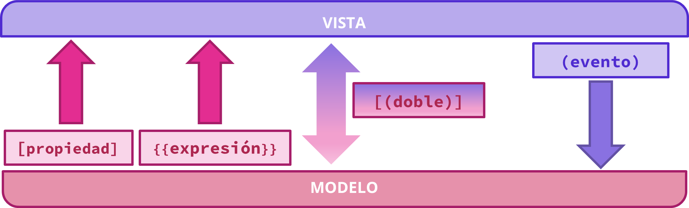

[TOC]

# Introducción

{.rounded}

En Angular, una **vista es la parte de la aplicación que el usuario ve en pantalla**. Es la representación visual de un componente y normalmente se define en un archivo HTML y CSS.

Cada componente tiene asociada una vista, que se encarga de mostrar la información y permitir la interacción con el usuario.

Angular sigue una separación clara entre:

- 🧠 **Lógica** → definida en el archivo TypeScript del componente  
- 🖼️ **Vista** → definida en el archivo HTML y CSS  

Esta separación facilita el mantenimiento del código y permite trabajar de forma más organizada.

Cuando Angular carga un componente, automáticamente enlaza su lógica con su vista. Esto significa que cualquier dato definido en el componente puede mostrarse en el HTML, y cualquier interacción del usuario puede ser gestionada desde el TypeScript.

Una de las características más importantes de Angular es que la vista se actualiza automáticamente cuando cambian los datos del componente, sin necesidad de manipular el DOM manualmente (como habría que hacer con JS *a pelo*). Esto permite crear interfaces dinámicas de forma sencilla y eficiente.

# Tipos de binding en Angular

Angular ofrece diferentes formas de establecer la comunicación entre la **vista (HTML)** y el **modelo (TypeScript)**.

A estos mecanismos se les conoce como **tipos de binding**, y permiten definir cómo fluye la información entre ambos lados del componente.

En función del sentido de la comunicación, podemos distinguir varios tipos:

- 🟦 Binding de propiedad  
- 🟨 Binding de interpolación (expresiones)  
- 🟩 Binding de eventos  
- 🟪 Doble binding (banana in a box)  

Cada uno de ellos tiene una finalidad concreta y se utiliza en distintos escenarios dentro de una aplicación Angular.



A continuación veremos cada tipo con ejemplos prácticos de uso.


## 🟦 Binding de propiedad [ ]

El binding de propiedad permite enlazar un valor del modelo con una propiedad de un elemento HTML o componente.

Se utiliza la sintaxis:

```html
[propiedad]="valor"
```

**Ejemplos:**

```html

```

En este caso, la propiedad `src` de la imagen toma su valor desde una variable del componente (`imagenUrl`).

```html
<a [href]="homeUrl">Pulsa aquí para volver</a>
```

Lo mismo pasa con la propiedad `href` del enlace. Su valor estará definido por la variable `homeUrl` en el componente.

---

## 🟨 Binding de interpolación {{ }}

La interpolación permite mostrar datos del modelo directamente en la vista como texto. 

La diferencia respecto a las propiedades es que **se usarán mayormente como contenido de los elementos HTML**, no como propiedad o su valor. Por ejemplo, el contenido de un párrafo o el texto de un encabezado.

Se utiliza la sintaxis:

```html
{{ expresión }}
```

**Ejemplos:**

```html
<h1>{{ titulo }}</h1>
```

Aquí, el valor de `titulo` se muestra dentro del encabezado.

```html
<p>Precio total: {{ precio + iva }} €</p>
```

Se sustituye las `{{}}` por el resultado de sumar las dos variables. El resto se queda tal cual.

> [!note]
>
> La interpolación no se limita a mostrar variables simples. Lo que realmente hace Angular es **evaluar una expresión**, igual que se haría en cualquier lenguaje de programación.  
> Esto significa que dentro de `{{ }}` se pueden usar operaciones, llamadas a métodos o combinaciones de datos, y Angular mostrará el resultado final de esa evaluación.

> [!caution]
>
> Estas dos líneas pueden producir el mismo resultado. ¿Pero es lo mismo?
>
> ```html
> <a href="{{homeUrl}}">Pulsa aquí</a>
> <a [href]="homeURL">Pulsa aquí</a>
> ```
>
> En ambos casos, Angular termina asignando un valor al atributo `href`.
>
> Sin embargo, es importante entender que la interpolación siempre **evalúa una expresión y la convierte a string**, mientras que el binding de propiedad trabaja directamente con la **propiedad del elemento del DOM**.
>
> Por este motivo, aunque en casos simples puedan parecer equivalentes, **no siempre es recomendable usar interpolación en atributos HTML**.
>
> En general, cuando se trabaja con propiedades que no son de tipo string (por ejemplo objetos, booleanos o elementos del DOM), o cuando se quiere un comportamiento más fiel al modelo del navegador, es preferible utilizar **binding de propiedad `[ ]`**.
>
> ```html
> <button disabled="{{isDisabled}}">Enviar</button>
> ```
>
> ```typescript
> isDisabled=false
> ```
>
> Se traduciría a:
>
> ```html
> <button disabled="false">Enviar</button>
> ```
>
> Y en HTML, si el atributo `disabled` **existe** (da igual si es `true` o `false`), se deshabilita el botón. Por lo que la forma correcta debería ser:
>
> ```html
> <button [disabled]="isDisabled">Enviar</button>
> ```

> [!important]
>
> **Solo usaremos la interpolación `{{ }}` para los contenidos** de los elementos HTML y no para las propiedades de dichos elementos, que para eso usaremos el binding de propiedades `[ ]`.

## 🟩 Binding de eventos ( )

El binding de eventos permite responder a acciones del usuario como clics, teclas o cambios.

Se utiliza la sintaxis:

```html
(evento)="metodo()"
```

**Ejemplo:**

```html
<button (click)="saludar()">Pulsar</button>
```

Cuando el usuario hace clic, se ejecuta el método `saludar()` del componente.

Se puede escribir directamente una instrucción básica, una asignación o algo simple, pero se recomienda encapsular la lógica en una función, para hacer la aplicación más escalable.

```html
<button (dblclick)="contador=0">Reset</button> <!-- Funciona, pero ta feo -->
<button (dblclick)="reset()">Reset</button> <!-- Mejor así -->
```

**Ejemplo:**

```html
<input type="text" (keyup)="comprobar($event)" />
```

Al lanzar el evento `keyup` se ejecuta el método `comprobar()` al cual le pasamos un objeto (`$event`) que contiene toda la información del evento, incluyendo la tecla que se pulsó para lanzar el evento.

```typescript
comprobar(event) {
    if (event.key === 'Enter') {
        console.log('Se ha pulsado Enter');
    }
}
```

> [!note]
>
> 🤓El objeto `event` es de tipo `KeyboardEvent` y sería buena idea definir el parámetro con este tipo, así al escribir <kbd>event.</kbd> el propio IDE nos mostrará las propiedades del objeto, en lugar de ir a ciegas. Otro motivo para definir los tipos de datos con los que trabajamos.
>
> ```typescript
> comprobar(event: KeyboardEvent): void {
>       //...
> }
> ```


## 🟪 Doble binding [( )]

El doble binding permite sincronizar automáticamente los datos entre la vista y el modelo en ambas direcciones.


Se utiliza la sintaxis conocida como **banana in a box**🍌📦`[()]`:

```html
[(ngModel)]="variable"
```

> [!note]
>
> La notación es curiosa, porque realmente hace referencia a que se usa a la vez el enlace de propiedades `[ ]` y el de eventos `( )` conjuntamente.

<div style="
            display: flex;
            align-items: center;
            gap: 16px;
            background-color: #fff3b0;
            border: 2px solid #f4c430;
            border-radius: 12px;
            padding: 12px;
            margin-bottom: 2rem;
            ">
    
    <div style="
                flex: 1;
                color: #333;
                font-size: 14px;
                ">
        <h3>Banana in a box</h1>
        <p>Angular te aconseja que visualices una banana en una caja, para que recuerdes que primero van los corchetes (caja 📦) y dentro los paréntesis (banana 🍌).</p>
    </div>
</div>
**Ejemplo:**

```html
<input [(ngModel)]="nombre" />
```

En este caso:
- Si el usuario escribe en el input, el valor cambia en el modelo  
- Si el modelo cambia, el input se actualiza automáticamente  

Este tipo de binding es muy útil en formularios y entradas de usuario.

> [!caution]
>
> Para poder utilizar `[(ngModel)]`, es necesario importar el módulo de formularios de Angular (`FormsModule`), ya que esta funcionalidad no forma parte del núcleo básico del framework.
>
> A continuación vemos como hacerlo.

### Importar `FormsModule`

En AngularJS el binding era bidireccional por defecto, pero desde Angular 2 se adopta el *one-way binding* por motivos de rendimiento, dejando el *two-way binding* (doble binding) como una opción explícita mediante módulos.

El módulo `FormsModule` se debe importar en el componente que vaya a usar el doble binding, y en su código TS incluimos lo siguiente:

```typescript
import { Component } from '@angular/core';
import { FormsModule } from '@angular/forms'; //<------ Se añadirá automáticamente

@Component({
  selector: 'app-root',
  imports: [FormsModule],     //<------- Aquí añadimos el módulo a importar
  templateUrl: './app.html',
  styleUrl: './app.css'
})
export class App {
    //...
}
```

> [!important]
>
> - Lo único que tenemos que hacer es escribir `FormsModule` dentro de los corchetes de `imports`. 
> - El IDE añadirá la línea de import automáticamente al inicio del código.
> - Si hubiera otro módulo importado previamente, lo añadimos separándolo por comas. Ej: `import: [BrowserModule, FormsModule]`

# 🧪Ejercicio: Binding en Angular

En este ejercicio vas a crear un **nuevo proyecto de Angular** y trabajarás directamente sobre el **componente raíz** para practicar los distintos tipos de binding vistos en clase.

## 🎯 Objetivo del ejercicio

Practicar los siguientes tipos de binding para reforzar el uso de la comunicación entre la vista y el modelo.

- 🟨 Interpolación `{{ }}`
- 🟦 Binding de propiedad `[ ]`
- 🟩 Binding de eventos `( )`
- 🟪 Doble binding `[(ngModel)]`

##  ✍️Tareas a realizar

### ⬜ 0. Preparación

1. Crea el proyecto `demo2-binding` con el Angular CLI. Para enfocarnos en nuestro objetivo lo haremos sin routing y sin testing (aunque si están creados, simplemente óbvialos).

   > [!tip]
   >
   > 🤔¿Con qué comando se hacía el proyecto directamente sin routing y sin tests?

2. Abre el proyecto con VSC.

3. Ejecuta la aplicación y abre la vista previa.

4. Borra el contenido del componente raíz `app`. En él haremos todo el ejercicio. No necesitarás crear nuevos componentes.

---

### 🟨 1. Interpolación

Crea una propiedad en el componente raíz llamada `titulo` y asígnale un valor inicial (o directamente o con el constructor, como quieras).

Muestra ese valor en la vista dentro de un encabezado `<h1>` utilizando interpolación.

---

### 🟦 2. Binding de propiedad

Crea un campo de entrada (`input`) cuyo tipo pueda cambiar dinámicamente utilizando binding de propiedad.

Por ejemplo, puedes alternar entre mostrar el contenido como texto normal o como contraseña (`type="text"` / `type="password"`) en función de una propiedad del componente.

Es decir...

```typescript
// Si tienes un atributo así en el TS...
tipo: string = "text";
```

¿Cómo haces para enlazar la vista (HTML) con lo que dice el modelo (TS)?

```html
<input type="text" value="Este texto debería ocultarse cuando sea password" />
```

---

### 🟩 3. Binding de eventos

Añade dos botones que permitan cambiar el valor de la propiedad `tipo` del componente.

Uno de los botones debe hacer que el campo de texto se muestre como texto normal (`text`) y el otro como contraseña (`password`).

Es decir, debes conseguir que al pulsar los botones, el comportamiento del input cambie dinámicamente.

```html
<!-- Si tienes estos dos botones en la vista... -->
<button>Mostrar</button>
<button>Ocultar</button>
```

¿Cómo haces que estos botones modifiquen el valor de la propiedad en el componente?

> [!tip]
>
> - Hazlo primero haciendo dos métodos separados (`mostrar()` y `ocultar()`) y enlazándolo con cada botón.
> - ¿Se podría hacer con solo un método que conmutara el tipo?. Si está en `text` que lo cambie a `password` y viceversa.
> - Intenta hacer un cuarto botón para que se muestre la contraseña mientras se mantiene pulsado el botón, y al soltarlo se vuelva a ocultar.

---

### 🟪 4. Doble binding

Añade otro cuadro de texto (`input`) vinculado a la propiedad `titulo` mediante `[(ngModel)]`.

De esta forma, cualquier cambio en el input debe reflejarse automáticamente en el `<h1>` y viceversa.

> [!warning]
>
> Para que `[(ngModel)]` funcione, recuerda que debes importar el módulo correspondiente en el componente.

> [!tip]
>
> 🍌📦Para comprobar la diferencia entre el *one-way* y *two-way biding*, puedes probar a enlazar el `input.value` al título y ver que solo va en una dirección. Y con el `ngModel` va en dos direcciones.

# 🧪Ejercicio: Selector de color

Creamos un nuevo proyecto con nombre `demo3-color`. Igual que antes, sin routing y sin tests. Usaremos el componente raíz como antes.

Crea un `select` con varios colores y vincúlalo a una propiedad del componente usando `[(ngModel)]`. 

Utiliza ese valor para cambiar dinámicamente el color de fondo de un bloque (`div`) en la vista.

Puedes usar este HTML como base:

```html
<select>
  <option value="white">Blanco</option>
  <option value="lightblue">Azul claro</option>
  <option value="lightgreen">Verde claro</option>
  <option value="lightcoral">Rojo claro</option>
  <option value="lightyellow">Amarillo</option>
</select>

<div style="padding: 20px; margin-top: 10px;">
  Este bloque cambiará de color
</div>
```

> [!tip]
>
> 🤔En Angular puedes aplicar estilos CSS dinámicamente utilizando binding de propiedad sobre `style`.  
> Esto permite modificar directamente propiedades como `color`, `width`, `height`, `backgroundColor`, entre otras.
>
> ```html
> <div [style.color]="valor"></div>
> <div [style.width]="valor"></div>
> <div [style.backgroundColor]="valor"></div>
> ```

# ⚡Stackblitz

StackBlitz es una herramienta online que permite **ejecutar proyectos de desarrollo directamente desde el navegador**, sin necesidad de instalar nada en el ordenador. Es como un entorno de trabajo listo para usar donde puedes ver, modificar y probar código en tiempo real.

En este curso lo vamos a utilizar como apoyo para acceder rápidamente a ejemplos ya creados y pequeños proyectos de referencia. Así podremos ver cómo funcionan ciertas partes de Angular de forma práctica, sin tener que montar todo el entorno local cada vez.

> [!caution]
> Los enlaces de StackBlitz que encontrarás en este curso están pensados como material de apoyo y referencia.
>
> Pueden ayudarte a repasar el ejercicio, comprobar cómo está resuelto o ver alternativas una vez lo hayas intentado.
>
> **Sin embargo, es importante que primero intentes realizar el ejercicio por tu cuenta, sin consultar el ejemplo.**
> El aprendizaje real se consigue practicando y resolviendo los problemas paso a paso.
> Una vez hecho ese esfuerzo, entonces sí puedes usar los enlaces para comparar, corregir o reforzar lo aprendido.

{{ HACER el demo1 ya que estamos, para tenerlos todos hechos }}


<div style="
  display: flex;
  justify-content: center;
  margin-top: 20px;
  margin-bottom: 20px;
">
  <a href="https://stackblitz.com/edit/demo2-binding?file=src%2Fapp%2Fapp.html" target="_blank" style="
    display: inline-flex;
    align-items: center;
    gap: 10px;
    padding: 8px 14px;
    border-radius: 999px;
    background-color: #1e1e1e;
    border: 1px solid #333;
    color: #ffffff;
    text-decoration: none;
  ">
    
    Abrir proyecto <code style="color:#49A2F8">demo2-binding</code> en StackBlitz
  </a>
</div>

<div style="
  display: flex;
  justify-content: center;
  margin-top: 20px;
  margin-bottom: 20px;
">
  <a href="https://stackblitz.com/edit/demo3-color?file=src%2Fapp%2Fapp.html" target="_blank" style="
    display: inline-flex;
    align-items: center;
    gap: 10px;
    padding: 8px 14px;
    border-radius: 999px;
    background-color: #1e1e1e;
    border: 1px solid #333;
    color: #ffffff;
    text-decoration: none;
  ">
    
    Abrir proyecto <code style="color:#49A2F8">demo3-color</code> en StackBlitz
  </a>
</div>

