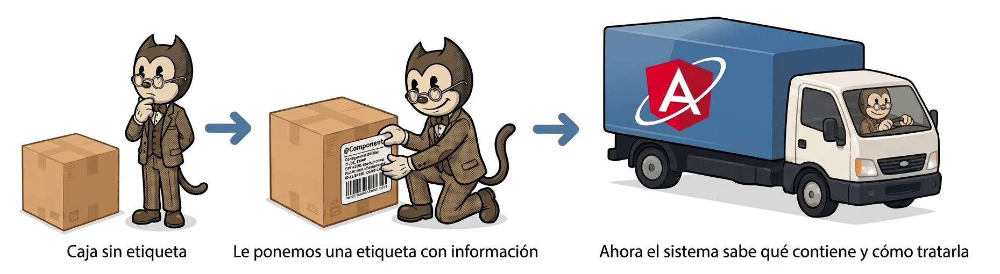

# Introducción a los decoradores

Cuando vimos los componentes, ya aparecía algo importante aunque no lo desarrollamos en profundidad: **los decoradores**.

Por ejemplo, `@Component` es un decorador.

**Un decorador es una forma de añadir información o comportamiento adicional a una clase, propiedad o método**, sin modificar directamente su código interno. En Angular, se utilizan principalmente para definir **metadatos**, es decir, información que el framework necesita para saber cómo debe funcionar cada elemento.

{.rounded-4}

> [!tip]
>
> Piensa en los decoradores como etiquetas en un paquete. No cambian el objeto, pero le dan información importante a quien lo usa.

Los decoradores se identifican fácilmente porque empiezan por `@` seguido de su nombre.

En Angular, se utilizan sobre todo para indicar qué es cada cosa dentro de la aplicación. Por ejemplo:

- `@Component` indica que una clase es un componente.
- `@Injectable` indica que una clase puede ser inyectada como servicio.
- `@NgModule` define un módulo de Angular.

Veamos el caso que ya conocemos:

```typescript
// app.ts
import { Component } from '@angular/core';

@Component({
  selector: 'app-root',
  templateUrl: './app.html',
  styleUrls: ['./app.css']
})
export class App {
  title = 'ejemplo';
}
```

En este caso, `@Component` está “decorando” la clase `App`.

Gracias a este decorador, Angular sabe que esta clase no es una clase cualquiera, sino un componente, y además recibe información clave como:

- El selector (`app-root`).
- La plantilla HTML asociada.
- Los estilos CSS asociados.

Sin este decorador, Angular no sabría cómo interpretar esta clase dentro de la aplicación.

Los decoradores son una parte fundamental de Angular, ya que prácticamente todo el framework se basa en ellos para organizar y estructurar la aplicación.

Más adelante veremos otros decoradores muy importantes como `@Input`, `@Output` o `@ViewChild`, que se utilizan para la comunicación entre componentes, pero por ahora es suficiente con entender la idea general.

> [!important]
>
> Una de las razones por las que Angular tomó TypeScript como lenguaje es por permitir el uso de decoradores.

