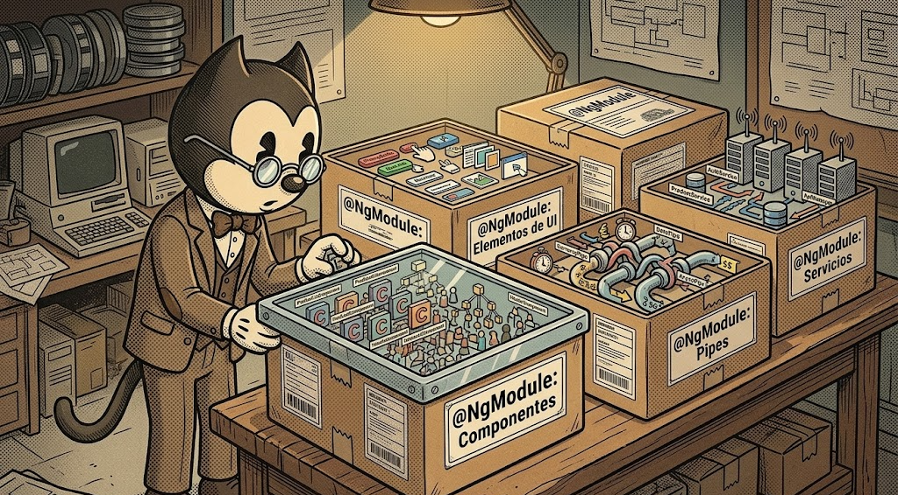
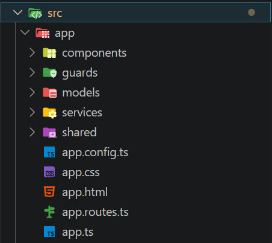
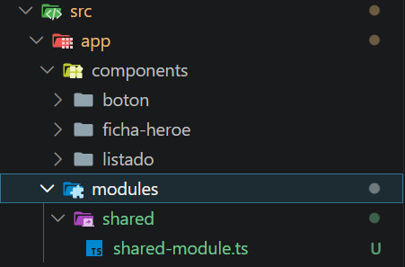

[TOC]

# Introducción ¿Qué es un módulo?

{.rounded-4}

En Angular, un módulo es una forma de **organizar y agrupar partes de la aplicación** como componentes, directivas, pipes o servicios. Tradicionalmente, Angular se ha basado en esta estructura para poder dividir una aplicación en bloques más manejables.

Un módulo se define mediante el decorador `@NgModule` y actúa como una “caja” donde se registran los elementos que pertenecen a esa parte de la aplicación. Esto permite a Angular saber qué piezas forman parte de cada funcionalidad y cómo se relacionan entre sí.

Durante mucho tiempo, los módulos han sido una pieza fundamental en la arquitectura de Angular, ya que **toda la aplicación debía estar estructurada obligatoriamente a través de ellos**.

Sin embargo, es importante entender que su papel ha cambiado con la llegada de los **componentes *standalone*** (Angular 14+), que permiten crear componentes sin necesidad de declararlos dentro de un módulo. Aun así, los módulos siguen existiendo dentro del ecosistema de Angular y en muchos proyectos reales todavía están presentes.

# Angular moderno y componentes standalone

Con las versiones recientes de Angular, la forma de construir aplicaciones ha cambiado respecto al enfoque tradicional basado en módulos (`NgModules`).

Antes de este cambio, Angular obligaba a que todo estuviera organizado dentro de módulos, que actuaban como el centro de la aplicación. Con la introducción de los componentes *standalone*, esto cambia y se permite una forma de trabajar más directa y flexible.

🏗️ **Antes (basado en módulos)**

- Todo componente debía declararse en un módulo.
- Existía un módulo raíz llamado `app.module.ts`.
- Las dependencias se gestionaban desde el módulo.
- La estructura del proyecto giraba alrededor de los NgModules.

⚡ **Ahora (standalone)**

- Los componentes pueden funcionar de forma independiente.
- No necesitan estar declarados en un módulo.
- Cada componente gestiona sus propias dependencias.

> [!warning]
>
> **Cómo identificar rápidamente el tipo de proyecto en Angular**
>
> 🔍 **Truco 1: Busca el archivo principal**
>
> - Si existe `app.module.ts` ➡️ el proyecto está basado en **módulos (NgModules)**
> - Si NO existe y ves `app.config.ts` ➡️ el proyecto es **standalone**
>
> 🔍  **Truco 2: Mira el bootstrap de la app**
>
> - `platformBrowserDynamic().bootstrapModule(AppModule)` ➡️ módulos
> - `bootstrapApplication(AppComponent)` ➡️ standalone

> [!tip]
>
> En Angular 17+, los proyectos nuevos se crean por defecto con enfoque *standalone*, como todos los que hemos creado en el curso hasta ahora. 
>
> Este comportamiento puede variar en un futuro según la configuración del CLI al generar el proyecto, igual que ocurrió cuando se pasó de una estructura basada en módulos a otra centrada en componentes standalone.


## Componentes standalone

Los componentes *standalone* son una forma moderna de crear componentes en Angular que no dependen de un `NgModule` para funcionar.

Esto significa que el componente es **autónomo**, es decir, puede existir y utilizarse sin necesidad de ser declarado dentro de un módulo.

**Características principales**

- ⚡ No necesitan estar en `declarations` de ningún módulo.
- 📦 Se pueden usar directamente en rutas (*routing*, ya lo veremos) o en otros componentes.
- 🔗 Gestionan sus propias dependencias mediante `imports`.
- 🧱 Reducen la necesidad de estructuras intermedias como módulos.
- 🪪 Se identifican por la propiedad `standalone:true` en el `@Component`.

> [!caution]
>
> - En proyectos modernos (Angular 17+), por defecto, todos los componentes ya se generan como *standalone* automáticamente.
> - Por eso, en muchos casos no verás `standalone: true` escrito explícitamente.
> - Si aparece, simplemente sirve para **hacer explícito su comportamiento**, no para activarlo manualmente ni porque sea obligatorio.
> - De hecho, todos los componentes que hemos creado hasta ahora son *standalone* y ninguno tenía la propiedad `standalone: true`.

**Ejemplo:**

```typescript
import { Component } from '@angular/core';

@Component({
  selector: 'app-saludo',
  standalone: true,
  imports: [],
  template: `
    <h2>👋 Hola Angular</h2>
    @if (mostrarMensaje) {
    <p>
      Este es un componente standalone funcionando sin NgModule.
    </p>
    }
    <button (click)="alternarMensaje()">
      Mostrar / Ocultar mensaje
    </button>
  `
})
export class SaludoComponent {
  mostrarMensaje = true;

  alternarMensaje(): void {
    this.mostrarMensaje = !this.mostrarMensaje;
  }
}
```

> [!warning]
>
> 🤯No te líes:
>
> - Este componente es exactamente igual que cualquiera que hayamos visto (aunque tenga el HTML en el TS, ya vimos que se podía).
> - Solo está indicando de forma explícita (cosa que no hace falta) que es un componente *standalone* con la propiedad `standalone: true`.
> - Todos los componentes por defecto ya son *standalone*, aunque no tenga `standalone: true`.


## ¿Cuándo seguimos usando módulos?

Aunque Angular moderno trabaja principalmente con componentes *standalone*, los módulos (`NgModules`) siguen siendo útiles en algunos escenarios concretos. No son obligatorios en la mayoría de casos, pero sí aparecen en situaciones reales de desarrollo o integración.

1. 📦 **Integración de librerías externas**
   Algunas librerías aún están basadas en módulos y requieren ser importadas desde un `NgModule`. En estos casos, se suele crear un módulo propio para agrupar e importar todo de forma ordenada. Lo veremos al integrar librerías UI (*user interface*) como PrimeNG o Angular Material.
2. 🧩 **Agrupación de funcionalidades**
   Los módulos pueden usarse para agrupar componentes relacionados dentro de una misma funcionalidad, facilitando la organización del proyecto y evitando duplicación de imports.
3. ⚡**Lazy loading (carga perezosa o diferida)**
   Siguen siendo una forma habitual de estructurar rutas que se cargan solo cuando el usuario accede a ellas, mejorando el rendimiento en aplicaciones grandes. Lo veremos más adelante.
4. 🏗️ **Proyectos existentes o legacy**
   En aplicaciones ya creadas con una arquitectura basada en módulos, es habitual seguir utilizándolos para mantener la coherencia del proyecto o evitar migraciones innecesarias.

> [!important]
>
> 🎯Los módulos no han desaparecido, pero han dejado de ser obligatorios en la mayoría de casos. Se siguen usando principalmente para organización, retrocompatibilidad y casos específicos como librerías o *lazy loading*.


## Crear un proyecto basado en módulos

Angular permite crear proyectos basados en módulos, que era el enfoque tradicional antes de la introducción de los componentes *standalone*.

Para ello, podemos crear un proyecto con el siguiente comando:

```shell
ng new proyecto-modulos --no-standalone
```

En este tipo de proyectos encontramos algunas diferencias respecto a los actuales:

- Se crea el archivo `app.module.ts`, que actúa como módulo principal de la aplicación.
- Los componentes deben declararse dentro de un módulo (`declarations`).
- El arranque de la aplicación se realiza a través del módulo mediante:
   `platformBrowserDynamic().bootstrapModule(AppModule)`

Frente a esto, en los proyectos modernos que estamos utilizando en el curso:

- No existe `app.module.ts` como pieza principal.
- Los componentes funcionan de forma independiente (*standalone*).
- El arranque se realiza directamente con el componente raíz:
   `bootstrapApplication(AppComponent)`

> [!warning]
>
> 👴En este curso trabajamos con el enfoque moderno basado en componentes *standalone*, pero es importante conocer este tipo de proyectos para entender cómo funcionaba Angular tradicionalmente y poder trabajar con proyectos existentes o crear uno nuevo por si fuera necesario.

# 🦸Proyecto Héroes

Aunque Angular moderno trabaja principalmente con componentes *standalone*, los módulos siguen siendo importantes para entender proyectos antiguos y ciertos patrones de organización que todavía podemos encontrar en aplicaciones reales.

En este ejemplo vamos a partir de un proyecto Angular moderno (con componentes *standalone*), donde ya tenemos varios componentes creados y organizados. A partir de esa base, veremos cómo podemos agruparlos dentro de un módulo.

> [!caution]
>
> Tienes dos opciones para trabajar este ejercicio:
>
> 1. 🛠️ **Paso a paso (recomendado si hay tiempo)**
>     Seguir el punto <kbd>Crear el proyecto</kbd> que viene a continuación para crear los componentes manualmente para repasar todo el flujo visto hasta ahora.
> 2. 📥 **Desde repositorio base**
>     Saltar al punto <kbd>Clonar el proyecto desde Git</kbd> y seguir desde ahí para centrarse únicamente en la creación del módulo.
>
> Ambas opciones llevan al mismo punto final del ejercicio.


## Crear el proyecto

Partimos de un proyecto Angular normal (como los que hemos creado hasta ahora), solo que ahora no le vamos a quitar el routing ni los tests. La idea es que este proyecto nos sirva de base para ir aplicando todo lo que vayamos aprendiendo en un futuro.

Creamos el proyecto y le añadimos Bootstrap tal y como dice su [documentación oficial](https://getbootstrap.com/):

```shell
ng new heroes
cd heroes
npm install bootstrap
```

Ya podemos abrir el el proyecto con Visual Studio Code y añadimos la hoja de estilos de Bootstrap en el `angular.json`:

```json
"styles": [
    "node_modules/bootstrap/dist/css/bootstrap.min.css",
    "src/styles.css"
]
```

Así ya podríamos usar clases de Bootstrap directamente en los componentes, por ejemplo:

```html
class="btn btn-primary"
class="card p-3"
```

> [!tip]
>
> Bootstrap también puede añadirse de otras formas en un proyecto Angular, por ejemplo:
>
> - Incluyéndolo mediante CDN en el `index.html`, sin instalarlo localmente con `npm`.
> - Usando `@import` directamente en `styles.css`, importando la hoja de estilos o bien local instalada con `npm` o bien remota con `cdn`.
>
> Sin embargo, la forma recomendada es instalarlo con `npm` y añadirlo en `angular.json`, ya que:
>
> - 📦 Se integra correctamente en el sistema de build de Angular.
> - 🚀 Evita dependencias externas en tiempo de ejecución.
> - 🧩 Permite un mejor control de versiones y mantenimiento.
> - 🔍 Centraliza la configuración de estilos del proyecto.

## Crear los componentes

Ahora que ya tenemos el proyecto preparado con Bootstrap, vamos a crear los componentes que utilizaremos como ejemplo para ver después cómo se pueden agrupar en un módulo.

La idea es trabajar con componentes sencillos, para centrarnos únicamente en la organización del código.

> [!important]
>
> Vamos a crear los componentes dentro de una carpeta llamada `components`. Esto nos ayudará a tener el código más organizado, ya que en un futuro crearemos `guards`, `services`, `shared`, `assets`, etc. Además VSC mostrará cada carpeta con un estilo diferente y nos ayudará a identificar visualmente más rápido las carpetas de nuestro proyecto.
>
> {.rounded}

Creamos los componentes en la carpeta `components`, añadiendo su ruta en el comando de creación con Angular CLI:

```shell
ng g c components/fichaHeroe
ng g c components/boton
ng g c components/listado
```

> [!tip]
>
> 🙈Puedes añadir el comando `--skip-tests` en la creación de los componentes, ya que no vamos a usar testing por ahora y así nos enfocamos mejor.

- 🦸 `ficha-heroe` → representará una ficha de héroe.
- 📋 `listado` → mostrará varias fichas.
- 🔘 `boton` → botón reutilizable personalizado superchulo.

> [!important]
>
> {{Nota sobre el camelCase al crear el componente}}

### Mostrar los componentes

Nada más crear los componentes, lo primero es mostrarlos en pantalla. Ahora mismo tendrán el contenido por defecto (`<p>nombre-componente works!</p>` pero nos servirá para ver que todo va en orden:

En el componente raíz (`app.html`) borramos su contenido y mostramos el componente `listado`.

```html
<!-- Componente raíz app.html -->
<app-listado></app-listado>
```

El componente raíz será el punto de entrada de la aplicación y será sobre el que estén añadidos el resto de componentes.

> [!important]
>
> **No hacemos ningún cambio manual en el archivo `app.ts`**, pero fíjate que al mostrar el componente `listado` en la plantilla del componente `app-root`, el IDE lo añadirá en la sección `imports` de forma automática.

> [!warning]
>
> En la sección de `imports` verás otro llamado `RouterOutlet` que pertenece al *routing*. Lo veremos más adelante.

### FichaHeroe

Representará una ficha con los datos de un héroe. La idea es repetir esta ficha en el listado.

````typescript
// ficha-heroe.ts
import { Component } from '@angular/core';

@Component({
  selector: 'app-ficha-heroe',
  imports: [],
  templateUrl: './ficha-heroe.html',
  styleUrl: './ficha-heroe.css',
})
export class FichaHeroe {
  nombre: string = 'Spider-Man';
  nivelPoder: number = 85;
  activo: boolean = true;
}
````

```html
<!-- ficha-heroe.html -->
<div class="card p-3 mb-2">
  <h4>{{ nombre }}</h4>
  <p>Nivel de poder: {{ nivelPoder }}</p>

  @if (activo) {
    <p>🟢 Estado: Activo</p>
  } @else {
    <p>🔴 Estado: Inactivo</p>
  }
</div>
```

### Listado

Este componente será el encargado de mostrar varias fichas de héroes.

De momento no vamos a usar arrays ni lógica compleja, simplemente repetimos el mismo componente para centrarnos en la estructura y no en los datos.

```html
<!-- listado.html -->
<div class="container mt-3">
  <h2>Listado de héroes</h2>

  <app-heroe></app-heroe>
  <app-heroe></app-heroe>
  <app-heroe></app-heroe>
</div>
```

> [!important]
>
> **No hacemos ningún cambio manual en el archivo TS**, pero fíjate que al mostrar el componente `heroe` en la plantilla del componente `listado`, el IDE lo añadirá en la sección `imports` de forma automática.

### Botón

Este componente lo dejamos preparado como elemento reutilizable. Será estrictamente decorativo. Lo usaremos como ejemplo para agrupar más componentes dentro de un módulo.

```typescript
// boton.ts
import { Component } from '@angular/core';

@Component({
  selector: 'app-boton',
  imports: [],
  templateUrl: './boton.html',
  styleUrl: './boton.css',
})
export class Boton {
  cargando: boolean = false;

  hacerClick(): void {
    this.cargando = !this.cargando;
  }
}
```

```html
<!-- boton.html -->
<button
  class="btn boton-personalizado"
  [class.btn-primary]="!cargando"
  [class.btn-warning]="cargando"
  (click)="hacerClick()"
>
  {{ cargando ? '⌛Cargando...' : '🔍Ver más' }}
</button>

```

```css
/* boton.css */
.boton-personalizado {
  border-radius: 20px;
  padding: 8px 16px;
  font-weight: bold;
  transition: all 0.5s ease-in-out;
}

.boton-personalizado:hover {
  transform: scale(1.05);
}
```

> [!note]
>
> Es un botón que al pulsarlo, alterna entre el estado `cargando=true` y `cargando=false` y muestra un estilo y texto diferente para cada estado.

## Clonar el proyecto desde Git

> [!note]
>
> 🤓**Glosario de términos que deberíamos saber:**
>
> 🔧 **Git**  
> Es una herramienta que permite controlar versiones de un proyecto.  
> Permite guardar cambios, volver atrás y trabajar de forma ordenada.
>
> 🌐 **GitHub**  
> Es una plataforma online donde se guardan proyectos que usan Git.  
> Permite compartir código y trabajar en equipo.
>
> 📦 **Repositorio (repo)**  
> Es una “carpeta de proyecto” gestionada con Git.  
> Contiene todo el código y el historial de cambios del proyecto.
>
> 📥 **Clonar un repositorio**  
> Es descargar una copia de un repositorio desde GitHub a tu ordenador.  
> Así puedes trabajar con el proyecto de forma local.

Si no quieres hacer todo el proceso anterior manualmente o no disponemos de tanto tiempo, tenemos preparado un repositorio en GitHub con la instantánea del proyecto en este punto, listo para clonarlo.

> [!important]
>
> Para poder clonar el repositorio del proyecto es necesario tener instalado **Git**.
>
> Si no lo tienes instalado, puedes descargarlo desde aquí:  https://git-scm.com/

Sitúate en la carpeta donde estés guardando tus proyectos de Angular (por ejemplo `Escritorio/proyectos-angular`).

Desde esa carpeta abre la terminal y ejecuta el comando de clonación. Se creará una carpeta con el proyecto clonado en esa ubicación (ej: `Escritorio/proyectos-angular/heroes`)

```shell
git clone https://github.com/borilio/heroes-modulos/
```

Una vez clonado, entramos a la carpeta y le instalamos todas las dependencias del proyecto:

```shell
cd heroes-modulos
npm install
```

Ya puedes abrir el proyecto con Visual Studio Code y lo tendrás tal y como hemos explicado en los pasos anteriores. Preparado para crear un módulo.

## Crear un módulo

Vamos a crear un módulo en el proyecto para agrupar los componentes relacionados.

Al igual que hicimos con `components`, vamos a organizar también los módulos dentro de una carpeta llamada `modules`, para mantener una estructura clara del proyecto.

Esto nos ayudará a separar:

- 📦 componentes reutilizables
- 🧩 módulos funcionales

Creamos el módulo llamado `shared` con Angular CLI:

```shell
ng generate module modules/shared
```

Esto genera automáticamente `modules/shared/shared.module.ts` con el siguiente contenido:

{.rounded-4}

```typescript
import { NgModule } from '@angular/core';
import { CommonModule } from '@angular/common';

@NgModule({
  declarations: [],
  imports: [CommonModule],
})
export class SharedModule {}
```


## Añadir los componentes al módulo

Una vez creado el módulo, vamos a incluir dentro de él los componentes reutilizables:

- 🦸 `FichaHeroe`
- 🔘 `Boton`

En un módulo trabajamos con dos conceptos muy importantes:

\- 📥 **`imports`** → permiten que el módulo “conozca” y pueda usar esos componentes  
\- 📤 **`exports`** → permiten que otros módulos o partes de la app puedan usarlos  

En este caso, queremos que estos componentes estén disponibles fuera del módulo, por lo que los añadimos en ambos.

```typescript
import { NgModule } from '@angular/core';
import { CommonModule } from '@angular/common';
import { FichaHeroe } from '../../components/ficha-heroe/ficha-heroe';
import { Boton } from '../../components/boton/boton';

@NgModule({
  declarations: [],
  imports: [
    CommonModule,
    FichaHeroe,
    Boton
  ],
  exports: [ 
    FichaHeroe,
    Boton
  ]
})
export class SharedModule {}
```

## Usar los componentes del módulo

### Como estaba antes

Hasta ahora la aplicación funcionaba con una jerarquía directa de componentes:

````
🏠 AppComponent  
└── 📋 Listado  
	└── 🦸 FichaHeroe  
		└── 🔘 Boton  
````

Cada componente dependía directamente del siguiente, y todos se usaban de forma individual mediante imports.

### Cómo lo vamos a hacer ahora

A partir de ahora introducimos un módulo llamado `SharedModule` que agrupa parte de estos componentes.

La estructura pasa a ser:

```
🏠 AppComponent  
└── 📋 Listado  
	└── 🧩 SharedModule  
        ├── 🦸 FichaHeroe  
        └── 🔘 Boton 
```

El componente `Listado` seguirá utilizando `FichaHeroe`, pero en lugar de importarlo directamente, lo hará a través del módulo `shared`.

> [!note]
>
> El componente `Listado` sigue siendo el encargado de mostrar las fichas, pero ahora no importa cada componente individualmente, sino que se apoya en el módulo `SharedModule`, que agrupa y expone los componentes reutilizables.
>
> Esto reduce la necesidad de imports repetidos y centraliza la gestión de componentes comunes, aunque seguimos trabajando con una arquitectura basada en componentes standalone.


### Como quedaría

Una vez creado el módulo y añadidos los componentes, necesitamos importarlo en el componente donde queramos utilizarlos.

En este caso, el cambio se realiza en el componente raíz (`AppComponent`), ya que es donde se usa `Listado`.

```ts
// app.ts
import { Component, signal } from '@angular/core';
import { RouterOutlet } from '@angular/router';
import { Listado } from './components/listado/listado';
import { SharedModule } from './modules/shared/shared-module';

@Component({
  selector: 'app-root',
  imports: [
    RouterOutlet,
    Listado,
    SharedModule
  ],
  templateUrl: './app.html',
  styleUrl: './app.css'
})
export class App {
  protected readonly title = signal('heroes');
}}
```

> [!warning]
>
> Recuerda que `RouterOutlet` y `signal` no los hemos visto por ahora, lo dejamos aquí porque vienen en el código y si no lo ponemos te puede liar más, pero ahora no tienen ningún uso y podrían eliminarse.

El componente `Listado` se sigue importando porque lo usamos directamente en el HTML del componente raíz.

Sin embargo, `FichaHeroe` y `Boton` ya no se importan de forma individual, sino que vienen incluidos dentro de `SharedModule`.

> [!important]
>
> Ahora, en lugar de importar cada componente por separado (o de forma escalonada como antes), podemos agruparlos en un módulo e importarlos todos de una sola vez.
>
> **Aunque en este ejemplo el cambio es pequeño, esta forma de trabajar resulta muy útil cuando el número de componentes crece, ya que mejora la organización y evita imports repetidos.**


{{Hacerlo en stackblitz y ponerlo también}}

<div style="
  display: flex;
  justify-content: center;
  margin: 20px 0px;
">
  <a href="https://stackblitz.com/PONERRUTA" target="_blank" style="
    display: inline-flex;
    align-items: center;
    gap: 10px;
    padding: 8px 14px;
    border-radius: 999px;
    background-color: #1e1e1e;
    border: 1px solid #333;
    color: #ffffff;
    text-decoration: none;
  ">
    
    Abrir en StackBlitz <code style="color:#49A2F8">heroes-modulos</code>
  </a>
</div>

