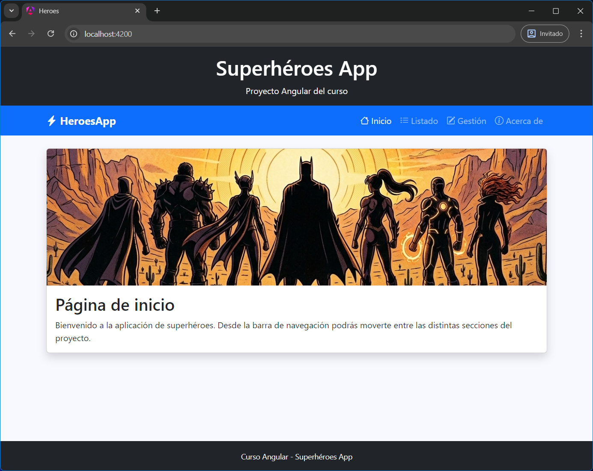

# Introducción

<div style="padding: 1rem; background-color: #fff3cd; border: 1px solid #ffeeba; border-radius: 4px; color: #7b5e00; margin: 1rem 0;">
<h3 style="font-weight: bold; color: #7b5e00;">🟡 Bloque Intermedio</h3> 
<p>A continuación comenzamos el bloque intermedio, donde la aplicación empieza a comportarse como una aplicación real:</p>
<ul>
  <li>🧱 Definiremos <strong>modelos</strong> para estructurar los datos.</li>
  <li>🔧 Crearemos <strong>servicios</strong> para centralizar la lógica.</li>
  <li>🔗 Veremos la <strong>comunicación entre componentes</strong>.</li>
  <li>🧪 Usaremos <strong>pipes</strong> para transformar datos en la vista.</li>
  <li>🧭 Implementaremos <strong>routing</strong> para navegar entre pantallas.</li>
  <li>🌐 Realizaremos <strong>peticiones HTTP</strong> usando <strong>observables</strong>.</li>
</ul>
<p>Con todo esto, pasamos de una aplicación estática a una aplicación dinámica, conectada y organizada siguiendo buenas prácticas.</p>
</div>


{.rounded-4}

# Punto de partida

A partir de este punto, donde **ya hemos asentado las bases del desarrollo con Angular** (componentes, plantillas, binding, etc.), vamos a cambiar ligeramente la forma de trabajar. 

En lugar de crear pequeños proyectos independientes para cada concepto nuevo, **empezaremos a construir una aplicación de forma progresiva**, añadiendo funcionalidades paso a paso. 

Para ello, partiremos de un proyecto base que descargaremos o clonaremos desde GitHub, y sobre él iremos incorporando cada nuevo concepto que vayamos aprendiendo. De esta forma, el aprendizaje será más realista y cercano a un entorno de trabajo profesional.

Para trabajar con este proyecto tienes varias opciones y siempre se mostrará lo siguiente:

- Se indica la versión del repositorio a la que apuntan los enlaces.
- <kbd>Ver en Stackblitz</kbd>: Permite ver y editar el proyecto directamente desde el navegador, en la versión indicada, sin instalación y sin descargas.
- <kbd>Descarga de GitHub</kbd>: Descarga el proyecto comprimido en zip en la versión indicada, listo para editar localmente.

<div style="display:flex; justify-content:center; align-items:center; gap:12px; font-family:sans-serif; margin:16px 0;">
    <span style="font-weight:bold; font-family:monospace; background-color:#f1f3f5; color: #000000; padding:6px 10px; border-radius:6px; font-size:0.9rem;">
        <i class="pi pi-tag"></i>
        v1-base
    </span>
    <div style="display:flex; border: 2px solid white; border-radius: 999px;">
        <a href="https://stackblitz.com/github/borilio/heroes/tree/v1-base" target="_blank"
           style="display:flex; align-items:center; gap:6px; text-decoration:none; padding:8px 14px; font-size:0.9rem; color:white; background-color:#0d6efd; border-top-left-radius:999px; border-bottom-left-radius:999px;">
            <i class="pi pi-bolt"></i>
            Ver en StackBlitz
        </a>
        <a href="https://github.com/borilio/heroes/archive/refs/tags/v1-base.zip" target="_blank"
           style="display:flex; align-items:center; gap:6px; text-decoration:none; padding:8px 14px; font-size:0.9rem; color:white; background-color:#212529; border-top-right-radius:999px; border-bottom-right-radius:999px;">
            <i class="pi pi-github"></i>     
            Descargar de GitHub
        </a>
    </div>
</div>


# Versiones del proyecto

En el repositorio del proyecto se han definido distintas versiones mediante **tags de Git**, que puedes consultar en el siguiente enlace:

👉 https://github.com/borilio/heroes/tags

La primera versión disponible es **v1-base**, que corresponde a la base inicial del proyecto.

A lo largo del curso iremos utilizando el mismo repositorio, pero iremos indicando explícitamente el enlace a cada versión (tag) correspondiente a cada tema.

> [!caution]
>
> Si no se especifica ninguna versión (o bien al clonar, al descargar o para Stackblizt, se usará siempre la última versión del proyecto (rama principal), lo cual no utilizaremos en el curso para evitar confusiones.

**Por este motivo, es fundamental acceder siempre a la versión indicada en cada apartado del temario.**

# 🦸Proyecto Héroes


{.rounded-3}

La aplicación está organizada con una estructura pensada para mantener el código ordenado, escalable y fácil de entender a medida que el proyecto crece (que crecerá).

```text
components/
├── layout/
│   ├── header
│   ├── navbar
│   └── footer
└── pages/
    ├── home
    ├── about
    ├── heroes-list
    └── heroes-manage
```

Dentro de la carpeta `components` se agrupan todos los componentes de la interfaz de la aplicación (como hemos hecho siempre), organizados en dos subcarpetas para mantener el proyecto ordenado y fácil de escalar.

- **layout**: estructura común y estática de la app.
  - `header` → cabecera superior de la aplicación donde se muestra el título o identidad visual
  - `navbar` → barra de navegación que permite moverse entre las distintas páginas
  - `footer` → pie de página que se mantiene fijo en toda la aplicación

- **pages**: pantallas o vistas que se mostrarán de forma dinámica dependiendo de la ruta.
  - `home` → página de inicio que presenta la aplicación
  - `about` → página típica de “acerca de”
  - `heroes-list` → página que mostrará el listado de superhéroes 
  - `heroes-manage` → página destinada a la gestión de superhéroes (CRUD en fases posteriores)

Esta estructura separa claramente los componentes de `layout` (estructura común de la app) de los componentes de pages (pantallas o vistas), facilitando la organización del proyecto y su evolución en fases posteriores.

> [!warning]
>
> El contenido de cada componente, con el objetivo de facilitar la mantenibilidad del temario, no se incluye en este documento. Para consultarlo, puedes acceder al repositorio en GitHub o abrir el proyecto en StackBlitz mediante los enlaces proporcionados anteriormente. Te los recordamos:
>
> <div style="display:flex; justify-content:center; align-items:center; gap:12px; font-family:sans-serif; margin:16px 0;">
>     <span style="font-weight:bold; font-family:monospace; background-color:#f1f3f5; color: #000000; padding:6px 10px; border-radius:6px; font-size:0.9rem;">
>         <i class="pi pi-tag"></i>
>         v1-base
>     </span>
>     <div style="display:flex; border: 2px solid white; border-radius: 999px;">
>         <a href="https://stackblitz.com/github/borilio/heroes/tree/v1-base" target="_blank"
>            style="display:flex; align-items:center; gap:6px; text-decoration:none; padding:8px 14px; font-size:0.9rem; color:white; background-color:#0d6efd; border-top-left-radius:999px; border-bottom-left-radius:999px;">
>             <i class="pi pi-bolt"></i>
>             Ver en StackBlitz
>         </a>
>         <a href="https://github.com/borilio/heroes/archive/refs/tags/v1-base.zip" target="_blank"
>            style="display:flex; align-items:center; gap:6px; text-decoration:none; padding:8px 14px; font-size:0.9rem; color:white; background-color:#212529; border-top-right-radius:999px; border-bottom-right-radius:999px;">
>             <i class="pi pi-github"></i>     
>             Descargar de GitHub
>         </a>
>     </div>
> </div>

> [!important]
>
> 💪**Recomendación:** Hacer el proyecto desde 0. Tardarás 5 minutos y afianzarás conocimiento. Solo tienes que:
>
> 1. Crear un proyecto nuevo.
> 2. Instalar y configurar Bootstrap.
> 3. Crear los componentes.
> 4. Añadir el contenido HTML de cada componente que encontrarás en Stackblitz.

