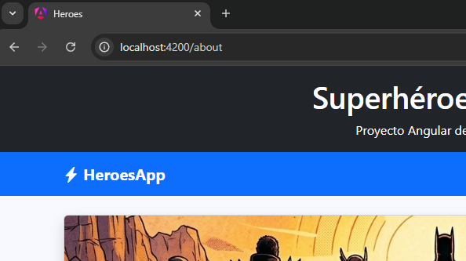
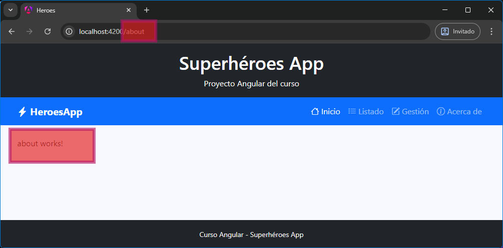

[TOC]

# Introducción

{.rounded-4}

El **routing** en Angular es el sistema encargado de gestionar la navegación dentro de una aplicación.

Su función principal es permitir que la aplicación **muestre diferentes vistas o componentes en función de la URL**, sin necesidad de recargar la página.

En otras palabras, el routing es lo que convierte una aplicación Angular en una **Single Page Application (SPA)** con navegación real entre “páginas”, aunque técnicamente todo ocurra dentro del mismo documento.

# ¿Qué hace exactamente el *routing*?

El routing se encarga de:

- Asociar una URL con un componente concreto
- Detectar cuándo cambia la URL
- Cargar el componente correspondiente
- Evitar recargas completas de la página

De esta forma, cada “pantalla” de la aplicación no es una página independiente, sino un **componente que se muestra o se oculta según la ruta activa**.

> [!tip]
>
> Por este motivo, en nuestra app Héroes, todos los componentes cuyo contenido depende de la ruta se han organizado en una carpeta llamada `pages` y los que no dependen de la ruta  están en la carpeta `layout` (el header, navbar y footer salen siempre). Y a su vez todos son `components`.

# Definir las rutas

El primer paso para usar routing en Angular es **definir las rutas de la aplicación**.

Esto consiste en crear una configuración donde le decimos a Angular:

- qué rutas existen
- qué componente debe cargarse en cada una
- y qué hacer cuando la ruta no existe

Por ejemplo, podríamos definir algo como:

- `/home` → componente Home
- `/about` → componente About
- `/contact` → componente Contact

Con esta configuración estamos diciendo explícitamente a Angular: **“Estas son las rutas válidas de mi aplicación y esto es lo que debe mostrar cada una”**.

## ¿Qué pasa con las rutas no definidas?

Una parte importante del routing es que también podemos controlar qué ocurre cuando el usuario intenta acceder a una ruta que no existe.

Por ejemplo:

- `/loquesea` ❌

Angular puede redirigir a una página de error o a una vista por defecto.

Esto es clave porque el routing no solo define lo que existe, sino también **lo que no está permitido o no está contemplado** dentro de la navegación.

## Archivo  `app.routes.ts`

En Angular, las rutas se definen en un archivo de configuración que normalmente se llama **`app.routes.ts`** (o equivalente según el tipo de proyecto).

Este archivo es el lugar donde se establece el **mapa de navegación de toda la aplicación**, indicando qué componente debe mostrarse para cada URL.

Si abrimos el archivo `app.routes.ts` de cualquier proyecto que hayamos creado por ahora, tendrá el siguiente contenido:

```typescript
// app.routes.ts
import { Routes } from '@angular/router';

export const routes: Routes = [];
```

**Las rutas en Angular se definen como un array de objetos.**

Cada objeto representa una ruta y suele tener esta estructura:

- `path`: la URL que se quiere definir
- `component`: el componente que se debe mostrar

Por ejemplo:

- `path: 'home'` → define la ruta `/home`
- `component: HomeComponent` → indica qué se muestra en esa ruta

Con esto, Angular ya sabe cómo reaccionar cuando el usuario navega a una determinada dirección.

En nuestra app Héroes, el contenido de `app.routes.ts` puede ser el siguiente:

```typescript
import { Routes } from '@angular/router';
import { Home } from './components/pages/home/home';
import { HeroesList } from './components/pages/heroes-list/heroes-list';
import { HeroesManage } from './components/pages/heroes-manage/heroes-manage';
import { About } from './components/pages/about/about';

export const routes: Routes = [
    { path: 'home', component: Home },
    { path: 'list', component: HeroesList },
    { path: 'manage', component: HeroesManage },
    { path: 'about', component: About },
    { path: '**', redirectTo: 'home' }    
];
```

De esta forma, por ahora, solo estamos definiendo **que rutas estamos permitiendo**, de forma que podemos probar a escribir que pasa si escribimos esas URL u otras en el navegador.

{.rounded-4}

Comprobarás el siguiente comportamiento:

- En las rutas que hemos definido, **las considera válidas** y “nos deja estar”, aunque no veamos nada más.
- Si probamos cualquier otra ruta, **nos redirige a la ruta** `/home`, que es la que hemos definido como ruta comodín (ninguna de las anteriores).

> [!important]
>
> **La ruta comodín o *fallback* (`**`) siempre debe ir al final de la lista**, porque Angular evalúa las rutas en orden.
>
> Si la pusiéramos arriba, “capturaría” todas las rutas y las demás dejarían de funcionar.
>
> Su función es actuar como **captura de errores de navegación**, permitiendo:
>
> - Mostrar una página de “No encontrado” o página 404 personalizada.
> - O redirigir a una vista válida que deseemos.

> [!note]
>
> Por ahora, solo estamos **permitiendo o no** quedarnos en una ruta. NO HACEMOS NADA MAS. La navegación real vendrá después, pero es necesario entender este primer paso.

## Ruta inicial `/`

Esta configuración se utiliza para definir qué ocurre cuando el usuario accede a la raíz de la aplicación, es decir, a la URL `/`.

En este caso se utiliza una ruta vacía (`''`) junto con una redirección:

```typescript
{
  path: '',
  redirectTo: 'home',
  pathMatch: 'full'
}
```

Con esto le estamos diciendo a Angular que, cuando no se especifique ninguna ruta, debe redirigir automáticamente a `/home`. Es una forma de establecer una página de inicio por defecto dentro de la aplicación.

El campo `redirectTo` indica la ruta a la que queremos enviar al usuario, mientras que `pathMatch: 'full'` es importante porque asegura que la coincidencia con la ruta sea exacta. Es decir, solo se aplicará esta redirección cuando la URL sea exactamente vacía, evitando comportamientos inesperados con otras rutas.

En conjunto, esta configuración no crea ningún componente nuevo, sino que actúa como un punto de entrada controlado para dirigir al usuario hacia la vista principal de la aplicación.

El contenido completo de `app.routes.ts` sería:

```typescript
// app.routes.ts
import { Routes } from '@angular/router';
import { Home } from './components/pages/home/home';
import { HeroesList } from './components/pages/heroes-list/heroes-list';
import { HeroesManage } from './components/pages/heroes-manage/heroes-manage';
import { About } from './components/pages/about/about';

export const routes: Routes = [
    {
        path: '',
        redirectTo: 'home',
        pathMatch: 'full'
    },
    {
        path: 'home',
        component: Home,
    },
    {
        path: 'list',
        component: HeroesList,
    },
    {
        path: 'manage',
        component: HeroesManage,
    },
    {
        path: 'about',
        component: About,
    },
    {
        path: '**',
        redirectTo: 'home',
    },
];

```

> [!NOTE]
> El campo `pathMatch: 'full'` es necesario para evitar comportamientos inesperados en las redirecciones.
>
> Angular, por defecto, puede interpretar las rutas como coincidencias parciales. Es decir, podría considerar válida una ruta aunque solo coincida una parte del path.
>
> Al usar `full`, le indicamos que la coincidencia debe ser exacta: la ruta debe ser completamente igual a `''` para que se aplique la redirección.
>
> Esto evita que la redirección se ejecute en rutas que no corresponden y asegura un comportamiento predecible al iniciar la aplicación.

# El componente `router-outlet`

Una vez que hemos definido las rutas de la aplicación, Angular ya sabe qué componente debe mostrarse para cada URL.

Sin embargo, todavía falta una pieza clave: **indicar en qué parte de la aplicación se van a renderizar esos componentes**.

Aquí es donde entra en juego el `<router-outlet>`.

El `<router-outlet>` es una directiva especial de Angular que actúa como un **contenedor dinámico de vistas**. Su función es servir como el punto de inserción donde Angular muestra el componente correspondiente a la ruta activa.

No representa contenido por sí mismo, sino que funciona como un espacio reservado que Angular va rellenando en función de la navegación del usuario.

Cuando el usuario cambia de ruta:

- Angular detecta la URL actual  
- Busca la ruta definida en la configuración  
- Identifica el componente asociado  
- Y lo renderiza dentro del `<router-outlet>`  

De esta forma, la aplicación no recarga la página ni sustituye el HTML completo, sino que únicamente cambia la vista dentro de este punto concreto.

---

El `<router-outlet>` se coloca en la plantilla principal de la aplicación, normalmente en el componente raíz (`app.html`).

Su uso es muy sencillo:

```html
<!-- app.html de una aplicación genérica -->
<header>
  <h1>Mi aplicación Angular</h1>
</header>

<nav>
  <!-- aquí irán los enlaces del menú -->
</nav>

<main>
  <!-- El router-outlet actúa como contenedor de las vistas asociadas a cada ruta -->
  <router-outlet></router-outlet>
</main>

<footer>
  <p>Pie de página</p>
</footer>
```

# 🦸`<router-outlet>` en Héroes

Para probar el funcionamiento de `router-outlet` en nuestra app, solo tenemos que abrir nuestro `app.html`, y cambiar el componente `app-home` que se muestra siempre fijo, por el `router-outlet`.

```html
<!-- app.html -->
<div class="d-flex flex-column min-vh-100">

    <app-header></app-header>

    <app-navbar></app-navbar>

    <!-- Crece hasta ocupar todo el contenido, y el footer ya aparece abajo -->
    <main class="container mt-4 flex-grow-1">
        <!--<app-home></app-home> Ahora podemos quitar esto ya-->
        <router-outlet></router-outlet>
    </main>

    <app-footer></app-footer>

</div>
```

Ahora, si cambiamos la ruta de nuestra aplicación manualmente en el navegador, veremos que no solo nos “permite estar”, **sino que renderiza el componente que hemos definido para dicha URL en el `app.routes.ts`**.

{.rounded-3}

> [!caution]
> Para que el routing funcione correctamente es necesario que el componente `RouterOutlet` esté disponible en la aplicación.
>
> En proyectos Angular modernos (especialmente los generados con Angular CLI y configuración standalone), este elemento ya viene configurado por defecto, por lo que no suele ser necesario añadirlo manualmente.
>
> Aun así, es importante entender que sin `RouterOutlet`, Angular no tendría un punto donde renderizar los componentes asociados a las rutas, y por tanto la navegación no funcionaría correctamente.

# Navegación con `routerLink`

Para que la navegación funcione correctamente en una aplicación Angular, no debemos utilizar enlaces HTML tradicionales (`href`), ya que provocan una recarga completa de la página, pero en una **Single Page Application (SPA)** no es el comportamiento ideal.

En su lugar, Angular proporciona el atributo `routerLink`, que permite navegar entre rutas sin recargar la aplicación.

🔗**Un enlace tradicional sería:**

```html
<a href="/home">Inicio</a>
```

Este tipo de enlace hace que el navegador:

- Cambie la URL
- Recargue completamente la página
- Vuelva a cargar toda la aplicación Angular

🔗**Mientras que usando Angular, sería:**

```html
<a routerLink="/home">Inicio</a>
```

En este caso:

- Angular intercepta la navegación
- Cambia la URL sin recargar la página
- Actualiza únicamente el contenido dentro del `<router-outlet>`

---

Ambos enlaces llevan a la misma ruta (`/home`), pero:

- `href` → recarga toda la aplicación ❌
- `routerLink` → navegación interna sin recarga ✔️

Por eso, en aplicaciones Angular siempre debemos usar `routerLink` para la navegación entre vistas.

## Enlace activo con `routerLinkActive`

Además, Angular permite marcar automáticamente qué enlace está activo mediante el atributo `routerLinkActive`.

Este atributo añade una clase CSS cuando la ruta coincide con la URL actual, lo que resulta especialmente útil en menús de navegación.

```html
<a routerLink="/home" routerLinkActive="active">Inicio</a>
```

Cuando el usuario esté en `/home`, ese enlace tendrá la clase `active`, permitiendo aplicar estilos (como resaltar la opción seleccionada).

> [!tip]
>
> Da la casualidad... que Bootstrap tiene una clase llamada `active` para los enlaces activos que queramos resaltar.


## 🦸Usando `routerLink` y routerLinkActive en Héroes

Como los únicos enlaces que tiene por ahora nuestra aplicación están en el `NavBar`, solo tenemos que modificar los atributos `routerLink` y `routerLinkActive` de nuestro componente de navegación para aplicar la navegación completa a nuestra aplicación.

Nuestro componente `navbar.html`, usando ya por completo el routing de Angular, en lugar de `href` tradicional:

```html
<!-- navbar.html -->
<nav class="navbar navbar-expand-lg navbar-dark bg-primary">
  <div class="container">
    <!-- Brand -->
    <a class="navbar-brand fw-bold" href="#">
      <i class="bi bi-lightning-charge-fill"></i>
      HeroesApp
    </a>

    <!-- Botón hamburguesa -->
    <button
      class="navbar-toggler"
      type="button"
      data-bs-toggle="collapse"
      data-bs-target="#mainNavbar"
    >
      <span class="navbar-toggler-icon"></span>
    </button>

    <!-- Menú -->
    <div class="collapse navbar-collapse" id="mainNavbar">
      <ul class="navbar-nav ms-auto">
        <li class="nav-item">
          <a
            class="nav-link"
            routerLink="/home"
            routerLinkActive="active"
            [routerLinkActiveOptions]="{ exact: true }"
          >
            <i class="bi bi-house"></i> Inicio
          </a>
        </li>

        <li class="nav-item">
          <a class="nav-link" routerLink="/list" routerLinkActive="active">
            <i class="bi bi-list-ul"></i> Listado
          </a>
        </li>

        <li class="nav-item">
          <a class="nav-link" routerLink="/manage" routerLinkActive="active">
            <i class="bi bi-pencil-square"></i> Gestión
          </a>
        </li>

        <li class="nav-item">
          <a class="nav-link" routerLink="/about" routerLinkActive="active">
            <i class="bi bi-info-circle"></i> Acerca de
          </a>
        </li>
      </ul>
    </div>
  </div>
</nav>
```

> [!NOTE]
> Por defecto, `routerLinkActive` utiliza coincidencia parcial. Esto significa que un enlace se marcará como activo si la URL actual comienza (no hace falta que sea exacto) por el valor definido en `routerLink`.
>
> Por ejemplo, si tenemos:
>
> ```html
> <a routerLink="/home" routerLinkActive="active">Inicio</a>
> ```
>
> Este enlace se marcará como activo tanto en:
>
> - `/home` ✅  
> - `/home/details` ❌ (puede no ser lo esperado)
>
> En algunos casos, esto puede provocar que varios enlaces aparezcan como activos al mismo tiempo, especialmente en menús de navegación.
>
> Para evitarlo, podemos usar `[routerLinkActiveOptions]="{ exact: true }"`, indicando que la coincidencia debe ser exacta. De este modo, el enlace solo se marcará como activo cuando la URL coincida exactamente con la ruta definida.
>
> **Es recomendable usarlo**, al menos en rutas como `/home`. 

> [!warning]
>
> No hace falta hacerlo manualmente, pero al usar `routerLink` y `routerLinkActive` en el `navbar.html`, el IDE de forma automática nos hace los *imports* necesarios en el archivo `navbar.ts`. Es importante tener en cuenta que la aplicación daría error si no están dichos *imports*.
>
> ```typescript
> // navbar.ts
> import { Component } from '@angular/core';
> import { RouterLink, RouterLinkActive } from "@angular/router";
> 
> @Component({
>   selector: 'app-navbar',
>   imports: [RouterLink, RouterLinkActive],
>   templateUrl: './navbar.html',
>   styleUrl: './navbar.css',
> })
> export class Navbar {}
> ```

{.rounded-3}

> [!tip]
>
> Fíjate en lo siguiente:
>
> - Al pulsar los enlaces del `navbar`, el contenido del `<router-outlet>` se actualiza mostrando el componente asociado a cada ruta.
> - Los componentes cambian sin necesidad de recargar toda la página, lo que hace que la navegación sea más rápida y fluida.
> - Los enlaces ya no utilizan `href`, sino `routerLink`, pero para el usuario el comportamiento es el mismo.
> - La barra de navegación resalta automáticamente la opción activa en cada momento.
> - Implementar este tipo de navegación de forma manual con JavaScript “vainilla” sería bastante más complejo.
> - Mejora la escalabilidad y mantenibilidad, ya que tenemos todas las rutas y sus componentes centralizados en un único archivo (`app.routes.ts`).

---

<div style="display:flex; justify-content:center; align-items:center; gap:12px; font-family:sans-serif; margin:16px 0;">
    <span style="font-weight:bold; font-family:monospace; background-color:#f1f3f5; color: #000000; padding:6px 10px; border-radius:6px; font-size:0.9rem;">
        <i class="pi pi-tag"></i>
        v2-routing
    </span>
    <div style="display:flex; border: 2px solid white; border-radius: 999px;">
        <a href="https://stackblitz.com/github/borilio/heroes/tree/v2-routing" target="_blank"
           style="display:flex; align-items:center; gap:6px; text-decoration:none; padding:8px 14px; font-size:0.9rem; color:white; background-color:#0d6efd; border-top-left-radius:999px; border-bottom-left-radius:999px;">
            <i class="pi pi-bolt"></i>
            Ver en StackBlitz
        </a>
        <a href="https://github.com/borilio/heroes/archive/refs/tags/v2-routing.zip" target="_blank"
           style="display:flex; align-items:center; gap:6px; text-decoration:none; padding:8px 14px; font-size:0.9rem; color:white; background-color:#212529; border-top-right-radius:999px; border-bottom-right-radius:999px;">
            <i class="pi pi-github"></i>     
            Descargar de GitHub
        </a>
    </div>
</div>

