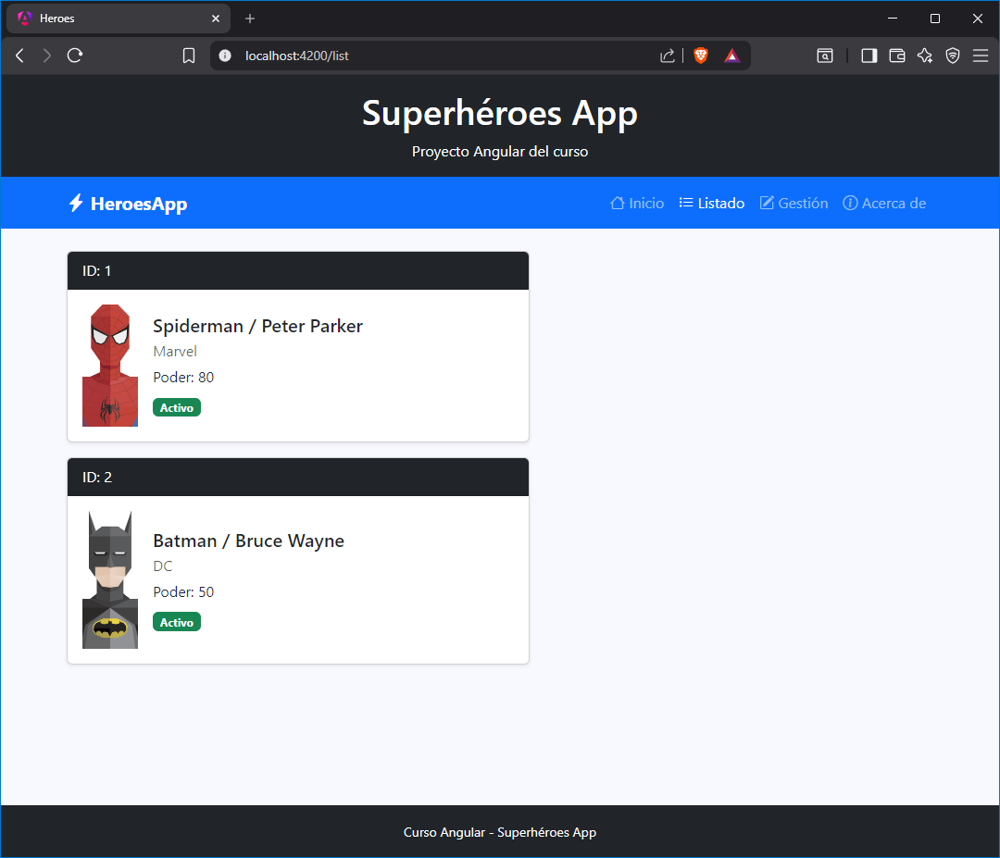
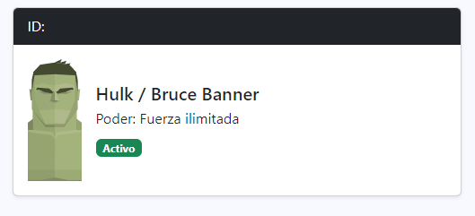
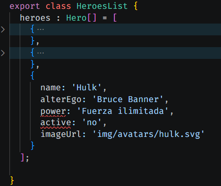
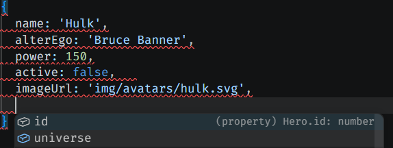
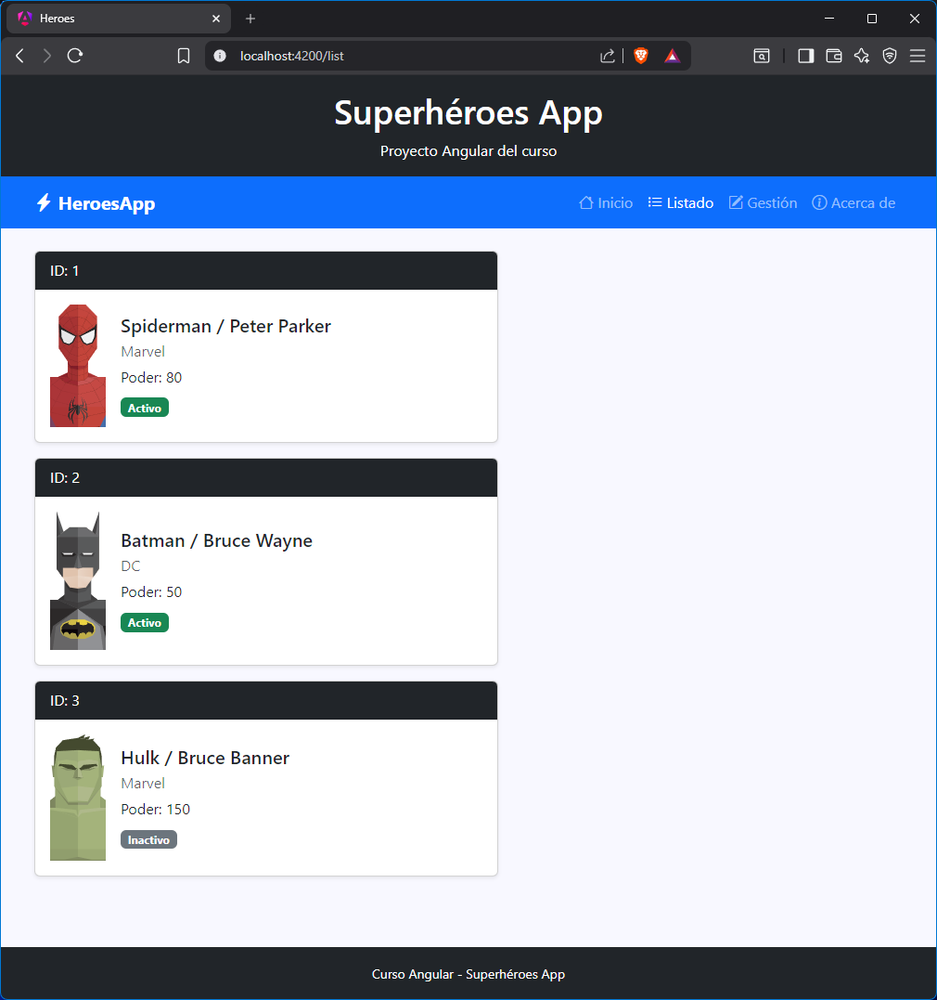

[TOC]


# Introducción

{.rounded-4}

Antes de entrar en qué es exactamente un modelo en Angular, es importante entender primero el problema que intentan resolver.

Hasta ahora hemos trabajado con datos directamente dentro de los componentes, utilizando objetos simples para representar la información. Este enfoque es muy habitual al principio, ya que es rápido y flexible.

Sin embargo, esa flexibilidad tiene un inconveniente: al no existir una estructura definida para los datos, es fácil que aparezcan inconsistencias, errores o falta de coherencia entre objetos similares, sobre todo cuando la aplicación empieza a crecer.

Por este motivo, antes de ver la solución, vamos a trabajar con un ejemplo real en la aplicación de héroes que nos permita visualizar claramente este problema. A partir de ahí, veremos cómo los modelos nos ayudan a solucionarlo.

# 🦸Listado de héroes (sin modelos)

En este punto vamos a empezar a trabajar con datos reales dentro de nuestra aplicación.

El objetivo será mostrar un listado de héroes en el componente `heroes-list`, sin utilizar todavía modelos ni estructuras avanzadas.

De momento, vamos a trabajar de la forma más sencilla posible: definiendo los datos directamente dentro del propio componente.

Esto nos permite centrarnos únicamente en la visualización de información.

Dentro del componente `heroes-list`, creamos un array de objetos:

```typescript
// heroes-list.ts
// ...
heroes = [
    {
        id: 1,
        name: 'Spiderman',
        alterEgo: 'Peter Parker',
        power: 80,
        active: true,
        imageUrl: 'img/avatars/spiderman.svg',
        universe: 'Marvel'
    },
    {
        id: 2,
        name: 'Batman',
        alterEgo: 'Bruce Wayne',
        power: 50,
        active: true,
        imageUrl: 'img/avatars/batman.svg',
        universe: 'DC'
    }
];
```

El siguiente paso sería mostrar dicho array de objetos en la vista `heroes-list.html` usando `@for` como ya vimos en [control de flujo](/tema/flujo):

```html
<!-- heroes-list.html -->

@for (hero of heroes; track hero.id) {

<div class="card mb-3 shadow-sm" style="max-width: 500px;">

  <div class="card-header text-bg-dark">
    ID: {{ hero.id }}
  </div>

  <div class="card-body d-flex align-items-center">

    

    <div class="flex-grow-1">

      <h5 class="card-title mb-1">
        {{ hero.name }} / {{hero.alterEgo}}
      </h5>

      <p class="card-text mb-1 text-muted">
        {{ hero.universe }}
      </p>

      <p class="card-text mb-2">
        Poder: {{ hero.power }}
      </p>

      @if (hero.active) {
      <span class="badge bg-success">Activo</span>
      } @else {
      <span class="badge bg-secondary">Inactivo</span>
      }

    </div>

  </div>

</div>

}
```

Y nuestra aplicación debería verse así si navegamos a la opción de <kbd>Listado</kbd>. Mostrando cada objeto del array `heroes` en una tarjeta.

{.rounded}

# El problema de no tener modelos

Hasta ahora hemos trabajado con un array de objetos dentro del componente `heroes-list`, donde todos los héroes siguen una estructura más o menos consistente.

Esto funciona bien mientras controlamos nosotros mismos los datos, pero en aplicaciones reales esto no siempre ocurre.

Para entender el problema, vamos a añadir un nuevo héroe al array: **Hulk**.

En este caso lo vamos a hacer a propósito con errores o inconsistencias, simulando una situación real donde los datos no están perfectamente controlados.

```typescript
{
  name: 'Hulk',
  alterEgo: 'Bruce Banner',
  power: 'Fuerza ilimitada',
  active: 'no',
  imageUrl: 'img/avatars/hulk.svg'
}
```

Si observamos este objeto, podemos detectar varios problemas:

- El campo `active` no es un booleano, sino un string (`'no'`).
- Falta la propiedad `id` y `universe`.
- No existe ninguna validación que nos impida añadir este tipo de datos.

A pesar de estos errores, la aplicación no falla completamente, **pero sí empiezan a aparecer inconsistencias en la visualización o en el comportamiento de la interfaz**.

Por ejemplo, el estado del héroe puede no mostrarse correctamente y seguir apareciendo como “Activo”, cuando habíamos puesto que “No”.

> [!tip]
>
> **Truthy o falsy:** En JavaScript, si se evalúa una cadena en una condición, se considera `false` si está vacía y `true` en cualquier otro caso. Por eso `if (active)` daría `true` si su valor es cualquier cadena de texto distinta de `''`.
>
> ```typescript
> if ('no') → true
> if ('') → false
> ```

{.rounded-4}

# Los modelos de datos

Para evitar este tipo de situaciones, Angular (a través de TypeScript) nos permite definir **modelos de datos**.

**Un modelo nos permite establecer una estructura fija que todos los objetos deben respetar**, garantizando que los datos sean consistentes desde el inicio.

Cuando creamos un modelo en una aplicación Angular, lo habitual es definirlo en un archivo independiente para poder reutilizarlo en distintos componentes.

## Crear un modelo

Estos archivos, por convención suelen organizarse dentro de una carpeta llamada `src/app/models`, y suelen tener el sufijo `.model.ts` pero es decisión tuya y de la organización del proyecto la ubicación y nombres de los mismos.

Por ejemplo, si queremos definir un modelo de usuario, el archivo podría llamarse `user.model.ts` y tendría el siguiente contenido:

```typescript
export interface User {
  id: number;
  name: string;
  email: string;
  active: boolean;
}
```

> [!warning]
>
> No existe un comando específico en Angular para crear un modelo de datos como tal, pero sí podemos generar una interfaz utilizando el Angular CLI con el comando `ng g interface models/user`.
>
> Aun así, **en la práctica se recomienda crear el archivo manualmente (por ejemplo `user.model.ts`) y definir la interfaz a mano**, ya que de esta forma tenemos un control total tanto sobre el nombre del archivo como sobre el nombre de la propia interfaz.
>
> Esto nos permite mantener una convención clara y consistente dentro del proyecto, evitando posibles discrepancias generadas automáticamente por el CLI.

**¿Qué estamos haciendo aquí?**

- `export` → permite usar el modelo en otros archivos de la aplicación.
- `interface` → define la estructura del objeto.
- `User` → nombre del modelo (por convención en PascalCase).
- propiedades → cada campo con su tipo de dato correspondiente.

## Usar del modelo

Una vez creado el modelo, podemos utilizarlo para tipar nuestros objetos dentro de cualquier componente o servicio.

Por ejemplo, si queremos crear un usuario dentro de un componente, lo haríamos de la siguiente forma:

```ts
import { User } from '../models/user.model';

// ...

const user: User = {
  id: 1,
  name: 'Tony Stark',
  email: 'tony@stark.com',
  active: true
};
```

> [!important]
>
> Esto nos permite asegurarnos de que los datos que estamos utilizando respetan la estructura definida previamente.

> [!note]
>
> Aquí estamos “tipando” una constante, pero se puede “tipar ”cualquier tipo de dato, como una variable, un atributo, el valor devuelto por una función o un método, etc. Tan solo hay que añadirle `:` después del nombre y añadir el nombre de la interfaz (recuerda, con PascalCase). 
>
> El `import` necesario lo hará el IDE de forma automática.

# 🦸Usando modelos en Héroes

Una vez entendido **qué es un modelo y cómo se define** de forma genérica, vamos a aplicarlo directamente en nuestro proyecto de héroes.

El objetivo es sustituir el array sin tipado que hemos estado utilizando hasta ahora, por un array basado en un modelo que garantice la estructura de los datos.

Para ello seguiremos estos pasos:

1. **Crear el archivo del modelo:** Manualmente creamos una carpeta `src/app/models` y en ella, un archivo nuevo en blanco llamado `hero.model.ts`. 

2. **Le añadimos el contenido** a `hero.model.ts`:

   ```typescript
   // hero.model.ts
   export interface Hero {
     id: number;
     name: string;
     alterEgo: string;
     power: number;
     active: boolean;
     imageUrl: string;
     universe: string;
   }
   ```

3. **Tipar el dato con el nuevo modelo**: Con nuestro ejemplo, el array de héroes en el componente `heroes-list`:

   ```typescript
   import { Hero } from '../models/hero.model'; // El import se hace automático
   
   export class HeroesList {
       heroes : Hero[] = [
           {},
           {},
           {}
       ];
   }
   ```

   

> [!tip]
>
> - Y con esto salen a la luz los posibles errores que hayamos cometido. **Ahora estaríamos obligados a corregir nuestros datos**, siguiendo la estructura que hemos definido en el modelo. 
>
> {.rounded-4}
>
> - Otra ventaja es que el ahora el **IDE puede ayudarnos a autocompletar** los atributos que faltan de los objetos y sus tipos de datos, puesto que ya sabe como se construye.
>
> {.rounded-4}

El contenido de `heroes-list.ts` quedaría así:

```typescript
import { Component } from '@angular/core';
import { Hero } from '../../../models/heroe.model';

@Component({
  selector: 'app-heroes-list',
  imports: [],
  templateUrl: './heroes-list.html',
  styleUrl: './heroes-list.css',
})
export class HeroesList {
  heroes : Hero[] = [
    {
      id: 1,
      name: 'Spiderman',
      alterEgo: 'Peter Parker',
      power: 80,
      active: true,
      imageUrl: 'img/avatars/spiderman.svg',
      universe: 'Marvel'
    },
    {
      id: 2,
      name: 'Batman',
      alterEgo: 'Bruce Wayne',
      power: 50,
      active: true,
      imageUrl: 'img/avatars/batman.svg',
      universe: 'DC'
    },
    {
      id: 3,
      name: 'Hulk',
      alterEgo: 'Bruce Banner',
      power: 150,
      active: false,   
      imageUrl: 'img/avatars/hulk.svg',
      universe: 'Marvel'
    }
  ];

}
```

Y la visualización del `heroes-list.html` quedaría así (el código no cambia nada):

{.rounded}

---

<div style="display:flex; justify-content:center; align-items:center; gap:12px; font-family:sans-serif; margin:16px 0;">
    <span style="font-weight:bold; font-family:monospace; background-color:#f1f3f5; color: #000000; padding:6px 10px; border-radius:6px; font-size:0.9rem;">
        <i class="pi pi-tag"></i>
        v3-modelos
    </span>
    <div style="display:flex; border: 2px solid white; border-radius: 999px;">
        <a href="https://stackblitz.com/github/borilio/heroes/tree/v3-modelos" target="_blank"
           style="display:flex; align-items:center; gap:6px; text-decoration:none; padding:8px 14px; font-size:0.9rem; color:white; background-color:#0d6efd; border-top-left-radius:999px; border-bottom-left-radius:999px;">
            <i class="pi pi-bolt"></i>
            Ver en StackBlitz
        </a>
        <a href="https://github.com/borilio/heroes/archive/refs/tags/v3-modelos.zip" target="_blank"
           style="display:flex; align-items:center; gap:6px; text-decoration:none; padding:8px 14px; font-size:0.9rem; color:white; background-color:#212529; border-top-right-radius:999px; border-bottom-right-radius:999px;">
            <i class="pi pi-github"></i>     
            Descargar de GitHub
        </a>
    </div>
</div>
