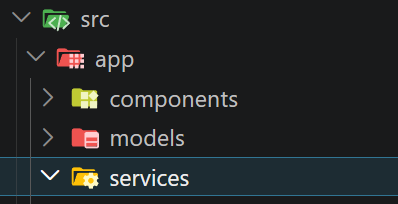
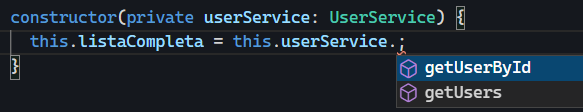

[TOC]

# Introducción a los servicios

![Un camarero nos da la bienvenida a un restaurante de lujo, en el cual a veces viene la mafia y otros personajes ilustres. No se come muy bien, pero es acogedor y su servicio siempre es muy discreto. Se suelen hacer eventos importantes, tanto políticos como empresariales. De lunes a viernes tienen menú del día bastante barato y postres caseros. A veces la cocinera suele salir a regañarte si no te lo terminas todo diciendo “que le pasa a ese pollo? no has chupado bien los huesos”. La pobre pasó mucha hambre en la posguerra y no hay quién le quite ese sentimiento profundo de sus entrañas. Y si, toda esta descripción es necesaria para entender los servicios en Angular](img/11-servicios/image-20260429114531608.png){.rounded-4}

Hasta ahora hemos estado trabajando con los datos directamente dentro de los componentes. Este enfoque es útil para empezar, pero tiene una limitación importante: **los componentes están asumiendo demasiadas responsabilidades**.

Por un lado, se encargan de la parte visual (la plantilla HTML) y, por otro, también gestionan los datos. A medida que la aplicación crece, esta mezcla de responsabilidades hace que el código sea **más difícil de mantener, reutilizar y escalar**.

> [!note]
>
> 🍽️Imagina un restaurante en el que una misma persona se encarga de todo: te da la bienvenida, toma nota, cocina la comida y la sirve. Y hace lo mismo para todos los clientes. No sería eficiente.

Aquí es donde entran en juego los **servicios**.

Un servicio es una clase cuya responsabilidad principal es **gestionar la lógica de negocio y el acceso a los datos**, separándola de los componentes.

> [!important]
>
> **De esta forma, los componentes se centran únicamente en mostrar información, mientras que los servicios se encargan de proporcionarla.** Cada uno no necesita saber como el otro hace su trabajo.

---

En lugar de definir los datos dentro del componente, podemos moverlos a un servicio y hacer que el componente los consuma desde ahí.

**Esto nos permite:**

- **Centralizar la gestión de datos**  
- **Reutilizar la misma información en distintos componentes**  
- **Mantener los componentes más simples y enfocados**  

Además, este enfoque tiene una ventaja muy importante a futuro.

Hoy estamos trabajando con datos definidos manualmente, pero en una aplicación real esos datos podrían venir de una API o de una base de datos.

Si toda esa lógica está encapsulada dentro de un servicio, **el día de mañana podremos cambiar la forma de obtener los datos sin modificar los componentes**.

Para los componentes, todo seguirá funcionando igual: seguirán pidiendo datos al servicio, sin importar de dónde vengan realmente.

{.rounded-4}

> [!tip]
>
> Imagina un servicio como la cocina de un restaurante de comida rápida.
>
> El dependiente (el componente) toma el pedido del cliente y lo envía a la cocina (el servicio). La cocina decide cómo preparar ese pedido: puede hacerlo en el momento o tener parte ya preparada. En cualquier caso, esa decisión le corresponde únicamente a la cocina.
>
> Una vez listo, la cocina entrega el menú completo (los datos): hamburguesa, patatas y bebida. El dependiente recoge ese pedido y se lo entrega al cliente.
>
> - 👨‍💼 **Dependiente → Componente**: Solicita los datos y los muestra al usuario  
>   
> - 👨‍🍳 **Cocina → Servicio**: Se encarga de preparar y gestionar los datos  
>   
> - 🍔🍟🥤 **Menú → Datos**: Es la información que el componente necesita  
>
> 🔎**Fíjate en un detalle importante:** El dependiente **no sabe cómo se ha preparado la comida**. No conoce los procesos internos ni necesita conocerlos. Su única responsabilidad es pedir el menú y entregarlo.
>
> Y si mañana la cocina cambia su forma de trabajar o mejora sus procesos, el dependiente seguirá funcionando exactamente igual, sin necesidad de modificar nada.
>

# Crear un servicio

Al igual que pasa con los modelos, los servicios se definen en archivos independientes para poder reutilizarlos en distintos componentes de la aplicación.

Por convención, los servicios suelen organizarse dentro de una carpeta como `src/app/services/`, aunque, como siempre, la ubicación concreta dependerá de la organización del proyecto.

{.rounded-4}

## Nombre del archivo

Los servicios suelen seguir una convención de nombres clara:

- nombre descriptivo
- sufijo `.service.ts`

Por ejemplo: `user.service.ts` para el nombre del archivo y `UserService` para nombre de la clase.

## Crear el servicio con Angular CLI

Angular sí proporciona un comando específico para generar servicios:

```shell
ng generate service services/user.service
```

o su versión abreviada:

```shell
ng g s services/user.service
```

Este comando genera automáticamente:

- La carpeta `services` si no existía.
- El archivo del servicio (`user.service.ts`)
- El archivo de pruebas (`user.service.spec.ts`)

> [!note]
>
> 🧪 El archivo de pruebas podemos eliminarlo, o no crearlo añadiendo `--skip-tests`.

## Estructura básica de un servicio

Un servicio en Angular es simplemente una clase decorada con `@Injectable`.

Su estructura básica sería:

```typescript
import { Injectable } from '@angular/core';

@Injectable({
  providedIn: 'root',
})
export class UserService {}
```

## Añadir lógica al servicio

Hasta ahora hemos creado el servicio, pero todavía no hace nada. Antes de utilizarlo desde un componente, vamos a añadirle un poco de lógica añadiendo:

- Un array con la lista de usuarios completa.
- Un método para obtener todos los usuarios
- Un método para obtener un usuario concreto según la id recibida.

La idea es que el servicio sea el encargado de gestionar los datos, incluso ahora que todavía no estamos trabajando con una API o una base de datos real.

```typescript
import { Injectable } from '@angular/core';
import { User } from '../models/user.model';

@Injectable({
    providedIn: 'root',
})
export class UserService {

    // Atributo privado users que contiene un User[]
    private users: User[] = [
        {
            id: 1,
            name: 'Tony Stark',
            email: 'tony@stark.com',
            active: false
        },
        {
            id: 2,
            name: 'Steve Rogers',
            email: 'steve@shield.com',
            active: true
        }
    ];

    // Retornamos el array completo de users
    getUsers(): User[] {
        return this.users;
    }

	// Retornamos el User por la id indicada o undefined si no existe
    getUserById(id: number): User | undefined {
        for (let user of this.users) {
            if (user.id === id) {
                return user;
            }
        }
        return undefined;
    }

}
```

# Usar un servicio desde un componente

Hasta ahora hemos creado nuestro servicio y hemos visto cómo centraliza la lógica y los datos de la aplicación.

Ahora vamos a ver cómo utilizarlo desde un componente para obtener los datos que tiene que representar.

## Consumiendo el servicio

Imaginemos un componente cualquiera llamado `ListadoComponent`. Queremos mostrar una lista con todos los usuarios.

El flujo será siempre el mismo:

1. El componente necesita acceder al servicio.
2. El servicio nos devuelve los datos.
3. Guardamos esos datos en una propiedad del componente.
4. Los mostramos en la vista (`listado.component.html`).

## Inyección del servicio en el componente

En Angular, los servicios se inyectan directamente en el constructor del componente. Esto es lo que se conoce como **inyección de dependencias**.

```typescript
import { Component } from '@angular/core';
import { User } from '../../models/user.model';
import { UserService } from '../../services/user.service';

@Component({
  selector: 'app-listado-component',
  imports: [],
  templateUrl: './listado.component.html',
  styleUrl: './listado.component.css',
})
export class ListadoComponent {

  public listaCompleta: User[] = [];

  constructor(private userService: UserService) {
    this.listaCompleta = this.userService.getUsers();
  }

}
```

> [!important]
>
> 1. El servicio se inyecta directamente en el constructor del componente. De esta forma, Angular nos proporciona una instancia de `UserService` lista para ser utilizada, con todos sus métodos disponibles.
>
>    {.rounded-4}
>
> 2. A partir de esa instancia, utilizamos los métodos del servicio para obtener los datos que necesitemos y asignarlos a la propiedad del componente (`listaCompleta`).
>
> 3. Cuando el componente se inicializa, el constructor se ejecuta automáticamente, por lo que los datos se cargan en ese momento y quedan listos para ser mostrados en la plantilla HTML.


## Mostrar los datos en la plantilla

Ahora que el componente ya obtiene los datos desde el servicio, el siguiente paso es mostrarlos en la vista tal y como hemos venido haciendo hasta ahora.

> [!warning]
>
> En este punto es importante entender algo clave: el uso del servicio no cambia la forma en la que se muestran los datos, únicamente cambia **de dónde vienen**.
>
> La presentación en la plantilla sigue funcionando exactamente igual, independientemente de si los datos están definidos dentro del componente o si provienen de un servicio.

En este ejemplo, lo haremos visualizando los datos en una tabla HTML:

````html
<!-- listado.component.html -->
<table>

  <thead>
    <tr>
      <th>ID</th>
      <th>Nombre</th>
      <th>Email</th>
      <th>Estado</th>
    </tr>
  </thead>

  <tbody>

    @for (user of this.listaCompleta; track user.id) {

      <tr>
        <td>{{ user.id }}</td>
        <td>{{ user.name }}</td>
        <td>{{ user.email }}</td>
        <td>{{ user.active ? 'Activo' : 'Inactivo' }}</td>
      </tr>

    }

  </tbody>

</table>
````

<div style="
  display: flex;
  justify-content: center;
  margin: 20px 0px;
">
  <a href="https://stackblitz.com/edit/demo-servicios" target="_blank" style="
    display: inline-flex;
    align-items: center;
    gap: 10px;
    padding: 8px 14px;
    border-radius: 999px;
    background-color: #1e1e1e;
    border: 1px solid #333;
    color: #ffffff;
    text-decoration: none;
  ">
    
    Abrir en StackBlitz <code style="color:#49A2F8">demo-servicios</code>
  </a>
</div>

# Profundidad adicional (opcional)

En este punto ya hemos visto cómo funcionan los servicios y cómo se utilizan dentro de los componentes.

A continuación vamos a ver algunos conceptos internos de Angular que ayudan a entender mejor qué está ocurriendo por detrás. No es imprescindible para usar servicios, pero sí muy recomendable para comprender su comportamiento.

## Inyección de dependencias

La inyección de dependencias es el mecanismo que utiliza Angular para proporcionarnos instancias de clases (como servicios) sin que tengamos que crearlas manualmente.

Cuando pedimos un servicio en el constructor, Angular se encarga de crearlo o proporcionarlo automáticamente.

> [!note]
>
> El modificador de acceso (`private`, `public`, `protected`) no es necesario para que Angular pueda inyectar un servicio, pero sí es importante a nivel de diseño.
>
> En la mayoría de casos se utiliza `private`, ya que indica que el servicio solo se utilizará dentro de la lógica del componente y no será accesible desde la plantilla HTML.
>
> Si se utiliza `public`, el servicio también será accesible desde la vista, lo que puede llevar a mezclar lógica con presentación y no suele ser recomendable.

## Decorador `@Injectable`

Los servicios necesitan el decorador `@Injectable` para poder ser gestionados por el sistema de Angular.

```typescript
@Injectable({
  providedIn: 'root'
})
```

## Patrón Singleton

Cuando un servicio se registra con `providedIn: 'root'`, Angular lo crea siguiendo el patrón **Singleton**.

Esto significa que:

- Se crea **una única instancia del servicio** en toda la aplicación.
- Esa misma instancia es compartida por todos los componentes que la utilicen.
- No se genera una nueva copia del servicio cada vez que se inyecta.

En la práctica, todos los componentes están utilizando el mismo servicio (la misma instancia del objeto).

> [!important]
>
> Esto permite compartir información entre componentes sin necesidad de pasar datos manualmente entre ellos.
>
> Por ejemplo, si un componente modifica los atributos de un servicio, cualquier otro componente que lo esté usando verá esos cambios automáticamente.

## Un servicio puede inyectar otros servicios

```typescript
import { Injectable } from '@angular/core';

@Injectable({
    providedIn: 'root',
})
export class UserService {
	constructor(private http: HttpClient) {}
}
```

Un servicio puede depender de otros servicios, como ya veremos más adelante. Esto permite construir capas de lógica.

En este caso, sin adelantar mucho, solo diremos que `HttpClient` en un servicio, que está siendo inyectado en el servicio `UserService`.

# 🦸 Usando servicios en la aplicación Héroes

![Misma ilustración del camarero anterior (con la misma historia detrás), solo que ahora muestra su identidad secreta y revela que por el día trabaja de camarero y los domingos lucha contra la explotación en el sector hostelero con la fuerza y rapidez de SUPER SERVICE WAITER. Tiene como superpoderes que brilla en la oscuridad cuando recibe propina,   tiene el doble de memoria retener mensajes del tipo “niño, ¿puedes traer alioli?”, o “chico, cuando puedas me traes la cuenta, que la he pedido 7 veces ya, que te quedará mu bonico el traje pero vaya si te hace la cabeza gorda”.](img/11-servicios/image-20260429175008968.png){.rounded-4}

Una vez entendido cómo funcionan los servicios de forma genérica, vamos a aplicarlo directamente a nuestro proyecto de héroes.

El objetivo es el mismo que hemos visto en el ejemplo anterior, pero ahora trabajando con nuestros propios datos.

Hasta ahora, el componente `heroes-list` contenía directamente el array de héroes. Esto funciona, pero no es lo ideal, ya que mezcla la lógica de datos con la lógica de presentación.

Para mejorar esto, vamos a mover la gestión de los héroes a un servicio.

## Paso 1: crear el servicio de héroes

Creamos un servicio llamado `HeroService`, donde centralizaremos toda la lógica relacionada con los héroes.

Este servicio será el encargado de proporcionar los datos al resto de la aplicación.

```shell
ng g s services/hero.service --skip-tests
```

## Paso 2: mover los datos al servicio

El array de héroes que antes estaba en el componente pasa ahora al servicio.

```typescript
// hero.service.ts
import { Injectable } from '@angular/core';
import { Hero } from '../models/heroe.model';

@Injectable({
  providedIn: 'root',
})
export class HeroService {
  // Atributos
  private heroes: Hero[];

  // Constructor
  constructor() {
    this.heroes = [
      {
        id: 1,
        name: 'Spiderman',
        alterEgo: 'Peter Parker',
        power: 80,
        active: true,
        imageUrl: 'img/avatars/spiderman.svg',
        universe: 'Marvel'
      }
      // En el repo encontrarás el array completo
    ];
  }

  // Métodos disponibles del servicio

  /**
   * Método que retorna la lista completa de Heroes
   */
  public getHeroes(): Hero[] {
    return this.heroes;
  }

  /**
   * Método que retorna un Hero según la id, o bien undefined si no existe.
   */
  public getHeroById(id: number): Hero | undefined {
    for (let hero of this.heroes) {
      if (hero.id === id) {
        return hero;
      }
    }
    return undefined;
  }

}
```

> [!important]
>
> El array `heroes` está definido como `private`, lo que significa que no se puede acceder directamente desde fuera del servicio.
>
> Esto obliga a utilizar métodos como `getHeroes()` o `getHeroById()`, permitiendo que el servicio controle cómo se accede y se manipula la información.

> [!warning]
>
> El método `getHeroById()` se incluye como ejemplo para mostrar que en un servicio podemos definir distintos métodos según cómo necesitemos acceder a los datos.
>
> **En este caso concreto no lo estamos utilizando**, pero su objetivo es ilustrar que los servicios crecen de forma progresiva: iremos añadiendo nuevos métodos a medida que la aplicación los necesite.

## Paso 3: consumir el servicio desde el componente

En el componente `heroes-list`, inyectamos el servicio y utilizamos sus métodos para obtener los datos y guardarlos en el array que ya teníamos `heroes`.

```typescript
// heroes-list.ts
import { Component } from '@angular/core';
import { Hero } from '../../../models/heroe.model';
import { HeroService } from '../../../services/hero.service';

@Component({
  selector: 'app-heroes-list',
  imports: [],
  templateUrl: './heroes-list.html',
  styleUrl: './heroes-list.css',
})
export class HeroesList {
  public heroes: Hero[];

  constructor(private heroService: HeroService) {
    this.heroes = heroService.getHeroes();
  }
}
```

> [!note]
>
> **El array `heroes` es el mismo que ya utilizábamos anteriormente para mostrar la información en la vista.** Por esta razón en el HTML no tenemos que cambiar nada.
>
> La diferencia es que antes lo inicializábamos directamente en el componente, y ahora su contenido proviene del servicio.


##  Resultado final

- El servicio se encarga de los datos
- El componente se encarga de la vista
- La aplicación queda mejor organizada y más escalable

Si en el futuro estos datos vinieran de una API (spoiler: vendrán 😏) o una base de datos, **solo habría que modificar el servicio**, sin tocar el componente.

<div style="display:flex; justify-content:center; align-items:center; gap:12px; font-family:sans-serif; margin:16px 0;">
    <span style="font-weight:bold; font-family:monospace; background-color:#f1f3f5; color: #000000; padding:6px 10px; border-radius:6px; font-size:0.9rem;">
        <i class="pi pi-tag"></i>
        v4-servicios
    </span>
    <div style="display:flex; border: 2px solid white; border-radius: 999px;">
        <a href="https://stackblitz.com/github/borilio/heroes/tree/v4-servicios" target="_blank"
           style="display:flex; align-items:center; gap:6px; text-decoration:none; padding:8px 14px; font-size:0.9rem; color:white; background-color:#0d6efd; border-top-left-radius:999px; border-bottom-left-radius:999px;">
            <i class="pi pi-bolt"></i>
            Ver en StackBlitz
        </a>
        <a href="https://github.com/borilio/heroes/archive/refs/tags/v4-servicios.zip" target="_blank"
           style="display:flex; align-items:center; gap:6px; text-decoration:none; padding:8px 14px; font-size:0.9rem; color:white; background-color:#212529; border-top-right-radius:999px; border-bottom-right-radius:999px;">
            <i class="pi pi-github"></i>     
            Descargar de GitHub
        </a>
    </div>
</div>

---

## ¿Que pasaría si...?

Como ejercicios, te proponemos los siguientes retos para reforzar lo que hemos visto:

- **¿Qué ocurriría si el servicio devolviera una lista vacía de héroes?**  
  ¿Qué se mostraría en el listado? ¿Cómo podrías gestionar esta situación para mejorar la experiencia de usuario?
  🔎Pista: `@empty`
  
- **Crea un nuevo listado en formato tabla.** Para ello deberás:
  
  - Crear un nuevo componente. Elije tu el nombre, pero que se integre con el resto.
  - Definir una nueva ruta en el routing (`app.routes.ts`).
  - Añadir un enlace en la barra de navegación. 
  
  En este caso, no debes modificar el servicio. Simplemente tendrás que consumirlo desde el nuevo componente para obtener los héroes, igual que hacemos con el listado de tarjetas.
