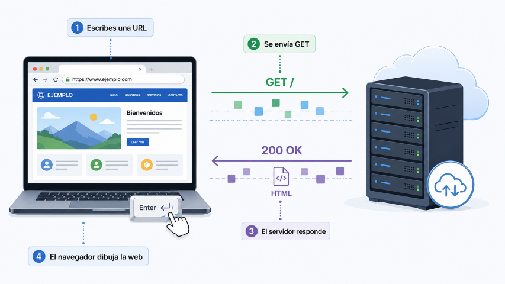
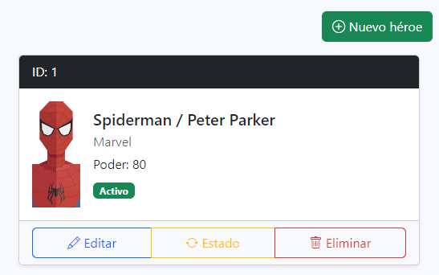
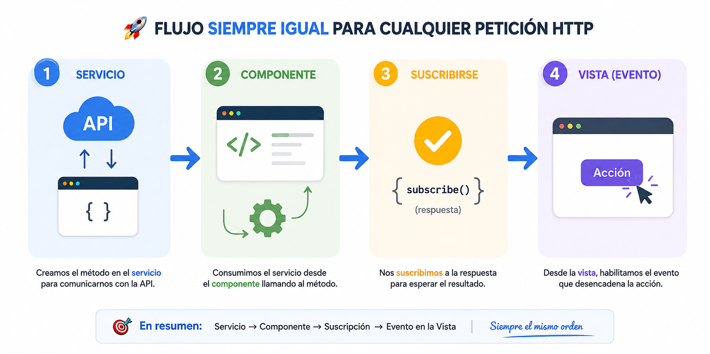

[TOC]

# Introducción

En este tema aprenderemos cómo realizar **peticiones HTTP en Angular** para comunicar nuestra aplicación con un servidor y trabajar con datos reales. 

Antes de llegar a la parte práctica, primero repasaremos algunos conceptos importantes como frontend y backend, APIs, formato JSON y tipos de peticiones HTTP, ya que entender este contexto nos ayudará a comprender mejor lo que hace Angular por detrás.

{.rounded-4}

# Contexto inicial

Si entiendes todos los conceptos de la imagen anterior, puedes saltar al siguiente epígrafe <kbd>Peticiones HTTP en Angular</kbd>. Si no, quédate un ratito más leyendo 😏.

## Frontend vs Backend

Una aplicación suele dividirse en **dos partes principales**:

- 🖥️ **Frontend**: Es la parte visual con la que interactúa el usuario (páginas, botones, formularios, menús, listados, etc.)
  En nuestro caso, **Angular se utiliza para crear el frontend**.
- ⚙️ **Backend**: Es la parte interna encargada de gestionar los datos y la lógica de la aplicación (base de datos, validar usuarios, procesar datos, responder peticiones del front, etc.).
  Puede estar hecho en **Java**, **PHP** o cualquier otro lenguaje de servidor.

**Cómo se relacionan**

El funcionamiento habitual es sencillo:

1. El frontend solicita información
2. El backend responde con los datos
3. El frontend los muestra al usuario

> [!important]
>
> Separar **frontend** y **backend** permite organizar mejor los proyectos, reutilizar los datos desde distintas aplicaciones (web, móvil, escritorio) y facilitar el trabajo en equipo, **ya que cada parte puede desarrollarse de forma independiente**.

## API REST

Una **API** (*Application Programming Interface*) es un sistema que permite que dos aplicaciones se comuniquen entre sí.

> [!tip]
>
> En la ilustración anterior, se representa mediante el puente y los mensajeros que se intercambian información.

En nuestro caso, Angular podrá utilizar una API para solicitar datos a un backend o enviar información.

Cuando esa API sigue ciertas normas habituales de comunicación mediante HTTP, se suele denominar **API REST**.

Gracias a una API REST, nuestra aplicación puede realizar acciones como:

- 📥 Obtener usuarios o productos
- ➕ Crear nuevos registros
- ✏️ Modificar información existente
- 🗑️ Eliminar datos

Normalmente una API REST ofrece distintas direcciones llamadas **endpoints**, por ejemplo:

- `/users`
- `/heroes`
- `/products`

> [!tip]
>
> Un **endpoint** es la dirección concreta que usamos para acceder a un recurso.
>
> - 📦 **Recurso** → el “tipo de dato” (`users`, `heroes`, `products`).
> - 🌐 **Endpoint** → la “URL concreta” para acceder a ese recurso.

En este temario crearemos nuestra propia API en 30 segundos. Y así poder practicar todo el funcionamiento completo sin tener que programar un backend desde 0.

## JSON como formato de intercambio

Cuando una API se comunica con una aplicación, necesita una forma común de enviar y recibir información.

Ese formato es normalmente **JSON**.

**JSON (JavaScript Object Notation)** es un formato de texto ligero que se utiliza para representar datos de manera estructurada y fácil de leer tanto para personas como para máquinas.

Por ejemplo, una API puede enviar un usuario o un héroe en formato JSON, y Angular lo interpreta para mostrarlo en pantalla.

{.rounded-4}

Es muy importante porque es el **estándar más utilizado en las APIs REST**, ya que:

- Es sencillo de leer
- Es fácil de generar desde cualquier lenguaje
- Funciona perfectamente en aplicaciones web

> [!important]
>
> JSON es el “idioma común” que utilizan el frontend y el backend para intercambiar información.

## Tipos de peticiones HTTP

### 📡 Introducción

{.rounded-4}

Cuando escribimos una dirección en el navegador (por ejemplo, `https://www.google.com`) y pulsamos <kbd>Intro</kbd>, en realidad estamos realizando una **petición HTTP** al servidor de esa página.

El navegador envía una solicitud, normalmente de tipo **GET**, indicando que quiere obtener el contenido asociado a esa dirección.

El servidor recibe la petición, la procesa y responde devolviendo dos elementos principales:

- **Un código de estado**: indica cómo ha ido la solicitud.
  - `200 OK` → todo correcto.
  - `404 Not Found` → el recurso solicitado no existe.
  - `500 Internal Server Error` → error en el servidor.
- **Un contenido**: los datos solicitados.
  - Habitualmente será **HTML** en una página web.
  - Pero también puede ser **JSON**, **XML**, imágenes, archivos u otros formatos.

Cuando la respuesta contiene HTML, el navegador interpreta ese código y lo dibuja en pantalla como una página visual.

Aunque no lo parezca, esto lo hacemos constantemente al navegar por internet. Cada vez que abrimos una web, consultamos una página o pulsamos muchos enlaces, estamos utilizando HTTP para comunicarnos con servidores.

> [!tip]
>
> **¿Sabías que...?** 🤓☕
> Dentro de los códigos oficiales de HTTP existe el curioso error **`418 I'm a teapot`** (*Soy una tetera*). El servidor retornará este código de error si le pides café a una tetera.
>
> Fue creado como una broma técnica en un estándar experimental de 1998, indicando que una tetera no puede preparar café. Aunque nació en tono humorístico, se hizo tan famoso que muchos programas y APIs todavía lo incluyen como guiño geek.
>
> 🏛️ Versión histórica en RFC Editor: https://www.rfc-editor.org/rfc/rfc2324

---

Cuando trabajamos con una API REST, no siempre hacemos el mismo tipo de acción. Dependiendo de lo que queramos hacer (leer datos, crear, modificar o eliminar), utilizaremos un **tipo de petición HTTP distinto**.

A estos tipos se les llama **métodos HTTP** o **verbos HTTP**.

> [!important]
>
> Por ejemplo, en la petición de ejemplo anterior a `/heroes`, es una petición de tipo `GET`, y recibimos el contenido en formato `JSON`.

Los más importantes son:

---

### 📥 GET (leer datos)

Se utiliza para **obtener información del servidor** sin modificar nada.

Por ejemplo:

- Obtener todos los héroes (`/heroes`)
- Obtener un usuario concreto (`/users/5`)
- Obtener todos héroes inactivos (`/heroes?active=false`)

**Ejemplo de endpoint:**

```http
GET /users
```

Nos daría la siguiente respuesta:

```json
{
    "users": [
        {
            "id": 1,
            "name": "Happy Hogan",
            "email": "happy.hogan@starkindustries.com",
            "active": true
        },
        {
            "id": 2,
            "name": "Nick Fury",
            "email": "nick.fury@shield.gov",
            "active": true
        },
        {
            "id": 3,
            "name": "Alfred Pennyworth",
            "email": "alfred.pennyworth@wayneenterprises.com",
            "active": true
        },
        {
            "id": 4,
            "name": "Lois Lane",
            "email": "lois.lane@dailyplanet.com",
            "active": true
        }
    ]
}
```

> [!note]
>
> Es el más común y el que más vamos a utilizar en consultas.

> [!caution]
>
> Las peticiones **GET solo leen datos**, no deben modificar nada en el servidor.

---

### ➕ POST (crear datos nuevos)

Se utiliza para **enviar información nueva al servidor** y crear un nuevo registro.

Por ejemplo:

- Crear un nuevo usuario
- Añadir un héroe

**Ejemplo de endpoint:**

```http
POST /heroes
```

> [!note] 
>
> Normalmente se envía un cuerpo (body) con los datos a añadir “adjuntos” en JSON. Ya veremos como se hace esto.

---

### ✏️ PUT (actualizar completamente)

Se utiliza para **actualizar un recurso existente**, sustituyéndolo por completo.

Por ejemplo:

- Editar un usuario
- Modificar todos los datos de un héroe

**Ejemplo de endpoint:**

```http
PUT /heroes/1
```

> [!note]
>
> Se envía el objeto completo actualizado. Igual que con `POST`, se envía un “adjunto” en JSON con todos los nuevos datos.

> [!warning]
>
> Si falta algún campo en el envío, puede sobrescribirse o perderse en el servidor.

---

### 🩹 PATCH (actualización parcial)

Se utiliza para **modificar solo una parte de un recurso**, sin necesidad de enviar todo el objeto.

Por ejemplo:

- Cambiar solo el nombre de un usuario
- Actualizar solo el poder de un héroe

**Ejemplo de endpoint:**

```http
PATCH /heroes/1
```

> [!note] 
>
> Es más ligero que `PUT` cuando solo queremos cambiar un dato. Igual que los anteriores, debemos enviar un JSON “adjunto” pero ahora solo con los atributos que queremos cambiar, no completo.

---

### 🗑️ DELETE (eliminar datos)

Se utiliza para **eliminar un recurso del servidor**.

Por ejemplo:

- Eliminar un usuario
- Eliminar un héroe

**Ejemplo de endpoint:**

```http
DELETE /heroes/1
```

> [!note]
>
> Normalmente no devuelve datos, solo confirma la eliminación.

---

> [!important]
>
> Estos métodos forman la base de cualquier API REST moderna y son la base de toda la comunicación entre frontend y backend (independientemente de la tecnología y lenguajes que usen cada uno).

# Creando nuestro propio backend

Para poder practicar todo lo que veremos en este tema, vamos necesitar un backend, y lo vamos a crear utilizando una API simulada con **json-server**, que nos permite crear un backend falso en local en muy poco tiempo.

Toda la instalación y configuración está explicada en la píldora de json-server, donde podrás ver el proceso paso a paso.

<div style="text-align:center; margin-top:10px;">  
    <a href="/tema/json-server" target="_blank" style="display:inline-block; padding:10px 16px; margin: 3rem; background:#0d6efd; color:white; text-decoration:none; border-radius:6px; font-weight:600;">💊 Ver píldora de json-server</a>
</div>

# Peticiones HTTP en Angular (GET)

> [!warning]
>
> Vamos a explicar todo lo necesario para entender y utilizar las peticiones HTTP en Angular. En este apartado trabajaremos únicamente con el método **GET**, ya que nos permite centrarnos en el flujo completo de comunicación con una API de forma progresiva.
>
> Más adelante, en el siguiente bloque, aplicaremos exactamente el mismo flujo para el resto de métodos (`POST`, `PUT`, `PATCH` y `DELETE`), sin volver a repetir estos conceptos base.

Hasta ahora hemos visto cómo funciona la comunicación entre frontend y backend, qué es una API REST y cómo se organizan los recursos y endpoints.

Ahora vamos a ver cómo Angular se comunica realmente con una API para **obtener y enviar datos**.

Para ello utilizaremos dos herramientas fundamentales:

- 🌐 **HttpClient de Angular**
- 🧪 **json-server** (para simular una API real)

## `HttpClient` en Angular

Angular nos proporciona un módulo específico para trabajar con peticiones HTTP llamado **`HttpClient`**.

Este servicio nos permite:

- 📥 Obtener datos (`GET`)
- ➕ Enviar datos (`POST`)
- ✏️ Actualizar datos (`PUT` / `PATCH`)
- 🗑️ Eliminar datos (`DELETE`)

Todo de forma sencilla y basada en **observables**.

## Configurar el proyecto

Para que la aplicación funcione correctamente, necesitamos realizar una configuración global:

- 🌐 `HttpClient`: permite comunicarnos con APIs REST
- ⚙️ Zone.js + `provideZoneChangeDetection`: aseguran que Angular detecte los cambios en los datos y los refleje en la interfaz

**Son cambios muy simples y solo tenemos que hacerlos una vez**.

### Instalar Zone.js

En una terminal en la carpeta del proyecto, tenemos que instalar la librería `zone.js`.

```shell
npm install zone.js
```

Y en el archivo `main.ts` hacer su correspondiente import:

```typescript
// main.ts
import 'zone.js'; // Lo añadimos arriba, en la zona de los imports
// (...resto del main.ts lo dejamos como está)
```

> [!warning]
>
> En Angular 20 no había que hacer esto. Para que veas que de una versión a otra pueden complicarte la vida.

### Activar providers (zone.js y HttpClient)

En Angular moderno (+20), antes de realizar peticiones HTTP, debemos registrar `HttpClient` y la detección de cambios en la configuración global de la aplicación.

Para ello, tenemos que abrir el `app.config.ts` y añadir:

- `provideHttpClient()`
- `provideZoneChangeDetection({ eventCoalescing: true })`
- Ambos se añadirán a la lista de providers que ya tenga la aplicación, con sus correspondientes imports.

```typescript
// app.config.ts
import { provideHttpClient } from '@angular/common/http';
import { provideZoneChangeDetection } from '@angular/core';

export const appConfig = {
  providers: [
    // (...), 
    provideHttpClient(),
    provideZoneChangeDetection({ eventCoalescing: true })
  ]
};
```

> [!caution]
>
> Si no haces esto, cualquier intento de inyectar `HttpClient` dará error y no funcionará nada relacionado con servicios HTTP.

> [!important]
>
> Esto solo se configura una vez por proyecto.

## Inyectar `HttpClient` y usarlo en el servicio

Una vez activado `HttpClient` y `zone.js` en la configuración global del proyecto, ya podemos utilizarlo dentro de nuestros componentes o servicios.

Lo más habitual es usarlo dentro de un **servicio**, ya que son los encargados de obtener y dar información.

Para ello, simplemente debemos:

1. **Importarlo e inyectarlo** en la clase donde lo vayamos a usar (normalmente el servicio).
2. Modificar los métodos del servicio para que en lugar de retornar los valores en memoria como antes, **retornar el resultado de la petición HTTP** a la API.

```typescript
// user.service.ts
import { Injectable } from '@angular/core';
import { HttpClient } from '@angular/common/http';
import { User } from './user.model';

@Injectable({ 
    providedIn: 'root' 
})
export class UserService {
    // 1. Lo inyectamos en el constructor
    constructor(private http: HttpClient) {}

    // 2. Usamos http en los métodos hacer peticiones GET a la API, retornando el resultado
    getUsers() {
        return this.http.get<User[]>('https://api.midominio.com/users');
    }

    // Ya no tenemos que buscar nosotros el héroe en el array, lo hace la API por nosotros
    getUserById(id: number) {
        return this.http.get<User | undefined>(`https://api.midominio.com/users/${id}`);
    }
}
```

> [!important]
>
> - ⚠️ Fíjate en que al método `getUsers()` **no le hemos indicado el tipo de retorno**. Lo hacemos así para simplificar el ejemplo y centrarnos primero en entender el flujo general.
> - 🧙‍♂️ Más adelante veremos que realmente este método **no devuelve directamente un array de usuarios**, sino otro tipo de objeto que Angular utiliza para trabajar con datos asíncronos.
> - 💡 De momento quédate con la idea principal: el servicio hace la petición y devuelve el resultado para poder utilizarlo desde otro lugar de la aplicación.
> - 🏷️ También observa que usamos `User[]` dentro de `get<User[]>()` para indicarle a Angular qué tipo de datos esperamos recibir desde la API.
> - 📤 La petición todavía **no muestra nada en pantalla por sí sola**. Solo retorna la respuesta que nos ha dado la API que después tendrá que “tratar” el componente.

> [!tip]
>
> En TypeScript podemos usar **template strings** con comillas invertidas  para construir textos dinámicamente. 
> En este caso nos permite unir la URL base con la `id` de forma cómoda sin concatenaciones manuales:
>
> ```typescript
> `https://api.midominio/users/${id}`
> ```
>
> Si `id` vale `5`, el resultado sería:
>
> ```url
> http://localhost:3000/heroes/5
> ```
>
> Sería el equivalente a hacer la concatenación manual:
>
> ```typescript
> "https://api.midominio/users/" + id
> thisApiURL + "/users/" + id
> ```
>
> Cuando concatenas varias subcadenas para construir una cadena, es más legible y fácil el uso de **template strings**.

> [!note]
>
> El objeto que hemos llamado `http` del tipo `HttpClient`, tiene distintos métodos para trabajar con APIs, como `.get()`, `.post()`, `.put()`, `.patch()` o `.delete()`. Cada uno se utiliza para realizar un tipo de petición HTTP diferente. Los veremos uno a uno más adelante.
>
> 


## Consumir el servicio desde el componente

Ya hemos preparado el servicio para que obtenga los datos desde una API usando `HttpClient`.

El siguiente paso será **usar ese servicio desde el componente**, igual que hacíamos antes.

Por ejemplo:

```typescript
// users-list.ts
import { Component } from '@angular/core';
import { UserService } from './user.service';

@Component({
  selector: 'app-users-list',
  templateUrl: './users-list.html'
})
export class UsersComponent {

  public users = [];

  constructor(private userService: UserService) {}

  ngOnInit() {
    this.users = this.userService.getUsers();
  }

}
```

Sin embargo, ahora aparece un problema.

Antes, nuestro método `getUsers()` retornaba directamente un array en memoria (`User[]`), por lo que podíamos asignarlo sin más en nuestro atributo, que era también otro `User[]`. 

Ahora el IDE nos mostrará un error parecido a este:

{.rounded-4}

Si dejas el cursor unos segundos encima de `this.users` y `this.userService.getUsers()` verás que el **error viene porque son tipos de datos distintos**.

{.rounded-4}

El servicio nos retorna un objeto de tipo **Observable** y queremos asignarlo a una variable de tipo `User[]`. Son tipos distintos de datos. Y aquí, nos tenemos que detener un poco a explicar que es un `Observable`.

## Observables

La API necesita un pequeño tiempo para responder.

Cuando Angular hace una petición HTTP, **los datos no llegan instantáneamente**, por lo que `HttpClient` no puede devolver directamente el array de usuarios puesto que no lo tiene.

En su lugar, devuelve un objeto especial llamado **Observable**.

> [!important]
>
> 👁️ Un **Observable** representa datos que llegarán (o no) más adelante.

Es decir:

- ❌ No recibimos los usuarios al momento.
- ⏳ Recibiremos los usuarios cuando la API responda.
- 📡 Angular nos avisa cuando eso ocurra.

> [!tip]
>
> Piensa en una compra por internet:
>
> - 💳Haces el pedido ahora.
> - 🚚El paquete no llega al instante.
> - 📦Cuando llegue, te avisan.
>
> Con una petición HTTP pasa algo parecido:
>
> - 📤Hacemos la petición ahora.
> - ⌛La respuesta tarda un poco (suelen ser segundos).
> - 📥Cuando llega, Angular puede reaccionar.

> [!note]
>
> Aquí veremos los **Observables** de forma muy básica, solo lo necesario para trabajar con peticiones HTTP en Angular. La librería **RxJS** es mucho más amplia y potente, pero también bastante extensa, así que nos centraremos únicamente en lo que realmente vamos a utilizar en este curso.

## Subscribe

Necesitamos **suscribirnos** al Observable para estar pendientes de la respuesta y ejecutar el código que queramos cuando los datos lleguen.

Esto se hace mediante el método **`subscribe()`**, que nos permite indicar qué hacer cuando la API responde.

```typescript
import { Component } from '@angular/core';
import { User } from '../../models/user.model';
import { UserService } from '../../services/user.service';

@Component({
  selector: 'app-listado-component',
  templateUrl: './listado.component.html',
})
export class ListadoComponent {
  public listaCompleta: User[] = [];

  constructor(private userService: UserService) {
    this.userService.getUsers().subscribe((datos) => {
      this.listaCompleta = datos;
    });
  }
}
```

**¿Qué está pasando aquí?**

- Llamamos al servicio: `getUsers()`
- Este método devuelve un **Observable**
- Nos **suscribimos** con `subscribe()`
- Cuando la API responde:
  - Angular ejecuta la función (no antes)
  - Recibimos los datos en `datos` (puedes llamarle como quieras)
  - Los guardamos en `this.listaCompleta`, ya que tanto `datos` como `this.listaCompleta` son `User[]` y ya no hay problema.
  - La aplicación sigue su flujo normal.

> [!tip]
>
> Piensa que ahora no todo se ejecuta seguido, línea por línea, como antes.
>
> Cuando llamamos a `subscribe()`, Angular lanza la petición y continúa con el resto del programa. Más adelante, cuando llegan los datos, se ejecuta el código que hemos puesto dentro de `subscribe()`.
>
> Hemos añadido unos `console.log()` para que sigas mejor el flujo:
> ```typescript
> ngOnInit(): void {
>   console.log('🟢 ngOnInit() - Inicio');
>   console.log('📤 Lanzamos la petición con subscribe()');
> 
>   this.userService.getUsers().subscribe((datos) => {
>     console.log('📥 Datos recibidos desde la API:');
>     console.log(datos);
> 
>     this.listaCompleta = datos;
> 
>     console.log('✅ Datos guardados en listaCompleta');
>   });
> 
>   console.log('🟡 ngOnInit() - El código sigue ejecutándose');
>   console.log('🔴 ngOnInit() - Fin');
> 
> }
> ```
>
> Si mostramos la consola de depuración veríamos lo siguiente:
>
> {.rounded}
>
> Si observamos la consola, veremos que **los mensajes finales aparecen antes que los datos recibidos**.
>
> Esto ocurre porque la petición tarda un pequeño tiempo en responder. Angular la lanza, sigue ejecutando el resto de `ngOnInit()`, y cuando la API responde más tarde, entra en el bloque de `subscribe()`.
>
> El orden habitual será:
>
> 1. 🟢 Inicio de `ngOnInit()`
> 2. 📤 Se lanza la petición
> 3. 🟡 El método continúa y termina 🔴
> 4. 📥 Llegan los datos después
> 5. ✅ Se guardan en el atributo

## Mostramos los datos en la plantilla HTML

Una de las ventajas de trabajar con servicios es que **la plantilla no necesita modificarse**.

Antes el servicio devolvía datos en memoria, y ahora los obtiene desde una API, pero el resultado final sigue guardándose en el mismo atributo del componente (`public listaCompleta: User[]`).

Por eso nuestro HTML puede quedarse exactamente igual.

> [!important]
>
> **La plantilla solo muestra datos.** Le da igual de donde vengan.
> No necesita saber si vienen de un array local, de una API o de cualquier otro origen.


## Stackblitz

Puedes ver todo el código que hemos visto en un proyecto de Stackblitz, donde hace peticiones HTTP de tipo `GET` a un backend (con `my-json-server`)

<div style="
  display: flex;
  justify-content: center;
  margin: 20px 0px;
">
  <a href="https://stackblitz.com/edit/demo-httpclient" target="_blank" style="
    display: inline-flex;
    align-items: center;
    gap: 10px;
    padding: 8px 14px;
    border-radius: 999px;
    background-color: #1e1e1e;
    border: 1px solid #333;
    color: #ffffff;
    text-decoration: none;
  ">
    
    Abrir en StackBlitz <code style="color:#49A2F8">demo-http</code>
  </a>
</div>


# Resumen del flujo

{.rounded-4}

1. **Configura el proyecto una sola vez**
   - Añade `provideHttpClient()` en `app.config.ts`
   - Activa la detección de cambios con `provideZoneChangeDetection(...)`
   - Instala e importa `zone.js` en `main.ts`

2. **Tipado de los datos (opcional según el caso)**
   - En muchos casos ya conoceremos la estructura de los datos (como con nuestro `json-server`)
   - Si trabajas con una API externa o desconocida, es muy útil generar una interfaz TypeScript a partir del JSON (puedes usar herramientas como [quicktype.io](https://quicktype.io/) para crearlas rápidamente)
   
3. **El servicio se encarga de las peticiones**
   - Usa `HttpClient` para comunicarse con la API
   - Retorna siempre un `Observable<T>` con el tipo de datos esperado
   - El servicio NO se suscribe, solo retorna el `Observable`.

4. **El componente consume el servicio**
   - Se suscribe al `Observable` usando `subscribe()`
   - Cuando llegan los datos, se asignan a un atributo normal del componente
   - Este atributo es el que usa la vista para mostrar la información
   - El código dentro de `subscribe()` se ejecuta cuando la API responde

5. **La plantilla HTML solo muestra datos**
   - No conoce ni la API ni los `Observables`
   - Solo trabaja con el atributo del componente
   - Si es un array, se recorre con `@for`
   - Si es un objeto, se muestra directamente

> [!important]
>
> La clave del flujo es entender que **el servicio no entrega datos directamente**, sino un `Observable`.  
> El componente es el que decide cuándo “escuchar” esos datos mediante `subscribe()` y actualizar la vista.

# Profundizando un poco más (opcional)

Hasta aquí ya sabes lo necesario para trabajar con peticiones HTTP en Angular.

Lo siguiente no es obligatorio para continuar el curso, pero sí son detalles interesantes que te ayudarán a escribir código más claro y profesional.

---

## Tipar explícitamente el valor devuelto en el servicio

En los ejemplos anteriores hemos omitido el tipo de retorno de algunos métodos para simplificar.

Por ejemplo, habíamos hecho esto:

```typescript
getUsers() {
  return this.http.get<User[]>(`${this.apiURL}/users`);
}
```

Pero una versión más completa sería:

```typescript
import { Observable } from 'rxjs';

getUsers(): Observable<User[]> {
  return this.http.get<User[]>(`${this.apiURL}/users`);
}
```

> [!important]
>
> Ambas versiones funcionan correctamente.
> Angular puede inferir el tipo automáticamente, pero escribirlo de forma explícita hace el código más claro y fácil de mantener.

> [!note]
>
> Fíjate en la diferencia:
>
> - `User[]` → son los datos finales.
> - `Observable<User[]>` → es el objeto que emitirá esos datos más adelante.

---

## Manejo de errores y finalización

Hasta ahora solo hemos visto el caso ideal: la petición funciona y llegan los datos.

Pero en la realidad pueden ocurrir errores:

- 🌐 El servidor está apagado.
- ❌ La URL de la API es incorrecta.
- 📡 No hay conexión.
- ⚠️ El backend devuelve un error.

También podemos controlarlo desde `subscribe()`:

```typescript
this.userService.getUsers().subscribe({
    next: (datos) => {
        // Se ejecuta cuando llegan los datos 
        this.listaCompleta = datos;
    },
    error: (err) => {
        // Se ejecuta si ocurre un error en la petición
        console.error('Error completo:', err);
    },
    complete: () => {
    	// Se ejecuta cuando la petición termina (opcional)
    	console.log('Petición finalizada');
	}
});
```

> [!tip]
>
> Puedes tipar la variable `datos : User[]` y el `err : HttpErrorResponse` para que el IDE te ayude con sus propiedades.
>
> **En general, deberías tipar TODO.**

---

## Buenas prácticas: usar HTTP desde servicios

Aunque técnicamente podríamos hacer peticiones HTTP directamente desde un componente, lo habitual y recomendable es hacerlo desde servicios.

Ventajas:

- 🧹 Código más ordenado.
- 🔁 Reutilización desde varios componentes.
- 🛠️ Mantenimiento más sencillo.
- 🧪 Más fácil de probar.

> [!important]
>
> - El componente debería centrarse en mostrar datos y reaccionar a eventos.
> - El servicio debería encargarse de obtener la información.

# 🦸‍♀️Usando HTTP en la aplicación Héroes

En este apartado vamos a **aplicar todo lo que hemos aprendido sobre peticiones HTTP en Angular** dentro de nuestra aplicación de héroes.

El objetivo es reforzar lo que hemos visto para:

- Ver que el patrón es siempre el mismo (configurar, inyectar, consumir y suscribir).
- Empezar a practicar con datos más cercanos al proyecto real.
- Empezar a tratar la aplicación como una aplicación real con frontend + backend y comunicación asíncrona.

**Pasos:**

1. Monta el backend usando `json-server`. 
2. Configura el proyecto para peticiones HTTP e instalar zone.js.
3. Inyectar el servicio `HttpClient` en nuestros servicios.
4. Modificar nuestro servicio para que use `HttpClient` y realice peticiones a nuestro backend local (paso 1).
5. Modificar nuestro componente para que consuma nuestro servicio.
6. Suscribirte al Observable que nos retornará el servicio.

**Extras:**

- Algunos héroes no tienen imagen. Podrías hacer que los que no reciban una imagen, muestren una por defecto (`img/avatars/defaultheroe.svg`).
- El backend tardará en responder nuestras peticiones. ¿Podríamos mostrar alguna indicativo de que estamos esperando la respuesta? 
  🔎 Pista: Empieza por un texto simple que diga “Cargando...” o similar, y después prueba con spinners de Bootstrap.

<div style="display:flex; justify-content:center; align-items:center; gap:12px; font-family:sans-serif; margin:16px 0; padding: 3rem 0;">
    <span style="font-weight:bold; font-family:monospace; background-color:#f1f3f5; color: #000000; padding:6px 10px; border-radius:6px; font-size:0.9rem;">
        <i class="pi pi-tag"></i>
        v5-http
    </span>
    <div style="display:flex; border: 2px solid white; border-radius: 999px;">
        <a href="https://stackblitz.com/github/borilio/heroes/tree/v5-http" target="_blank"
           style="display:flex; align-items:center; gap:6px; text-decoration:none; padding:8px 14px; font-size:0.9rem; color:white; background-color:#0d6efd; border-top-left-radius:999px; border-bottom-left-radius:999px;">
            <i class="pi pi-bolt"></i>
            Ver en StackBlitz
        </a>
        <a href="https://github.com/borilio/heroes/archive/refs/tags/v5-http.zip" target="_blank"
           style="display:flex; align-items:center; gap:6px; text-decoration:none; padding:8px 14px; font-size:0.9rem; color:white; background-color:#212529; border-top-right-radius:999px; border-bottom-right-radius:999px;">
            <i class="pi pi-github"></i>     
            Descargar de GitHub
        </a>
    </div>
</div>


---

# Peticiones HTTP en Angular (RESTO)

Hasta ahora hemos trabajado con peticiones `GET`, que sirven para consultar información. El siguiente paso natural es aprender a hacer el resto de peticiones, ya que se usa el mismo flujo para todas las peticiones, y lo haremos en directamente en nuestro proyecto Héroes.

Vamos a adaptar la interfaz para poder albergar las nuevas funcionalidades:

- Al inicio del listado, añadimos un botón de <kbd>➕Nuevo héroe</kbd>, para probar la petición `POST`.
- Añadimos una botonera en la tarjeta del héroe, con los siguientes botones:
  - <kbd>✏️Editar</kbd>: Modificaremos todos los datos del Héroe por unos valores fijos, así probaremos `PUT`.
  - <kbd>🔁Estado</kbd>: Conmutaremos el estado entre activo e inactivo, así probaremos `PATCH`.
  - <kbd>🗑️Eliminar</kbd>: Eliminaremos el héroe, así probaremos `DELETE`.


{.rounded-4}

```html
<!-- heroes-list.html -->

<!-- Contenido nuevo: Botón nuevo héroe -->
<div class="d-flex justify-content-end mb-3">
    <button class="btn btn-success">
        <i class="bi bi-plus-circle"></i> Nuevo héroe
    </button>
</div>

@for (hero of heroes; track hero.id) {

<div class="card mb-3 shadow-sm" style="max-width: 500px;">

    <!-- Mismo contenido anterior... -->
    <div class="card-header ..."></div>
    <div class="card-body ..."></div>

    <!-- Contenido nuevo: Botonera en la tarjeta -->
    <div class="card-footer bg-light">
        <div class="btn-group w-100" role="group">

            <button class="btn btn-outline-primary">
                <i class="bi bi-pencil"></i> Editar
            </button>

            <button class="btn btn-outline-warning">
                <i class="bi bi-arrow-repeat"></i> Estado
            </button>

            <button class="btn btn-outline-danger">
                <i class="bi bi-trash"></i> Eliminar
            </button>

        </div>
    </div>

</div>

}
```


## 🗑️DELETE

La idea general es sencilla: al pulsar el botón, enviaremos una petición `DELETE` al servidor indicando el identificador del héroe que queremos eliminar.

La interfaz ya dispone del botón **Eliminar** en cada tarjeta, así que solo necesitamos programar la lógica necesaria para que funcione.

1️⃣ Comenzaremos creando el método en el servicio, ya que será el encargado de comunicarse con la API.

```typescript
// hero.service.ts

public deleteHero(id: number)  {
    return this.http.delete(`${this.apiURL}/heroes/${id}`);
}
```

> [!note]
>
> Este método enviará una petición similar a la siguiente:
>
> ```http
> DELETE /heroes/3
> ```
>
> Es decir, eliminar el héroe cuyo identificador sea `3`. 
>
> Fíjate que:
>
> - Es lo mismo que hacemos para `GET` pero usando el método `http.delete()`en lugar del método `http.get()`. 
> - Y que ahora no retorna un `Observable`.

2️⃣ Una vez preparado el servicio, ya podemos consumirlo desde el componente. Hacemos otro método en el componente:

```typescript
// heroes-list.ts
// ...

deleteHero(id: number): void {
    this.heroService.deleteHero(id).subscribe(() => {
        console.log('✅ Héroe eliminado correctamente');
        this.loadHeroes();
    });
}
```

> [!tip]
>
> Observa que la petición no se ejecuta hasta realizar `subscribe()`, igual que ocurría con las peticiones `GET`.

3️⃣ Ahora solo queda enlazar el botón de la plantilla HTML con el método del componente.

```html
<!-- heroes-list.html -->
<button 
	class="btn btn-outline-danger"
	(click)="this.deleteHero(hero.id)"
>
	<i class="bi bi-trash"></i> Eliminar
</button>
```

Al pulsar el botón sobre un héroe (por ejemplo cuya id es 50), podemos ver como la petición se envía al backend, y la respuesta de éste (en la consola del `json-server`):

```http
DELETE /heroes/50 200 1547.917 ms - 2
```

> [!caution]
>
> **Pero habrás visto que tenemos un problema.** 
>
> Al borrar, borramos del servidor, pero nuestra lista sigue mostrando al héroe eliminado (el cual si intentamos borrar de nuevo dará un error por consola porque el recurso ya no existe). **No se actualiza**. Debemos forzar una actualización para que recargue la lista de nuevo y refleje los cambios.

4️⃣ Hasta ahora, cargamos la lista de héroes en el `ngOnInit` **una única vez**. Vamos a crear un método nuevo llamado `loadHeroes()`, que sea el encargado de hacer la petición `GET` y actualizar el array de héroes, y así podemos reutilizarlo cada vez que necesitemos:

```typescript
// heroes-list.ts
// ...
export class HeroesList implements OnInit {
  public heroes: Hero[] = [];

  constructor(private heroService: HeroService) {}

  ngOnInit(): void {
    this.loadHeroes();
  }

  loadHeroes(): void {
    this.heroService.getHeroes().subscribe((datos: Hero[]) => {
      this.heroes = datos;
    });
  }

  deleteHero(id: number): void {
    this.heroService.deleteHero(id).subscribe(() => {
      console.log('✅ Héroe eliminado correctamente');
      this.loadHeroes();
    });
  }
}
```


**Flujo:**

1. El usuario pulsa el botón de **eliminar** en la tarjeta de un héroe concreto.
2. Se ejecuta el método `deleteHero(id)` del componente, recibiendo como parámetro el `id` del héroe seleccionado.
3. El componente delega la operación en el servicio, llamando a su método `deleteHero(id)`, que es el encargado de realizar la petición HTTP al backend.
4. El servicio envía una petición `DELETE` a la API indicando el identificador del recurso a eliminar.
5. El componente se suscribe a la respuesta (`subscribe`) para esperar la confirmación de la operación.
6. Cuando la eliminación se completa correctamente, se vuelve a cargar la lista de héroes mediante `loadHeroes()` para actualizar la vista.


## ➕POST

El siguiente paso natural es aprender a **crear nuevos recursos** mediante el método HTTP `POST`.

La interfaz ya dispone del botón <kbd>➕Nuevo héroe</kbd> sobre el listado, así que solo necesitamos programar la lógica necesaria para que funcione.

1️⃣ Comenzaremos creando el método en el servicio, ya que será el encargado de comunicarse con la API.

```typescript
// hero.service.ts

public createHero(hero: Hero) {
    return this.http.post(`${this.apiURL}/heroes`, hero);
}
```

> [!note]
>
> Este método enviará una petición similar a la siguiente:
>
> ```http
> POST /heroes
> ```
>
> Acompañada de un cuerpo (`body`) con los datos del nuevo héroe.
>
> Fíjate que:
>
> - Usamos el método `http.post()`.
> - Además de la URL, debemos enviar el objeto con la información que queremos crear.

2️⃣ Una vez preparado el servicio, ya podemos consumirlo desde el componente. Hacemos otro método en el componente:

```typescript
// heroes-list.ts
// ...

createHero(): void {
    // 1. Creamos el recurso que vamos a enviar al backend para guardar...
    const milis = Date.now(); // Es la fecha actual en milis, para usarla como identificador
    const powerAleatorio = Math.floor(Math.random() * 100);
    const nuevoHeroe: Hero = {
      id: 0,
      name: `Héroe nº ${milis}`,
      alterEgo: `Nombre de ${milis}`,
      active: true,
      power: powerAleatorio,
      universe: 'Multiverso',
      imageUrl: ''
    };

    // 2. Lo mandamos al backend por post
    this.heroService.createHero(nuevoHeroe).subscribe(() => {
      console.log('✅ Héroe creado correctamente', nuevoHeroe);
      this.loadHeroes();
    });
}
```

> [!tip]
>
> Obtenemos el tiempo en milisegundos, para crear un “identificador” único para cada nuevo héroe que guardamos al pulsar el botón.

> [!important]
>
> En este ejemplo enviamos `id: 0` para simplificar el modelo y centrarnos en cómo funciona una petición `POST`.
>
> En aplicaciones reales, lo habitual es **no enviar la `id`**, dejando que el backend genere automáticamente el identificador del nuevo recurso.
>
> Si quisiéramos aplicar ese enfoque, tendríamos que realizar algunos ajustes adicionales:
>
> - Modificar el modelo y declarar la propiedad como opcional (cambiarlo en `hero.model.ts`):
>
>   ```typescript
>   id?: number;
>   ```
>
> - Al trabajar con una propiedad opcional, Angular puede detectar que `hero.id` podría no existir en algunos casos.
>
> - En determinadas situaciones sería necesario indicarlo explícitamente usando (solo hay que cambiarlo una vez en `heroes-list.html`):
>
>   ```html
>   hero.id!
>   ```
>
> El operador `!` le dice a TypeScript que confiamos en que ese valor existirá en ese momento.
>
> Para no desviar la atención del objetivo principal de este apartado, mantendremos `id: 0` y dejaremos el modelo actual sin cambios, ya que json-server ignora el atributo `id: 0` y asigna una nueva id incremental.

3️⃣ Ahora solo queda enlazar el botón de la plantilla HTML con el método del componente.

```html
<!-- heroes-list.html -->

<button	class="btn btn-success"	(click)="createHero()">
	<i class="bi bi-plus-circle"></i> Nuevo héroe
</button>
```

Al pulsar el botón, podemos ver cómo la petición se envía al backend y el nuevo recurso queda almacenado.

```http
POST /heroes 201 1534.700 ms - 172
```

```http
GET /heroes 200 1537.518 ms - -
```

> [!tip]
>
> Si no actualizamos la lista después de insertar el nuevo héroe, el registro existirá en el servidor, pero no aparecerá todavía en pantalla.
>
> Por eso reutilizamos `loadHeroes()` al finalizar correctamente la operación y veremos que tras la petición `POST`, se hace una nueva petición `GET`.

------

**Flujo:**

1. El usuario pulsa el botón **Nuevo héroe**.
2. Se ejecuta el método `createHero()` del componente.
3. El componente genera un objeto (con algunos valores aleatorios) con los datos del nuevo héroe.
4. El componente delega la operación en el servicio llamando a `createHero(hero)`.
5. El servicio envía una petición `POST` a la API con los datos del nuevo recurso.
6. El componente se suscribe a la respuesta (`subscribe`) para esperar la confirmación.
7. Cuando la creación se completa correctamente, se vuelve a cargar la lista mediante `loadHeroes()` para actualizar la vista.

> [!caution]
>
> En este ejemplo creamos el objeto directamente en el código con valores predefinidos para simplificar el proceso y centrarnos en cómo funciona la petición `POST`. Haremos lo mismo en las siguientes peticiones `PATCH` y `PUT`.
>
> En una aplicación real, lo habitual sería mostrar un formulario al usuario, recoger los datos introducidos, validarlos y construir el objeto a partir de esos valores antes de enviarlo al backend.
>
> Más adelante, en próximos temas, trabajaremos con formularios y veremos cómo realizar este proceso de forma correcta y dinámica.


## 🩹 PATCH

El siguiente paso natural es aprender a **modificar parcialmente recursos existentes** mediante el método HTTP `PATCH`.

En la interfaz ya le pusimos el botón <kbd>🔄 Estado</kbd> en cada tarjeta, así que solo necesitamos programar la lógica necesaria para que funcione.

1️⃣ Comenzaremos como siempre, creando el método en el servicio, ya que será el encargado de comunicarse con la API.

```typescript
// hero.service.ts

public patchHero(id: number, cambios: Partial<Hero>) {
    return this.http.patch(`${this.apiURL}/heroes/${id}`, cambios);
}
```

> [!important]
>
> `Partial<Hero>` es una utilidad de TypeScript que convierte todas las propiedades del modelo `Hero` en opcionales de forma temporal.
>
> Gracias a ello, podemos enviar solo los campos que queremos modificar, sin necesidad de construir el objeto completo.
>
> Por ejemplo:
>
> ```typescript
> { active: false }
> ```
>
> o también:
>
> ```typescript
> { name: 'Nuevo nombre', power: 90 }
> ```
>
> Esto encaja perfectamente con el funcionamiento habitual de una petición `PATCH`.

> [!note]
>
> Este método enviará una petición similar a la siguiente:
>
> ```http
> PATCH /heroes/7
> ```
>
> Acompañada de un cuerpo (`body`) con solo los campos que deseamos modificar.
>
> ```json
> {
>   "active": false
> }
> ```
>
> Fíjate que:
>
> - Usamos el método `http.patch()`.
> - No enviamos el héroe completo, solo la parte que queremos actualizar.

2️⃣ Una vez preparado el servicio, ya podemos consumirlo desde el componente. Hacemos otro método en el componente:

```typescript
// heroes-list.ts
// ...

toggleActive(hero: Hero): void {
    
    // 1. Creamos el trozo de objeto solo con los atributos que vamos a parchear
    const nuevosValores: Partial<Hero> = {
      active: !hero.active
    };

    //  2. Enviamos por PATCH el trozo del objeto que queremos modificar parcialmente
    this.heroService.patchHero(hero.id, nuevosValores).subscribe(()=>{
      console.log("✅ Atributos modificados", nuevosValores);
      this.loadHeroes();
    });

}
```

> [!tip]
>
> 🤓Utilizamos el operador `!` para invertir el valor actual:
>
> - `true` pasa a `false`
> - `false` pasa a `true`

3️⃣ Ahora solo queda enlazar el botón de la plantilla HTML con el método del componente.

```html
<!-- heroes-list.html -->

<button class="btn btn-outline-warning" (click)="toggleActive(hero)">
  <i class="bi bi-arrow-repeat"></i> Estado
</button>
```

Al pulsar el botón, podemos ver cómo la petición se envía al backend y el héroe cambia su estado. 

```http
PATCH /heroes/7 200 1532.611 ms - 172
```

```http
GET /heroes 200 337.565 ms - -
```

> [!tip]
>
> Tras modificar el recurso correctamente, llamamos a `loadHeroes()` para volver a cargar la lista y reflejar los cambios en pantalla.

------

**Flujo:**

1. El usuario pulsa el botón <kbd>🔄 Estado</kbd> en la tarjeta de un héroe, para conmutar su estado.
2. Se ejecuta el método `toggleActive(hero)` del componente.
3. El componente calcula el valor contrario al estado actual (`true` o `false`).
4. El componente delega la operación en el servicio llamando a `patchHero(id, cambios)`.
5. El servicio envía una petición `PATCH` a la API con solo el campo modificado.
6. El componente se suscribe a la respuesta (`subscribe`) para esperar la confirmación.
7. Cuando la actualización se completa correctamente, se vuelve a cargar la lista mediante `loadHeroes()` para actualizar la vista.

> [!warning]
>
> En este ejemplo modificamos únicamente el campo `active`, pero con `PATCH` podríamos actualizar cualquier combinación de propiedades sin necesidad de enviar el objeto completo.


## ✏️ PUT

El siguiente paso natural es aprender a **actualizar recursos completos existentes** mediante el método HTTP `PUT`.

En la interfaz ya disponemos del botón <kbd>✏️ Editar</kbd> en cada tarjeta, así que solo necesitamos programar la lógica necesaria para que funcione.

1️⃣ Comenzaremos creando el método en el servicio, ya que será el encargado de comunicarse con la API.

```typescript
// hero.service.ts

public updateHero(hero: Hero) {
    return this.http.put(`${this.apiURL}/heroes/${hero.id}`, hero);
}
```

> [!note]
>
> Este método enviará una petición similar a la siguiente:
>
> ```http
> PUT /heroes/7
> ```
>
> Acompañada de un cuerpo (`body`) con el objeto completo del héroe actualizado.
>
> Fíjate que:
>
> - Usamos el método `http.put()`.
> - No pasamos la `id` por separado en la firma, ya que va en el objeto `hero` y podemos usarla con `hero.id`. Pero vamos, que si se envía, funcionaría igualmente 😉.
> - Se envía el objeto completo del recurso, no solo una parte.


2️⃣ Una vez preparado el servicio, ya podemos consumirlo desde el componente. Creamos el método:

```typescript
// heroes-list.ts
// ...

updateHero(hero: Hero): void {
  
  // 1. Mismo objeto, pero le cambiamos algunas propiedades usando el operador spread (...)
  const heroeActualizado: Hero = {
    ...hero,
    name: hero.name + " ⚡",
    power: hero.power + 30, 
    universe: hero.universe + " Ultimate"
  };

  // 2. Hacemos la petición PUT para sobrescribir el MISMO recurso con estos nuevos valores
  this.heroService.updateHero(heroeActualizado).subscribe(()=>{
    console.log("✏️ Héroe actualizado correctamente: ", hero);
    this.loadHeroes();
  });

}
```

> [!important]
>
> En este caso utilizamos el operador `...` (spread operator), que nos permite copiar todas las propiedades del objeto original en uno nuevo.
>
> A partir de esa copia, modificamos únicamente los campos que queremos actualizar, evitando tener que reconstruir todo el objeto manualmente.
>
> 💡Con `...hero` es como si dijéramos, todas las propiedades que ya tiene el objeto `hero`, más las que te pongo a continuación.


3️⃣ Ahora solo queda enlazar el botón de la plantilla HTML con el método del componente.

```html
<!-- heroes-list.html -->

<button class="btn btn-outline-primary" (click)="updateHero(hero)">
  <i class="bi bi-pencil"></i> Editar
</button>
```

Al pulsar el botón, podemos ver cómo la petición se envía al backend y el héroe se actualiza completamente.

```http
PUT /heroes/7 200 1532.611 ms - 172
```

```http
GET /heroes 200 337.565 ms - -
```


> [!tip]
>
> Tras actualizar el recurso correctamente, reutilizamos `loadHeroes()` para volver a cargar la lista y reflejar los cambios en pantalla.

------

**Flujo:**

1. El usuario pulsa el botón <kbd>✏️ Editar</kbd> en la tarjeta de un héroe.
2. Se ejecuta el método `updateHero(hero)` del componente.
3. El componente crea un nuevo objeto basado en el héroe original, modificando algunos campos.
4. El componente delega la operación en el servicio llamando a `updateHero(hero)`.
5. El servicio envía una petición `PUT` a la API para sobrescribir el recurso entero, con el objeto completo actualizado.
6. El componente se suscribe a la respuesta (`subscribe`) para esperar la confirmación.
7. Cuando la actualización se completa correctamente, se vuelve a cargar la lista mediante `loadHeroes()` para actualizar la vista.

> [!caution]
>
> A diferencia de `PATCH`, el método `PUT` sustituye completamente el recurso, por lo que se debe enviar el objeto entero actualizado.


## 📄 Resumen

{.rounded}

# Stackblitz completo (todas las peticiones HTTP)

Aquí podrás ver funcionando la versión completa con todas las peticiones HTTP funcionando.

- 📥 `GET` recibe la lista completa de héroes.
- 🗑️ `DELETE` elimina un héroe de la lista.
- ➕ `POST` crea un nuevo héroe en la lista.
- 🩹 `PATCH` parchea un atributo de un héroe de la lista (conmuta la propiedad `active`)
- ✏️ `PUT` modifica varios atributos de un héroe y lo sustituye por completo en la lista.

> [!caution]
>
> **Recuerda que:** ️
>
> - En Stackblitz tendrás que cambiar la URL del servicio (en `hero.service.ts` encontrarás las instrucciones), ya que usa por defecto `localhost`.
> - Usando la URL remota de `my-json-server` **las peticiones HTTP no son persistentes**. El servidor las aceptará, pero **no verás ningún efecto en las peticiones** `PUT`, `POST`, `PATCH` y `DELETE`.

<div style="display:flex; justify-content:center; align-items:center; gap:12px; font-family:sans-serif; margin:16px 0; padding: 3rem 0;">
    <span style="font-weight:bold; font-family:monospace; background-color:#f1f3f5; color: #000000; padding:6px 10px; border-radius:6px; font-size:0.9rem;">
        <i class="pi pi-tag"></i>
        v5-http-full
    </span>
    <div style="display:flex; border: 2px solid white; border-radius: 999px;">
        <a href="https://stackblitz.com/github/borilio/heroes/tree/v5-http-full" target="_blank"
           style="display:flex; align-items:center; gap:6px; text-decoration:none; padding:8px 14px; font-size:0.9rem; color:white; background-color:#0d6efd; border-top-left-radius:999px; border-bottom-left-radius:999px;">
            <i class="pi pi-bolt"></i>
            Ver en StackBlitz
        </a>
        <a href="https://github.com/borilio/heroes/archive/refs/tags/v5-http-full.zip" target="_blank"
           style="display:flex; align-items:center; gap:6px; text-decoration:none; padding:8px 14px; font-size:0.9rem; color:white; background-color:#212529; border-top-right-radius:999px; border-bottom-right-radius:999px;">
            <i class="pi pi-github"></i>     
            Descargar de GitHub
        </a>
    </div>
</div>


# Mostrar indicadores de carga

![Imagen que muestra al personaje usando una página web, en la que se ve un indicador de carga y no sabe si la web está cargando o está colgada. También está pensando si le da tiempo a ir al baño mientras se procesa, que total, para lo que le pagan mejor que le paguen por cagar. Sobre todo cuando ve que su compañero está todo el día bajando a fumar y entre el vicio, el café y el tiempo que se tira hablando de fútbol y cuñadismos al final no trabaja nada, y encima lo poco que hace lo hace mal, pero eso si, al final de mes cobra lo mismo o más por ser un completo inútil. Moraleja, no vas a heredar la empresa, así que si tienes que ir al baño a descomer en horario laboral hazlo, cuando te tengan que echar no van a pensar que optimizabas tu tiempo y que preferías hacerlo en tu casa, ERES UN NÚMERO MAS](img/12-http/tiempos-carga.png){.rounded}

Hasta ahora nuestras peticiones funcionan correctamente, pero cuando el servidor tarda en responder, el usuario no sabe si la aplicación está trabajando o si se ha quedado bloqueada.

Una mejora muy habitual es mostrar **indicadores de carga** mientras esperamos la respuesta del backend.

Esto mejora la experiencia de uso y transmite que la aplicación sigue funcionando con normalidad.

Parla ello, usaremos variables booleanas en el componente para indicar cuándo una operación está en curso.

```text
false = no está cargando
true  = petición en proceso
```

Cuando comienza la petición, activamos el indicador, cuando finaliza correctamente, lo desactivamos.

Veamos el código paso por paso:

---

**1️⃣ Variables de control en el componente**

```typescript
export class HeroesList implements OnInit {
  public heroes: Hero[] = [];

  // Para controlar los tiempos de carga en las peticiones
  public cargandoHeroes: boolean = false;
  public cargandoId: number = 0;
  public cargandoEliminar: boolean = false;
  public cargandoNuevo: boolean = false;
  public cargandoToggle: boolean = false;
  public cargandoEditar: boolean = false;
    
  // ...
}
```

> [!note]
>
> `cargandoId` nos permite guardar el identificador del héroe afectado para mostrar el indicador solo en esa tarjeta, y no en todas las del listado.

------

**2️⃣ Activar y desactivar el estado de carga**

> [!warning]
>
> Lo mostramos con `DELETE`, pero sería igual para todas las peticiones HTTP.

**Ejemplo con la operación `DELETE`:**

```typescript
// heroes-list.ts

deleteHero(id: number): void {

  this.cargandoEliminar = true;
  this.cargandoId = id;

  this.heroService.deleteHero(id).subscribe(() => {
    console.log('✅ Héroe eliminado correctamente');

    this.cargandoEliminar = false;
    this.cargandoId = 0;

    this.loadHeroes();
  });
}
```

🔍 **Qué ocurre aquí**

1. Antes de lanzar la petición, activamos el indicador.
2. Guardamos la ID del héroe afectado.
3. Mientras esperamos la respuesta, mostraremos el spinner.
4. Cuando termina, restauramos los valores normales.

------

**3️⃣ Mostrar spinner en la vista**

```html
<button class="btn btn-outline-danger" (click)="deleteHero(hero.id!)">

  @if (cargandoEliminar && cargandoId === hero.id) {
    <i class="spinner-border spinner-border-sm"></i>
  } @else {
    <i class="bi bi-trash"></i>
  }
  <span> Eliminar</span>

</button>
```

> ❓ Si la petición `delete` está en proceso (`cargandoEliminar`)
>    y además coincide la id del héroe que estamos borrando...
>
>    └─── Mostramos el icono de carga ⌛
>
> ❓ En caso contrario...
>
>    └─── Mostramos el icono normal  🗑️


------

**🎯 Resultado visual**

| Estado                 | Icono                                                        |
| ---------------------- | ------------------------------------------------------------ |
| Normal                 | {.img-inline} |
| Procesando la petición | {.img-inline} |


------

**🧩 El mismo patrón para todas las operaciones**

Podemos aplicar exactamente la misma idea a:

- `POST` → crear héroe → botón <kbd>➕ Nuevo</kbd>

- `PUT` → editar héroe → botón <kbd>✏️ Editar</kbd>

- `PATCH` → cambiar estado → botón <kbd>🔄 Estado</kbd>

- `GET` → cargar listado inicial → Barra de progreso indeterminada al inicio del listado

  {.img-inline .rounded-4}

> [!important]
>
> **Solo cambia la variable booleana que utilicemos y mostramos el elemento UI de carga si está cargando, o no lo mostramos en caso contrario.**

> [!tip]
>
> 🎖️Mostrar indicadores de carga no cambia el funcionamiento de la aplicación, pero mejora mucho la sensación de rapidez y calidad para el usuario.

> [!note]
>
> 🤓En proyectos más avanzados existen formas más automáticas de controlar estas cargas (interceptores, estados globales, signals, etc.), pero este enfoque manual es perfecto para aprender cómo funciona el proceso.


<div style="display:flex; justify-content:center; align-items:center; gap:12px; font-family:sans-serif; margin:16px 0; padding: 3rem 0;">
    <span style="font-weight:bold; font-family:monospace; background-color:#f1f3f5; color: #000000; padding:6px 10px; border-radius:6px; font-size:0.9rem;">
        <i class="pi pi-tag"></i>
        v5-http-full-spinners
    </span>
    <div style="display:flex; border: 2px solid white; border-radius: 999px;">
        <a href="https://stackblitz.com/github/borilio/heroes/tree/v5-http-full-spinners" target="_blank"
           style="display:flex; align-items:center; gap:6px; text-decoration:none; padding:8px 14px; font-size:0.9rem; color:white; background-color:#0d6efd; border-top-left-radius:999px; border-bottom-left-radius:999px;">
            <i class="pi pi-bolt"></i>
            Ver en StackBlitz
        </a>
        <a href="https://github.com/borilio/heroes/archive/refs/tags/v5-http-full-spinners.zip" target="_blank"
           style="display:flex; align-items:center; gap:6px; text-decoration:none; padding:8px 14px; font-size:0.9rem; color:white; background-color:#212529; border-top-right-radius:999px; border-bottom-right-radius:999px;">
            <i class="pi pi-github"></i>     
            Descargar de GitHub
        </a>
    </div>
</div>


> [!caution]
>
> **Recuerda que:** ️
>
> - En Stackblitz tendrás que cambiar la URL del servicio (en `hero.service.ts` encontrarás las instrucciones), ya que usa por defecto `localhost`.
> - Usando la URL remota de `my-json-server` **las peticiones HTTP no son persistentes**. El servidor las aceptará, pero **no verás ningún efecto en las peticiones** `PUT`, `POST`, `PATCH` y `DELETE`.
