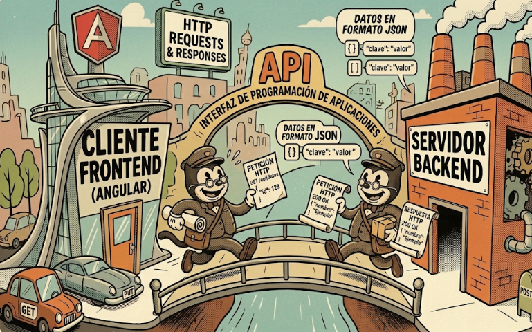
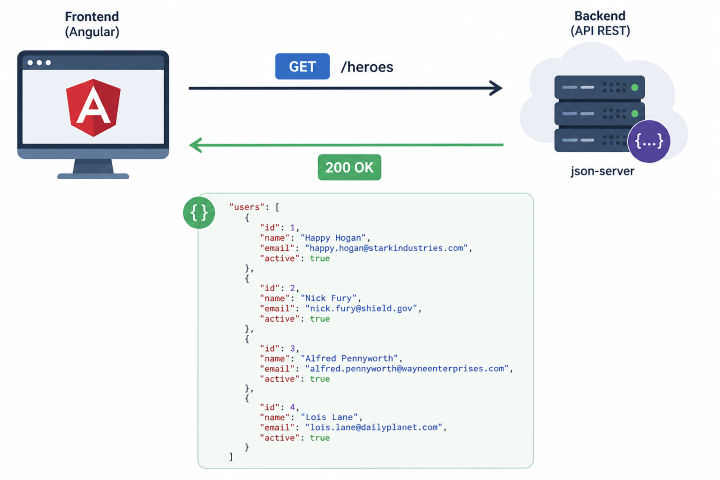
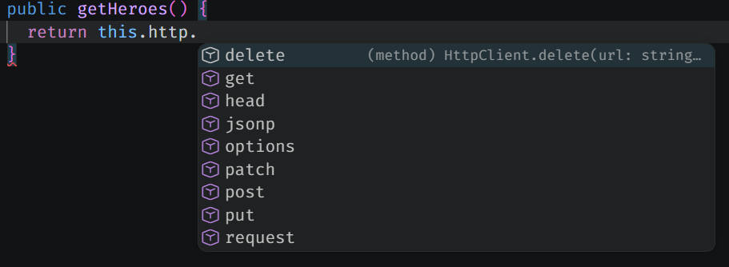
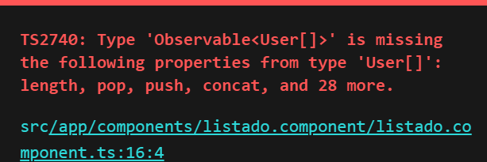
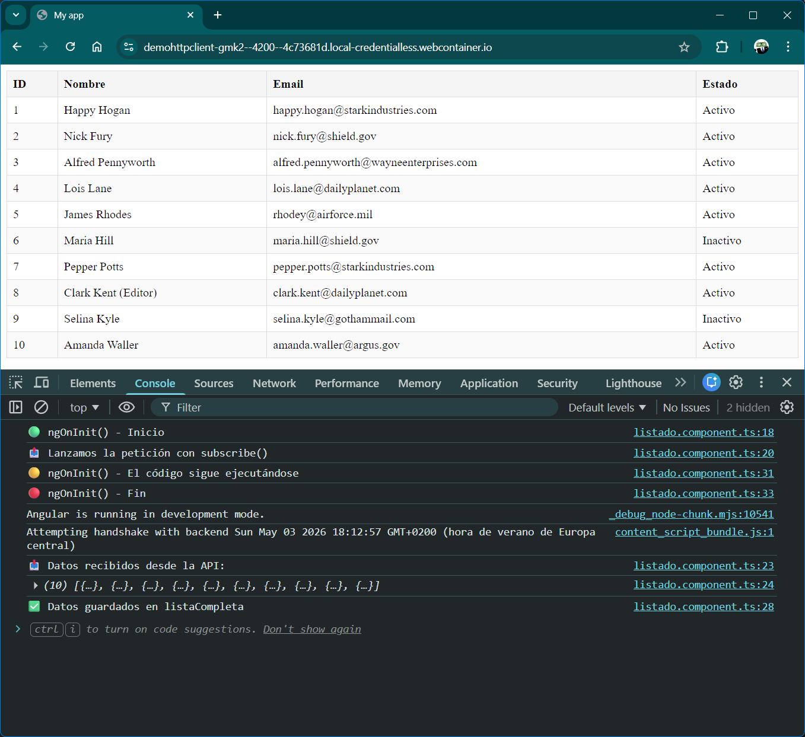
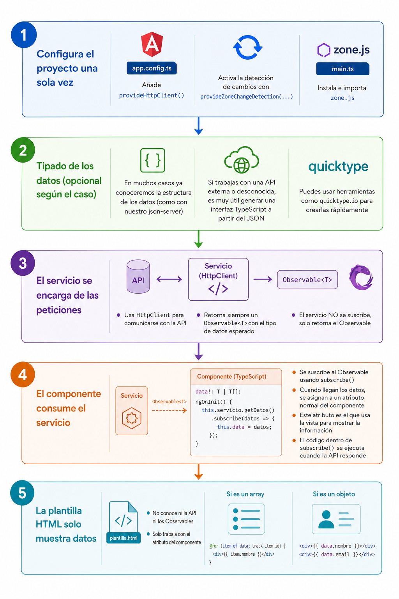

[TOC]

# Introducción

En este tema aprenderemos cómo realizar **peticiones HTTP en Angular** para comunicar nuestra aplicación con un servidor y trabajar con datos reales. 

Antes de llegar a la parte práctica, primero repasaremos algunos conceptos importantes como frontend y backend, APIs, formato JSON y tipos de peticiones HTTP, ya que entender este contexto nos ayudará a comprender mejor lo que hace Angular por detrás.

{.rounded-4}

# Contexto inicial

Si entiendes todos los conceptos de la imagen anterior, puedes saltar al siguiente epígrafe <kbd>Peticiones HTTP en Angular</kbd>. Si no, te quédate un ratito más leyendo 😏.

## Frontend vs Backend

Una aplicación suele dividirse en **dos partes principales**:

- 🖥️ **Frontend**: Es la parte visual con la que interactúa el usuario (páginas, botones, formularios, menús, listados, etc.)
  En nuestro caso, **Angular se utiliza para crear el frontend**.
- ⚙️ **Backend**: Es la parte interna encargada de gestionar los datos y la lógica de la aplicación (base de datos, validar usuarios, procesar datos, responder peticiones del front, etc.).
  Puede estar hecho en **Java**, **PHP** o cualquier otro lenguaje de servidor.

**Cómo se relacionan**

El funcionamiento habitual es sencillo:

1. El frontend solicita información
2. El backend responde con los datos
3. El frontend los muestra al usuario

> [!important]
>
> Separar **frontend** y **backend** permite organizar mejor los proyectos, reutilizar los datos desde distintas aplicaciones (web, móvil, escritorio) y facilitar el trabajo en equipo, **ya que cada parte puede desarrollarse de forma independiente**.

## API REST

Una **API** (*Application Programming Interface*) es un sistema que permite que dos aplicaciones se comuniquen entre sí.

> [!tip]
>
> En la ilustración anterior, se representa mediante el puente y los mensajeros que se intercambian información.

En nuestro caso, Angular podrá utilizar una API para solicitar datos a un backend o enviar información.

Cuando esa API sigue ciertas normas habituales de comunicación mediante HTTP, se suele denominar **API REST**.

Gracias a una API REST, nuestra aplicación puede realizar acciones como:

- 📥 Obtener usuarios o productos
- ➕ Crear nuevos registros
- ✏️ Modificar información existente
- 🗑️ Eliminar datos

Normalmente una API REST ofrece distintas direcciones llamadas **endpoints**, por ejemplo:

- `/users`
- `/heroes`
- `/products`

> [!tip]
>
> Un **endpoint** es la dirección concreta que usamos para acceder a un recurso.
>
> - 📦 **Recurso** → el “tipo de dato” (`users`, `heroes`, `products`).
> - 🌐 **Endpoint** → la “URL concreta” para acceder a ese recurso.

En este temario crearemos nuestra propia API en 30 segundos. Y así poder practicar todo el funcionamiento completo sin tener que programar un backend desde 0.

## JSON como formato de intercambio

Cuando una API se comunica con una aplicación, necesita una forma común de enviar y recibir información.

Ese formato es normalmente **JSON**.

**JSON (JavaScript Object Notation)** es un formato de texto ligero que se utiliza para representar datos de manera estructurada y fácil de leer tanto para personas como para máquinas.

Por ejemplo, una API puede enviar un usuario o un héroe en formato JSON, y Angular lo interpreta para mostrarlo en pantalla.

{.rounded-4}

Es muy importante porque es el **estándar más utilizado en las APIs REST**, ya que:

- Es sencillo de leer
- Es fácil de generar desde cualquier lenguaje
- Funciona perfectamente en aplicaciones web

> [!important]
>
> JSON es el “idioma común” que utilizan el frontend y el backend para intercambiar información.

## Tipos de peticiones HTTP

Cuando trabajamos con una API REST, no siempre hacemos el mismo tipo de acción. Dependiendo de lo que queramos hacer (leer datos, crear, modificar o eliminar), utilizaremos un **tipo de petición HTTP distinto**.

A estos tipos se les llama **métodos HTTP** o **verbos HTTP**.

> [!tip]
>
> Por ejemplo, en la petición de ejemplo anterior a `/heroes`, es una petición de tipo `GET`.

Los más importantes son:

---

### 📥 GET (leer datos)

Se utiliza para **obtener información del servidor** sin modificar nada.

Por ejemplo:

- Obtener todos los héroes (`/heroes`)
- Obtener un usuario concreto (`/users/5`)
- Obtener todos héroes inactivos (`/heroes?active=false`)

**Ejemplo de endpoint:**

```http
GET /users
```

Nos daría la siguiente respuesta:

```json
"users": [
    {
        "id": 1,
        "name": "Happy Hogan",
        "email": "happy.hogan@starkindustries.com",
        "active": true
    },
    {
        "id": 2,
        "name": "Nick Fury",
        "email": "nick.fury@shield.gov",
        "active": true
    },
    {
        "id": 3,
        "name": "Alfred Pennyworth",
        "email": "alfred.pennyworth@wayneenterprises.com",
        "active": true
    },
    {
        "id": 4,
        "name": "Lois Lane",
        "email": "lois.lane@dailyplanet.com",
        "active": true
    }
]
```

> [!note]
>
> Es el más común y el que más vamos a utilizar en consultas.

> [!caution]
>
> Las peticiones **GET solo leen datos**, no deben modificar nada en el servidor.

---

### ➕ POST (crear datos nuevos)

Se utiliza para **enviar información nueva al servidor** y crear un nuevo registro.

Por ejemplo:

- Crear un nuevo usuario
- Añadir un héroe

**Ejemplo de endpoint:**

```http
POST /heroes
```

> [!note] 
>
> Normalmente se envía un cuerpo (body) con los datos a añadir “adjuntos” en JSON. Ya veremos como se hace esto.

---

### ✏️ PUT (actualizar completamente)

Se utiliza para **actualizar un recurso existente**, sustituyéndolo por completo.

Por ejemplo:

- Editar un usuario
- Modificar todos los datos de un héroe

**Ejemplo de endpoint:**

```http
PUT /heroes/1
```

> [!note]
>
> Se envía el objeto completo actualizado. Igual que con `POST`, se envía un “adjunto” en JSON con todos los nuevos datos.

> [!warning]
>
> Si falta algún campo en el envío, puede sobrescribirse o perderse en el servidor.

---

### 🩹 PATCH (actualización parcial)

Se utiliza para **modificar solo una parte de un recurso**, sin necesidad de enviar todo el objeto.

Por ejemplo:

- Cambiar solo el nombre de un usuario
- Actualizar solo el poder de un héroe

**Ejemplo de endpoint:**

```http
PATCH /heroes/1
```

> [!note] 
>
> Es más ligero que `PUT` cuando solo queremos cambiar un dato. Igual que los anteriores, debemos enviar un JSON “adjunto” pero ahora solo con los atributos que queremos cambiar, no completo.

---

### 🗑️ DELETE (eliminar datos)

Se utiliza para **eliminar un recurso del servidor**.

Por ejemplo:

- Eliminar un usuario
- Eliminar un héroe

**Ejemplo de endpoint:**

```http
DELETE /heroes/1
```

> [!note]
>
> Normalmente no devuelve datos, solo confirma la eliminación.

---

> [!important]
>
> Estos métodos forman la base de cualquier API REST moderna y son la base de toda la comunicación entre frontend y backend (independientemente de la tecnología y lenguajes que usen cada uno).

# Creando nuestro propio backend

Para poder practicar todo lo que veremos en este tema, vamos necesitar un backend, y lo vamos a crear en a utilizar una API simulada con **json-server**, que nos permite crear un backend falso en local en muy poco tiempo.

Toda la instalación y configuración está explicada en la píldora de json-server, donde podrás ver el proceso paso a paso.

<div style="text-align:center; margin-top:10px;">  
    <a href="/tema/json-server" target="_blank" style="display:inline-block; padding:10px 16px; margin: 3rem; background:#0d6efd; color:white; text-decoration:none; border-radius:6px; font-weight:600;">💊 Ver píldora de json-server</a>
</div>

# Peticiones HTTP en Angular (GET)

> [!warning]
>
> Vamos a explicar todo lo necesario para entender y utilizar las peticiones HTTP en Angular. En este apartado trabajaremos únicamente con el método **GET**, ya que nos permite centrarnos en el flujo completo de comunicación con una API de forma progresiva.
>
> Más adelante, en el siguiente bloque, aplicaremos exactamente el mismo flujo para el resto de métodos (`POST`, `PUT`, `PATCH` y `DELETE`), sin volver a repetir estos conceptos base.

Hasta ahora hemos visto cómo funciona la comunicación entre frontend y backend, qué es una API REST y cómo se organizan los recursos y endpoints.

Ahora vamos a ver cómo Angular se comunica realmente con una API para **obtener y enviar datos**.

Para ello utilizaremos dos herramientas fundamentales:

- 🌐 **HttpClient de Angular**
- 🧪 **json-server** (para simular una API real)

## `HttpClient` en Angular

Angular nos proporciona un módulo específico para trabajar con peticiones HTTP llamado **`HttpClient`**.

Este servicio nos permite:

- 📥 Obtener datos (`GET`)
- ➕ Enviar datos (`POST`)
- ✏️ Actualizar datos (`PUT` / `PATCH`)
- 🗑️ Eliminar datos (`DELETE`)

Todo de forma sencilla y basada en **observables**.

## Configurar el proyecto

Para que la aplicación funcione correctamente, necesitamos realizar una configuración global:

- 🌐 `HttpClient`: permite comunicarnos con APIs REST
- ⚙️ Zone.js + `provideZoneChangeDetection`: aseguran que Angular detecte los cambios en los datos y los refleje en la interfaz

**Son cambios muy simples y solo tenemos que hacerlos una vez**.

### Instalar Zone.js

En una terminal en la carpeta del proyecto, tenemos que instalar la librería `zone.js`.

```shell
npm install zone.js
```

Y en el archivo `main.ts` hacer su correspondiente import:

```typescript
// main.ts
import 'zone.js'; // Lo añadimos arriba, en la zona de los imports
// (...resto del main.ts lo dejamos como está)
```

> [!warning]
>
> En Angular 20 no había que hacer esto. Para que veas que de una versión a otra pueden complicarte la vida.

### Activar providers (zone.js y HttpClient)

En Angular moderno (+20), antes de realizar peticiones HTTP, debemos registrar `HttpClient` y la detección de cambios en la configuración global de la aplicación.

Para ello, tenemos que abrir el `app.config.ts` y añadir:

- `provideHttpClient()`
- `provideZoneChangeDetection({ eventCoalescing: true })`
- Ambos se añadirán a la lista de providers que ya tenga la aplicación, con sus correspondientes imports.

```typescript
// app.config.ts
import { provideHttpClient } from '@angular/common/http';
import { provideZoneChangeDetection } from '@angular/core';

export const appConfig = {
  providers: [
    // (...), 
    provideHttpClient(),
    provideZoneChangeDetection({ eventCoalescing: true })
  ]
};
```

> [!caution]
>
> Si no haces esto, cualquier intento de inyectar `HttpClient` dará error y no funcionará nada relacionado con servicios HTTP.

> [!important]
>
> Esto solo se configura una vez por proyecto.

## Inyectar `HttpClient` y usarlo en el servicio

Una vez activado `HttpClient` y `zone.js` en la configuración global del proyecto, ya podemos utilizarlo dentro de nuestros componentes o servicios.

Lo más habitual es usarlo dentro de un **servicio**, ya que son los encargados de obtener y dar información.

Para ello, simplemente debemos:

1. **Importarlo e inyectarlo** en la clase donde lo vayamos a usar (normalmente el servicio).
2. Modificar los métodos del servicio para que en lugar de retornar los valores en memoria como antes, **retornar el resultado de la petición HTTP** a la API.

```typescript
// user.service.ts
import { Injectable } from '@angular/core';
import { HttpClient } from '@angular/common/http';
import { User } from './user.model';

@Injectable({ 
    providedIn: 'root' 
})
export class UserService {
    // 1. Lo inyectamos en el constructor
    constructor(private http: HttpClient) {}

    // 2. Usamos http en los métodos hacer peticiones GET a la API, retornando el resultado
    getUsers() {
        return this.http.get<User[]>('https://api.midominio.com/users');
    }

    // Ya no tenemos que buscar nosotros el héroe en el array, lo hace la API por nosotros
    getUserById(id: number) {
        return this.http.get<User | undefined>(`https://api.midominio.com/users/${id}`);
    }
}
```

> [!important]
>
> - ⚠️ Fíjate en que al método `getUsers()` **no le hemos indicado el tipo de retorno**. Lo hacemos así para simplificar el ejemplo y centrarnos primero en entender el flujo general.
> - 🧙‍♂️ Más adelante veremos que realmente este método **no devuelve directamente un array de usuarios**, sino otro tipo de objeto que Angular utiliza para trabajar con datos asíncronos.
> - 💡 De momento quédate con la idea principal: el servicio hace la petición y devuelve el resultado para poder utilizarlo desde otro lugar de la aplicación.
> - 🏷️ También observa que usamos `User[]` dentro de `get<User[]>()` para indicarle a Angular qué tipo de datos esperamos recibir desde la API.
> - 📤 La petición todavía **no muestra nada en pantalla por sí sola**. Solo retorna la respuesta que nos ha dado la API que después tendrá que “tratar” el componente.

> [!tip]
>
> En TypeScript podemos usar **template strings** con comillas invertidas  para construir textos dinámicamente. 
> En este caso nos permite unir la URL base con la `id` de forma cómoda sin concatenaciones manuales:
>
> ```typescript
> `https://api.midominio/users/${id}`
> ```
>
> Si `id` vale `5`, el resultado sería:
>
> ```url
> http://localhost:3000/heroes/5
> ```
>
> Sería el equivalente a hacer la concatenación manual:
>
> ```typescript
> "https://api.midominio/users/" + id
> thisApiURL + "/users/" + id
> ```
>
> Cuando concatenas varias subcadenas para construir una cadena, es más legible y fácil el uso de **template strings**.

> [!note]
>
> El objeto que hemos llamado `http` del tipo `HttpClient`, tiene distintos métodos para trabajar con APIs, como `.get()`, `.post()`, `.put()`, `.patch()` o `.delete()`. Cada uno se utiliza para realizar un tipo de petición HTTP diferente. Los veremos uno a uno más adelante.
>
> 


## Consumir el servicio desde el componente

Ya hemos preparado el servicio para que obtenga los datos desde una API usando `HttpClient`.

El siguiente paso será **usar ese servicio desde el componente**, igual que hacíamos antes.

Por ejemplo:

```typescript
// users-list.ts
import { Component } from '@angular/core';
import { UserService } from './user.service';

@Component({
  selector: 'app-users-list',
  templateUrl: './users-list.html'
})
export class UsersComponent {

  public users = [];

  constructor(private userService: UserService) {}

  ngOnInit() {
    this.users = this.userService.getUsers();
  }

}
```

Sin embargo, ahora aparece un problema.

Antes, nuestro método `getUsers()` retornaba directamente un array en memoria (`User[]`), por lo que podíamos asignarlo sin más en nuestro atributo, que era también otro `User[]`. 

Ahora el IDE nos mostrará un error parecido a este:

{.rounded-4}

Si dejas el cursor unos segundos encima de `this.users` y `this.userService.getUsers()` verás que el **error viene porque son tipos de datos distintos**.

{.rounded-4}

El servicio nos retorna un objeto de tipo **Observable** y queremos asignarlo a una variable de tipo `User[]`. Son tipos distintos de datos. Y aquí, nos tenemos que detener un poco a explicar que es un `Observable`.

## Observables

La API necesita un pequeño tiempo para responder.

Cuando Angular hace una petición HTTP, **los datos no llegan instantáneamente**, por lo que `HttpClient` no puede devolver directamente el array de usuarios puesto que no lo tiene.

En su lugar, devuelve un objeto especial llamado **Observable**.

> [!important]
>
> 👁️ Un **Observable** representa datos que llegarán (o no) más adelante.

Es decir:

- ❌ No recibimos los usuarios al momento.
- ⏳ Recibiremos los usuarios cuando la API responda.
- 📡 Angular nos avisa cuando eso ocurra.

> [!tip]
>
> Piensa en una compra por internet:
>
> - 💳Haces el pedido ahora.
> - 🚚El paquete no llega al instante.
> - 📦Cuando llegue, te avisan.
>
> Con una petición HTTP pasa algo parecido:
>
> - 📤Hacemos la petición ahora.
> - ⌛La respuesta tarda un poco (suelen ser segundos).
> - 📥Cuando llega, Angular puede reaccionar.

> [!note]
>
> Aquí veremos los **Observables** de forma muy básica, solo lo necesario para trabajar con peticiones HTTP en Angular. La librería **RxJS** es mucho más amplia y potente, pero también bastante extensa, así que nos centraremos únicamente en lo que realmente vamos a utilizar en este curso.

## Subscribe

Necesitamos **suscribirnos** al Observable para estar pendientes de la respuesta y ejecutar el código que queramos cuando los datos lleguen.

Esto se hace mediante el método **`subscribe()`**, que nos permite indicar qué hacer cuando la API responde.

```typescript
import { Component } from '@angular/core';
import { User } from '../../models/user.model';
import { UserService } from '../../services/user.service';

@Component({
  selector: 'app-listado-component',
  templateUrl: './listado.component.html',
})
export class ListadoComponent {
  public listaCompleta: User[] = [];

  constructor(private userService: UserService) {
    this.userService.getUsers().subscribe((datos) => {
      this.listaCompleta = datos;
    });
  }
}
```

**¿Qué está pasando aquí?**

- Llamamos al servicio: `getUsers()`
- Este método devuelve un **Observable**
- Nos **suscribimos** con `subscribe()`
- Cuando la API responde:
  - Angular ejecuta la función (no antes)
  - Recibimos los datos en `datos` (puedes llamarle como quieras)
  - Los guardamos en `this.listaCompleta`, ya que tanto `datos` como `this.listaCompleta` son `User[]` y ya no hay problema.
  - La aplicación sigue su flujo normal.

> [!tip]
>
> Piensa que ahora no todo se ejecuta seguido, línea por línea, como antes.
>
> Cuando llamamos a `subscribe()`, Angular lanza la petición y continúa con el resto del programa. Más adelante, cuando llegan los datos, se ejecuta el código que hemos puesto dentro de `subscribe()`.
>
> Hemos añadido unos `console.log()` para que sigas mejor el flujo:
> ```typescript
> ngOnInit(): void {
>   console.log('🟢 ngOnInit() - Inicio');
>   console.log('📤 Lanzamos la petición con subscribe()');
> 
>   this.userService.getUsers().subscribe((datos) => {
>     console.log('📥 Datos recibidos desde la API:');
>     console.log(datos);
> 
>     this.listaCompleta = datos;
> 
>     console.log('✅ Datos guardados en listaCompleta');
>   });
> 
>   console.log('🟡 ngOnInit() - El código sigue ejecutándose');
>   console.log('🔴 ngOnInit() - Fin');
> 
> }
> ```
>
> Si mostramos la consola de depuración veríamos lo siguiente:
>
> {.rounded}
>
> Si observamos la consola, veremos que **los mensajes finales aparecen antes que los datos recibidos**.
>
> Esto ocurre porque la petición tarda un pequeño tiempo en responder. Angular la lanza, sigue ejecutando el resto de `ngOnInit()`, y cuando la API responde más tarde, entra en el bloque de `subscribe()`.
>
> El orden habitual será:
>
> 1. 🟢 Inicio de `ngOnInit()`
> 2. 📤 Se lanza la petición
> 3. 🟡 El método continúa y termina 🔴
> 4. 📥 Llegan los datos después
> 5. ✅ Se guardan en el atributo

## Mostramos los datos en la plantilla HTML

Una de las ventajas de trabajar con servicios es que **la plantilla no necesita modificarse**.

Antes el servicio devolvía datos en memoria, y ahora los obtiene desde una API, pero el resultado final sigue guardándose en el mismo atributo del componente (`public listaCompleta: User[]`).

Por eso nuestro HTML puede quedarse exactamente igual.

> [!important]
>
> **La plantilla solo muestra datos.** Le da igual de donde vengan.
> No necesita saber si vienen de un array local, de una API o de cualquier otro origen.


## Stackblitz

Puedes ver todo el código que hemos visto, junto en un proyecto de Stackblitz, donde hace peticiones HTTP a un backend (con `my-json-server`)

<div style="
  display: flex;
  justify-content: center;
  margin: 20px 0px;
">
  <a href="https://stackblitz.com/edit/demo-httpclient" target="_blank" style="
    display: inline-flex;
    align-items: center;
    gap: 10px;
    padding: 8px 14px;
    border-radius: 999px;
    background-color: #1e1e1e;
    border: 1px solid #333;
    color: #ffffff;
    text-decoration: none;
  ">
    
    Abrir en StackBlitz <code style="color:#49A2F8">demo-http</code>
  </a>
</div>


# Resumen del flujo

{.rounded-4}

1. **Configura el proyecto una sola vez**
   - Añade `provideHttpClient()` en `app.config.ts`
   - Activa la detección de cambios con `provideZoneChangeDetection(...)`
   - Instala e importa `zone.js` en `main.ts`

2. **Tipado de los datos (opcional según el caso)**
   - En muchos casos ya conoceremos la estructura de los datos (como con nuestro `json-server`)
   - Si trabajas con una API externa o desconocida, es muy útil generar una interfaz TypeScript a partir del JSON
   - Puedes usar herramientas como [quicktype.io](https://quicktype.io/) para crearlas rápidamente

3. **El servicio se encarga de las peticiones**
   - Usa `HttpClient` para comunicarse con la API
   - Retorna siempre un `Observable<T>` con el tipo de datos esperado
   - El servicio NO se suscribe, solo retorna el `Observable`.

4. **El componente consume el servicio**
   - Se suscribe al `Observable` usando `subscribe()`
   - Cuando llegan los datos, se asignan a un atributo normal del componente
   - Este atributo es el que usa la vista para mostrar la información
   - El código dentro de `subscribe()` se ejecuta cuando la API responde

5. **La plantilla HTML solo muestra datos**
   - No conoce ni la API ni los `Observables`
   - Solo trabaja con el atributo del componente
   - Si es un array, se recorre con `@for`
   - Si es un objeto, se muestra directamente

> [!important]
>
> La clave del flujo es entender que **el servicio no entrega datos directamente**, sino un `Observable`.  
> El componente es el que decide cuándo “escuchar” esos datos mediante `subscribe()` y actualizar la vista.

# Peticiones HTTP en Angular (RESTO)

{{ Pendiente: Aquí explicaremos como hacer peticiones DELETE, POST, PUT, PATCH}}

# Profundizando un poco más (opcional)

Hasta aquí ya sabes lo necesario para trabajar con peticiones HTTP en Angular.

Lo siguiente no es obligatorio para continuar el curso, pero sí son detalles interesantes que te ayudarán a escribir código más claro y profesional.

---

## Tipar explícitamente el valor devuelto en el servicio

En los ejemplos anteriores hemos omitido el tipo de retorno de algunos métodos para simplificar.

Por ejemplo, habíamos hecho esto:

```typescript
getUsers() {
  return this.http.get<User[]>(`${this.apiURL}/users`);
}
```

Pero una versión más completa sería:

```typescript
import { Observable } from 'rxjs';

getUsers(): Observable<User[]> {
  return this.http.get<User[]>(`${this.apiURL}/users`);
}
```

> [!important]
>
> Ambas versiones funcionan correctamente.
> Angular puede inferir el tipo automáticamente, pero escribirlo de forma explícita hace el código más claro y fácil de mantener.

> [!note]
>
> Fíjate en la diferencia:
>
> - `User[]` → son los datos finales.
> - `Observable<User[]>` → es el objeto que emitirá esos datos más adelante.

---

## Manejo de errores y finalización

Hasta ahora solo hemos visto el caso ideal: la petición funciona y llegan los datos.

Pero en la realidad pueden ocurrir errores:

- 🌐 El servidor está apagado.
- ❌ La URL de la API es incorrecta.
- 📡 No hay conexión.
- ⚠️ El backend devuelve un error.

También podemos controlarlo desde `subscribe()`:

```typescript
this.userService.getUsers().subscribe({
    next: (datos) => {
        // Se ejecuta cuando llegan los datos 
        this.listaCompleta = datos;
    },
    error: (err) => {
        // Se ejecuta si ocurre un error en la petición
        console.error('Error completo:', err);
    }
    complete: () => {
    	// Se ejecuta cuando la petición termina (opcional)
    	console.log('Petición finalizada');
	}
});
```

> [!tip]
>
> Puedes tipar la variable `datos : User[]` y el `err : HttpErrorResponse` para que el IDE te ayude con sus propiedades.
>
> **En general, deberías tipar TODO.**

---

## Buenas prácticas: usar HTTP desde servicios

Aunque técnicamente podríamos hacer peticiones HTTP directamente desde un componente, lo habitual y recomendable es hacerlo desde servicios.

Ventajas:

- 🧹 Código más ordenado.
- 🔁 Reutilización desde varios componentes.
- 🛠️ Mantenimiento más sencillo.
- 🧪 Más fácil de probar.

> [!important]
>
> - El componente debería centrarse en mostrar datos y reaccionar a eventos.
> - El servicio debería encargarse de obtener la información.

# 🦸‍♀️Usando HTTP en la aplicación Héroes

En este apartado vamos a **aplicar todo lo que hemos aprendido sobre peticiones HTTP en Angular** dentro de nuestra aplicación de héroes.

El objetivo es reforzar lo que hemos visto para:

- Ver que el patrón es siempre el mismo (configurar, inyectar, consumir y suscribir).
- Empezar a practicar con datos más cercanos al proyecto real.
- Empezar a tratar la aplicación como una aplicación real con frontend + backend y comunicación asíncrona.

**Pasos:**

1. Monta el backend usando `json-server`. 
2. Configura el proyecto para peticiones HTTP e instalar zone.js.
3. Inyectar el servicio `HttpClient` en nuestros servicios.
4. Modificar nuestro servicio para que use `HttpClient` y realice peticiones a nuestro backend local (paso 1).
5. Modificar nuestro componente para que consuma nuestro servicio.
6. Suscribirte al Observable que nos retornará el servicio.

**Extras:**

- Algunos héroes no tienen imagen. Podrías hacer que los que no reciban una imagen, muestren una por defecto (`img/avatars/defaultheroe.svg`).
- El backend tardará en responder nuestras peticiones. ¿Podríamos mostrar alguna indicativo de que estamos esperando la respuesta? 🔎 Pista: Empieza por un texto simple, y después prueba con spinners de Bootstrap.
- {{más...}}

{{ Desarrollar un poco más, y poner en enlace a github y stackblitz }}

{{ Queda peticiones http en angular resto }}
