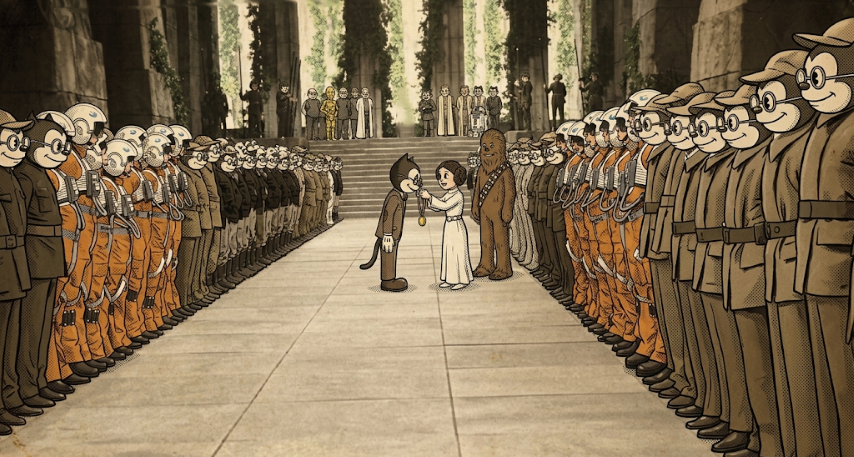

<h3 style="font-weight: bold; color: #7b5e00;">🟡 Bloque Intermedio</h3> 

En este bloque hemos empezado a construir aplicaciones mucho más cercanas a un entorno real de desarrollo:

<ul>
  <li>🧭 Hemos implementado <strong>routing</strong> para movernos entre pantallas.</li>
  <li>🧱 Hemos definido <strong>modelos</strong> para estructurar correctamente los datos.</li>
  <li>🔧 Hemos creado <strong>servicios</strong> para reutilizar y centralizar lógica.</li>
  <li>🌐 Hemos realizado <strong>peticiones HTTP</strong> usando <strong>observables</strong>.</li>
  <li>🔗 Hemos trabajado la <strong>comunicación entre componentes</strong>.</li>
  <li>🧪 Hemos utilizado <strong>pipes</strong> para transformar datos en la vista.</li>
</ul>

Con todo esto ya somos capaces de crear aplicaciones dinámicas, organizadas y conectadas con fuentes de datos externas.

🚀 A partir de ahora entraremos en un bloque más avanzado, donde empezaremos a trabajar con aspectos más complejos del framework, optimización, arquitectura y herramientas utilizadas en aplicaciones profesionales de mayor tamaño.

{.rounded-4}
