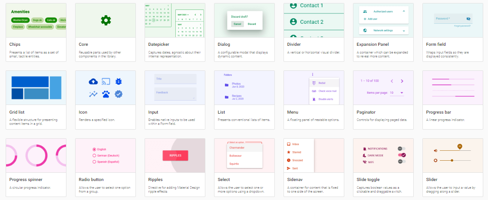

[TOC]


> [!caution]
>
> Este documento necesita una actualización. Está proceso...

# Introducción

Angular Material es un conjunto de componentes de interfaz de usuario basados en el diseño de Material Design, que es un sistema de diseño creado por Google. Con Angular Material podemos crear aplicaciones web modernas y atractivas que se adaptan a diferentes tamaños de pantalla y dispositivos. Algunos de los componentes que ofrece Angular Material son botones, menús, barras de navegación, tablas, formularios, diálogos, etc. Aquí hay algunos ejemplos de cómo se ven los controles de Angular Material:



> [!tip]
>
> Puedes ver la lista completa de componentes en: https://material.angular.dev/components/categories

Para empezar a usar Angular Material en nuestro proyecto, tenemos que seguir unos pasos sencillos que veremos a continuación.

## Añadir Angular Material al proyecto

Siguiendo la documentación oficial en  https://material.angular.dev/guide/getting-started.

Escribir en la línea de comandos, en la ruta del proyecto:

```shell
ng add @angular/material
```

Nos preguntará el tema que queremos aplicar, si queremos aplicar la tipografía global de Angular Material, y si queremos activar las animaciones del navegador. Responder al gusto :).


## Usar componentes de Angular Material

Hay una lista de componentes de Angular Material en https://material.angular.dev/components/categories. 

Para usar cada uno, entramos en el que queramos (ej: `card`) y ahí ya te explica como:

- hay que usarlas (https://material.angular.dev/components/card/overview) 
- importarlas (https://material.angular.dev/components/card/api)
- ejemplos (https://material.angular.dev/components/card/examples)

Por ejemplo, para poner un botón con material, habrá que hacer lo siguiente:

1. Mirar su funcionamiento en https://material.angular.dev/components/button/overview, y sacar la línea que tenemos que importar en el apartado de API.
2. Importar el módulo de material en nuestro `app.module.ts` o en el módulo que estemos usando dicho componente:

```typescript
import {MatButtonModule} from '@angular/material/button';
...
@NgModule ({ ...
	imports: [...,
		MatButtonModule,
		...
	],
})
```

3. En el HTML, usar las nuevas etiquetas que tendremos para ese botón. Su uso y variantes vendrá explicado en la documentación.

```html
<button mat-raised-button color="primary">Primary</button>	
```

Y así con todos los componentes que se usen, primero al `app.module.ts` (o módulo especializado para material) y después ya pueden usarse.
