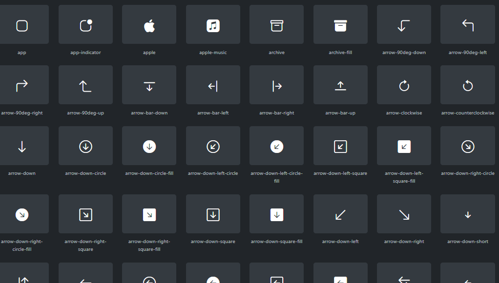
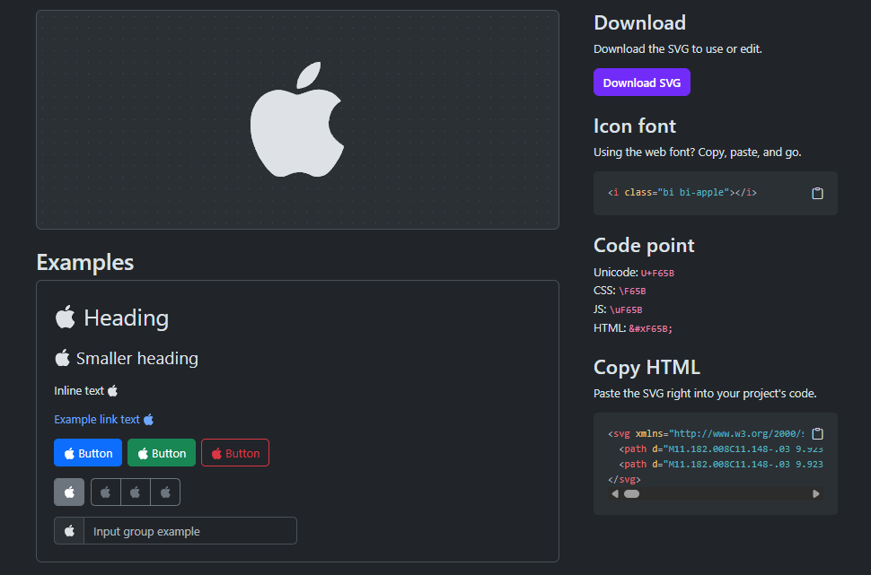

[TOC]


# Introducción

**Bootstrap es un framework de CSS** que nos permite diseñar interfaces web de forma rápida, consistente y responsive (adaptadas a distintos tamaños de pantalla como móviles, tablets y escritorio).

Incluye un conjunto de estilos predefinidos y componentes listos para usar, como botones, tarjetas, menús de navegación o formularios, lo que nos ayuda a construir aplicaciones visualmente atractivas sin necesidad de escribir todo el CSS desde cero.

Además, Bootstrap facilita la creación de diseños adaptables gracias a su sistema de rejilla (grid system), que organiza el contenido en filas y columnas de forma flexible.

**En este apartado veremos cómo integrar Bootstrap en un proyecto Angular, incluyendo estilos, iconos y soporte para componentes interactivos.**


# Instalación

Primero instalamos Bootstrap desde npm:

```shell
npm install bootstrap
```

Bootstrap Icons es una librería adicional que proporciona iconos vectoriales listos para usar, para instalarlo con npm:

```shell
npm install bootstrap-icons
```

> [!tip]
>
> Puedes instalar ambas librerías en un único comando npm:
>
> ```shell
> npm i bootstrap bootstrap-icons
> ```

> [!caution]
>
> Deberás ejecutar los comandos de npm en la raíz del proyecto donde quieras instalar las librerías, si no se descargarán en la carpeta en la que te encuentres.


# Configuración en `angular.json`

Una vez instaladas las librerías, debemos registrarlas en Angular para que estén disponibles globalmente.

Abrimos el archivo `angular.json` y añadimos lo siguiente:

- En la sección `styles`:

  ```json
  "styles": [
    "node_modules/bootstrap/dist/css/bootstrap.min.css",
    "node_modules/bootstrap-icons/font/bootstrap-icons.css",
    "src/styles.css"
  ]
  ```

- En la sección `scripts`:

  ````json
  "scripts": [
    "node_modules/bootstrap/dist/js/bootstrap.bundle.min.js"
  ]
  ````

> [!important]
>
> **El orden en el que se añaden las hojas de estilo en la propiedad `styles` de `angular.json` es importante.**
>
> Angular carga los estilos de arriba hacia abajo, por lo que los últimos pueden sobrescribir a los anteriores.
>
> Por eso, es recomendable **añadir primero librerías externas** (como Bootstrap) **y después nuestros estilos y scripts** personalizados.

> [!warning]
>
> **Bootstrap no solo es CSS.** Algunos componentes necesitan JavaScript para funcionar correctamente.
>
> Por ejemplo:
>
> - El menú hamburguesa del navbar en móviles
> - Ventanas modales
> - Menús desplegables
>
> Sin incluir el JS:
>
> - El diseño funciona ✔.
> - Pero la interacción no ❌.
> - Si no necesitas dicha interacción y solo necesitas las clases css, no es necesario que incluyas el script. **Aunque recuerda que más vale prevenir**.


# Uso de Bootstrap

Ya podrás usar todas las clases de Bootstrap disponibles tal y como se describen en su documentación oficial. 

```html
<div class="container mt-4">

  <!-- Tarjeta de ejemplo -->
  <div class="card shadow-sm mb-3">
    <div class="card-body">

      <h5 class="card-title">
        🦸 Superhéroe: Spider-Man
      </h5>

      <p class="card-text">
        Un joven con habilidades arácnidas que protege la ciudad de Nueva York.
      </p>

      <div class="d-flex gap-2">

        <button class="btn btn-primary btn-sm">
          <i class="bi bi-pencil"></i> Editar
        </button>

        <button class="btn btn-danger btn-sm">
          <i class="bi bi-trash"></i> Eliminar
        </button>

      </div>

    </div>
  </div>

  <!-- Botón añadir -->
  <button class="btn btn-success">
    <i class="bi bi-plus-circle"></i> Añadir héroe
  </button>

</div>
```

> [!tip]
>
> Siempre deberás visitar la documentación oficial para obtener la información actualizada: https://getbootstrap.com/docs/

# Uso de Bootstrap Icons

{.rounded-4}

{.rounded-4}

Una vez instalado y configurado, podemos usar iconos directamente en HTML:

```html
<i class="bi bi-house"></i>
<i class="bi bi-list"></i>
<i class="bi bi-trash"></i>
```

> [!tip]
>
> Puedes acceder a todos los iconos disponibles que tiene la librería en https://icons.getbootstrap.com/#icons

# Otras formas

Bootstrap también puede añadirse de otras formas en un proyecto Angular, por ejemplo:

- Incluyéndolo mediante CDN en el `index.html`, sin instalarlo localmente con `npm`.

  ```html
  <!doctype html>
  <html lang="es">
    <head>
      <meta charset="utf-8">
      <meta name="viewport" content="width=device-width, initial-scale=1">
      <title>Bootstrap demo</title>
      <link href="https://cdn.jsdelivr.net/npm/bootstrap@5.3.8/dist/css/bootstrap.min.css" rel="stylesheet" integrity="sha384-sRIl4kxILFvY47J16cr9ZwB07vP4J8+LH7qKQnuqkuIAvNWLzeN8tE5YBujZqJLB" crossorigin="anonymous">
    </head>
    <body>
      <h1>Hello, world!</h1>
      <script src="https://cdn.jsdelivr.net/npm/bootstrap@5.3.8/dist/js/bootstrap.bundle.min.js" integrity="sha384-FKyoEForCGlyvwx9Hj09JcYn3nv7wiPVlz7YYwJrWVcXK/BmnVDxM+D2scQbITxI" crossorigin="anonymous"></script>
    </body>
  </html>
  ```

- Usando `@import` directamente en `styles.css`, importando la hoja de estilos o bien local instalada con `npm` o bien remota con `cdn`.

  ```css
  /* Instalado con NPM */
  @import "../node_modules/bootstrap/dist/css/bootstrap.min.css";
  @import "../node_modules/bootstrap-icons/font/bootstrap-icons.css";
  
  /* De forma remota con CDN */
  @import url("https://cdn.jsdelivr.net/npm/bootstrap@5.3.8/dist/css/bootstrap.min.css");
  @import url("https://cdn.jsdelivr.net/npm/bootstrap-icons@1.13.1/font/bootstrap-icons.min.css");
  ```

---

Sin embargo, la forma recomendada es instalarlo con `npm` y añadirlo en `angular.json`, ya que:

- 📦 Se integra correctamente en el sistema de build de Angular.
- 🚀 Evita dependencias externas en tiempo de ejecución.
- 🧩 Permite un mejor control de versiones y mantenimiento.
- 🔍 Centraliza la configuración de estilos del proyecto.
