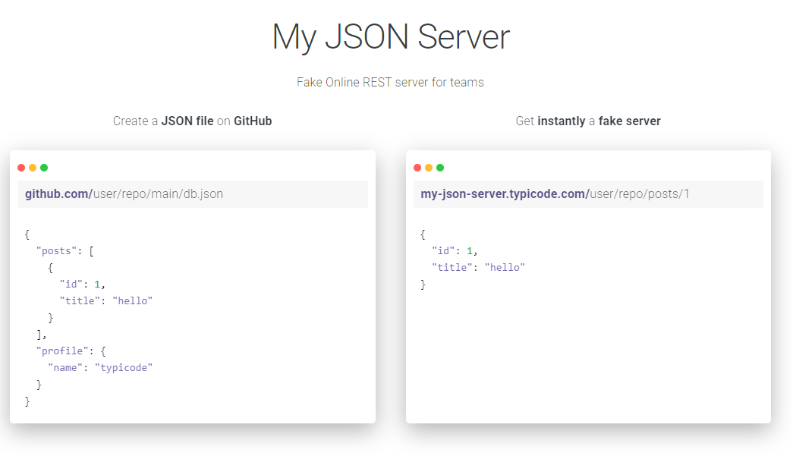

[TOC]

# Backend en Node.js

## JSON Server

Podremos instalar un servidor local de datos en formato JSON que acepta peticiones HTTP de tipo `GET, POST, PUT, PATCH, DELETE y OPTIONS`.

La página oficial y todas las instrucciones actualizadas están en https://www.npmjs.com/package/json-server.

Para instalarlo, debemos escribir en la consola lo siguiente: 

```shell
npm install -g json-server@0.17.4
```

> [!important]
>
> Esa es la última versión que incluía la opción de retraso artificial. Si deseas instalar la última versión disponible de json-server ejecuta `npm install -g json-server` sin indicar la versión concreta, pero no tendrás la opción de retraso.

Tendremos que crear un archivo llamado  `db.json` (puede llamarse de otra forma, pero se recomienda ese nombre) con los datos de la siguiente forma :

```json
{
    "users": [
        {
            "id": 1,
            "name": "Happy Hogan",
            "email": "happy.hogan@starkindustries.com",
            "active": true
        },
        {
            "id": 2,
            "name": "Nick Fury",
            "email": "nick.fury@shield.gov",
            "active": true
        },
        {
            "id": 3,
            "name": "Alfred Pennyworth",
            "email": "alfred.pennyworth@wayneenterprises.com",
            "active": true
        },
        {
            "id": 4,
            "name": "Lois Lane",
            "email": "lois.lane@dailyplanet.com",
            "active": true
        }
    ],
    "heroes": [
        {
            "id": 1,
            "name": "Spiderman",
            "alterEgo": "Peter Parker",
            "power": 80,
            "active": true,
            "imageUrl": "img/avatars/spiderman.svg",
            "universe": "Marvel"
        },
        {
            "id": 2,
            "name": "Batman",
            "alterEgo": "Bruce Wayne",
            "power": 50,
            "active": true,
            "imageUrl": "img/avatars/batman.svg",
            "universe": "DC"
        },
        {
            "id": 3,
            "name": "Hulk",
            "alterEgo": "Bruce Banner",
            "power": 150,
            "active": true,
            "imageUrl": "img/avatars/hulk.svg",
            "universe": "Marvel"
        },
        {
            "id": 4,
            "name": "Iron Man",
            "alterEgo": "Tony Stark",
            "power": 90,
            "active": false,
            "imageUrl": "img/avatars/ironman.svg",
            "universe": "Marvel"
        }
    ]
}
```

> [!tip]
>
> Puedes descargarte una versión completa del `db.json` con más usuarios y héroes en el siguiente enlace:
>
> 📦https://github.com/borilio/heroes-backend/blob/master/db.json

Este ejemplo tendría 2 'tablas' y serían `users` y `heroes`. Cada una de ellas tendrían sus propios campos. 

Para que NodeJS empiece a servir estos datos localmente tendremos que abrir una terminal en la carpeta donde tengamos el archivo `db.json` y escribir lo siguiente:

```shell
json-server --watch db.json
```

Esto abrirá algo parecido a:

```text
  \{^_^}/ hi!

  Loading db.json
  Done

  Resources
  http://localhost:3000/users
  http://localhost:3000/heroes

  Home
  http://localhost:3000

  Type s + enter at any time to create a snapshot of the database
  Watching...
```

Y así tendremos un **backend totalmente funcional** montado en 30 segundos. 

> [!warning]
>
> Si cierras la ventana de la terminal se cerrará el backend. Deja la ventana abierta mientras quieras hacer peticiones.

> [!note]
>
> Aunque lo estemos utilizando como un entorno de pruebas, **json-server se comporta como un backend real**.
>
> Permite realizar operaciones completas de una API REST:
>
> - 📥 GET (leer datos)
> - 📤 POST (crear registros)
> - ✏️ PUT / PATCH (actualizar datos)
> - 🗑️ DELETE (eliminar registros)
>
> Además, los cambios **son persistentes**, es decir:
>
> ✔ si añades o eliminas datos, estos se modifican en el archivo `db.json`  
> ✔ los datos se mantienen entre reinicios del servidor  

> [!tip]
>
> Por este motivo es muy recomendable mantener una copia original del archivo `db.json`, ya que cualquier modificación durante las pruebas puede alterar el estado inicial de los datos.
>
> Una práctica habitual es guardar una versión “limpia” del archivo para poder restaurarlo fácilmente cuando sea necesario.

### Retraso artificial

Ya que el servidor es local y la respuesta será muy rápida, se puede añadir un retraso artificial en la respuesta del backend para probar tiempos de carga y demás. En el siguiente ejemplo le añadiríamos 1500 milisegundos extra a la respuesta.

```shell
json-server --watch --delay 1500 db.json
```

### Parámetros en la petición

#### Buscar una cadena en algunos de sus campos

```http
GET http://localhost:3000/heroes?q=super
```

Mostrará todos los 'registros' que tengan en algún campo (el que sea), el texto 'super'.

#### Limitar el número de registros devueltos

```http
GET http://localhost:3000/heroes?q=super&_limit=5
```

Limitará a 5 elementos el resultado de la consulta anterior. Recordar que para el primero de los parámetros se usa el símbolo `?` y cada parámetro adicional va con el símbolo `&`. Se pueden poner en cualquier orden.

## My JSON Server

{.rounded-4}

También existe una versión online de `json-server` que no requiere instalación: https://my-json-server.typicode.com/.

Permite crear una API REST pública usando un repositorio de GitHub con un archivo `db.json`.

Solo hay que:

1. Crear un repositorio público en GitHub (`<tu-usuario>/<tu-repo>`).
2. Añadir un archivo `db.json` en la raíz.
3. Acceder a la URL: `https://my-json-server.typicode.com/<tu-usuario>/<tu-repo>`

**Ejemplo:** 

https://my-json-server.typicode.com/borilio/heroes-backend

Desde ahí podemos acceder a endpoints como:

- `/users`
- `/heroes`

> [!important]
>
> - Debe ser un repositorio público  
> - El archivo debe llamarse `db.json`  
> - No requiere instalación de nada ni servidor local  
> - Es para pruebas por si necesitas un backend remot. Tiene una limitación de 30 elementos por tabla.

> [!caution]
>
> **Diferencia importante:** Instalar json-server localmente permite hacer cambios persistentes (`POST`, `PUT`, `PATCH`, `DELETE`) que se guardarán en el archivo `db.json`. 
>
> En cambio, `my-json-server` remoto acepta estas peticiones pero **no las persiste**; los cambios se pierden al reiniciar el servidor o al volver a acceder, ya que los datos se cargan desde el archivo en GitHub pero no se modifican.
>
> Para peticiones de tipo `GET` funcionan igual ambos.
