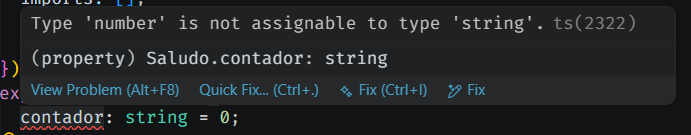
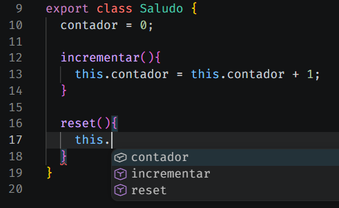

[TOC]

# Programación Orientada a Objetos

## Introducción

Antes de seguir avanzando con Angular, es importante entender una idea clave: **los componentes están escritos como clases**, utilizando programación orientada a objetos (POO).

Si ya has trabajado con otros lenguajes como Java, C# o incluso Python, muchos de estos conceptos te resultarán familiares. Si no es así, no te preocupes: vamos a verlos de forma sencilla y práctica.

En Angular, no vamos a estudiar la teoría completa de la POO, sino **cómo se aplica directamente en el código**. Es decir, cómo se definen clases, cómo se añaden datos (atributos) y cómo se crean funciones (métodos) dentro de ellas.

Todo esto se hace utilizando **TypeScript**, que es el lenguaje sobre el que está construido Angular y que añade una sintaxis más estructurada a JavaScript.

En los siguientes apartados veremos cada uno de estos elementos con ejemplos claros y aplicados a componentes reales.

## Clases y objetos

Una **clase** es una plantilla o modelo que se utiliza para definir cómo será algo. En ella se indican **los datos que tendrá** (atributos) y **las acciones que podrá realizar** (métodos).

{.rounded}

En Angular, los componentes se definen utilizando clases en TypeScript. Por ejemplo, cuando creamos un componente, estamos realmente creando una clase:

```typescript
export class SaludoComponent {

}
```

En este caso, `SaludoComponent` es una clase. Más adelante veremos que son y como añadir atributos y métodos dentro de ella.

A partir de una clase se pueden crear **objetos**. Un objeto es una instancia concreta de esa clase, es decir, un “ejemplar real” basado en la plantilla definida.

Por ejemplo, si tuviéramos una clase `Usuario`, podríamos crear distintos objetos a partir de ella:

```typescript
const usuario1 = new Usuario();
const usuario2 = new Usuario();
```

Aunque ambos objetos se crean a partir de la misma clase, cada uno tiene su propia información independiente.

En Angular no solemos crear objetos manualmente con `new` en los componentes básicos, pero es importante entender esta diferencia: 

> [!important]
>
> La **clase define el comportamiento**, y los **objetos son las instancias reales** que utilizan ese comportamiento.

{.rounded}


## Miembros

Dentro de una clase podemos definir dos elementos principales: **propiedades** y **métodos**.

### 🧩Atributos (propiedades)  

Son las variables que pertenecen a la clase. Se utilizan para almacenar información o estado.

En TypeScript, se definen directamente dentro de la clase indicando su nombre, y opcionalmente su tipo y valor inicial:

```typescript
export class UsuarioComponent {
    nombre: string = "Juan";
    edad: number = 30;
    activo: boolean = true;
}
```

En este ejemplo:

- `nombre`, `edad` y `activo` son propiedades  
- Cada una tiene un tipo (`string`, `number`, `boolean`)  
- También pueden tener un valor inicial  

> [!important]
>
> Aunque no es obligatorio indicar el tipo de dato con el que vamos a trabajar, es una práctica muy recomendable. **Definir los tipos ayuda a prevenir errores** difíciles de detectar más adelante, ya que JavaScript es un lenguaje poco estricto en el manejo de tipos, y así evitaremos el famoso “*[erótico resultado](https://youtu.be/F1uP2nwh0M0)*”.
>
> {.rounded}

### ⚙️Métodos (funciones)  

Son las funciones que se definen dentro de una clase. Se utilizan para realizar acciones o modificar los datos.

En TypeScript, los métodos se declaran dentro de la clase sin necesidad de la palabra `function`:

```typescript
export class UsuarioComponent {
    nombre: string = "Juan";

    saludar() {
        console.log("Hola " + nombre);
    }
}
```

Al igual que los atributos, los métodos también pueden definir el tipo de valor que retornan.

Esto se hace indicando el tipo después de los paréntesis del método, utilizando dos puntos (`:`).

Por ejemplo:

```typescript
export class UsuarioComponent {
    nombre: string = "Juan";

    saludar(): void {
        console.log("Hola " + nombre);
    }

}
```

En este caso:
- `: void` indica que el método no devuelve ningún valor  
- Es decir, el método simplemente ejecuta una acción  

Pero también podemos hacer que un método devuelva un valor:

```typescript
export class UsuarioComponent {
    nombre: string = "Juan";
    
    obtenerNombre(): string {
        return "Juan";
    }
}
```
Aquí:
- El método devuelve un valor de tipo `string`.
- TypeScript obliga a que el valor retornado coincida con el tipo definido.

Este sistema nos ayuda a:

- 🔍 Detectar errores en tiempo de desarrollo.
- 🧠 Hacer el código más claro y predecible.
- 🛡️ Controlar mejor qué devuelve cada método.


### 👉Palabra reservada `this`

Dentro de una clase, la palabra clave `this` se utiliza para hacer referencia al propio objeto, es decir, a sus propiedades y métodos.

Puede parecer un poco confuso al principio, pero la idea es sencilla:

> `this` significa “este objeto actual”

Veamos un ejemplo:

```typescript
export class UsuarioComponent {
    nombre: string = "Juan";

    mostrarNombre() {
        console.log(this.nombre);
    }
}
```

En este caso:
- `nombre` es una propiedad de la clase  
- Para acceder a ella desde un método, usamos `this.nombre`  

**¿Por qué es necesario usar `this`?**

Porque dentro de un método, si escribimos solo `nombre`, JavaScript/TypeScript no sabrá a qué nos referimos.

En cambio, al usar `this.nombre`, estamos indicando claramente que queremos acceder a la propiedad `nombre` de ese objeto.

Además, al escribir `this.` el IDE nos mostrará las sugerencias sobre los atributos y métodos que tenga **ESTE** objeto.

{.rounded}

> [!important]
>
> En Angular (y en general en POO), usar `this` es fundamental, ya que constantemente estaremos accediendo a propiedades y métodos del componente y nos ayudará a diferenciar a los miembros **DE ESTE OBJETO** o de otros.
>
> **Aunque no sea obligatorio a veces, es una buena práctica usarlo siempre.**


## Constructores

El **constructor** es un método especial que se ejecuta automáticamente cuando se crea un objeto a partir de una clase.

**Se utiliza principalmente para inicializar valores de las propiedades de la clase.**

En TypeScript, se define utilizando la palabra clave `constructor`.

### Constructor por defecto

Es un constructor que no recibe parámetros y que inicializa los atributos de la clase a unos valores predeterminados.

```typescript
export class UsuarioComponent {
    nombre: string;
    edad: number;

    constructor() {
        this.nombre = "Juan";
        this.edad = 30;
    }
}
```

> [!warning]
>
> Con este tipo de constructores, todos los objetos que creemos de esta clase, tendrán como nombre `Juan`, y como edad `30`.

### Constructor personalizado

También podemos pasar parámetros al constructor para inicializar valores dinámicamente:

```typescript
export class UsuarioComponent {

    nombre: string;
    edad: number;

    constructor(nombre: string, edad: number) {
        this.nombre = nombre;
        this.edad = edad;
    }

}
```

Por ejemplo, al crear una instancia de la clase:

```typescript
const usuario1 = new UsuarioComponent("Juan", 30);
const usuario2 = new UsuarioComponent("Ana", 25);
```

En este caso:
- Se está creando un objeto de tipo `UsuarioComponent`
- Se le pasan los valores que espera el constructor
- Cada objeto (`usuario1` y `usuario2`) tendrá sus propios datos independientes

> [!important]
>
> - ⚙️ El constructor se ejecuta al crear el objeto  
> - 🧩 Permite inicializar propiedades  
> - 📥 Puede recibir parámetros para configurar el objeto  

> [!caution]
>
> En Angular no solemos instanciar los componentes manualmente utilizando `new` como en el ejemplo anterior.
>
> Aunque hemos visto el constructor como concepto de POO, en Angular es el propio framework quien se encarga de crear las instancias de los componentes automáticamente cuando son necesarios.
>
> Nosotros nos limitaremos a definir la clase del componente, y Angular gestionará su creación y ciclo de vida.

### Sobrecarga de constructores

> [!note]
>
> - En TypeScript solo puede existir un constructor por clase  
> - Si no se define, se crea uno por defecto automáticamente  
> - No existe sobrecarga de constructores como en otros lenguajes (como Java)  
> - En su lugar, se utilizan parámetros opcionales o lógica interna para adaptarse a distintos casos
>
> ```typescript
> constructor(nombre?: string, edad?: number) {
>   this.nombre = nombre || "Anonimo";
>   this.edad = edad || 0;
> }
> ```

## Modificadores de acceso

Los atributos y métodos de una clase pueden tener **modificadores de acceso**, que determinan desde dónde se puede acceder a ellos.

Si no se indica ningún modificador, TypeScript aplica `public` por defecto.

| Modificador | Acceso                  | Descripción                                                  |
| ----------- | ----------------------- | ------------------------------------------------------------ |
| `public`    | Desde cualquier lugar   | Es accesible desde fuera de la clase. Es el valor por defecto. |
| `private`   | Solo dentro de la clase | No se puede acceder desde fuera de la clase.                 |
| `protected` | Clase y clases hijas    | Accesible desde la clase y sus clases heredadas, pero no desde fuera. |

Estos modificadores permiten controlar el acceso a los datos y ayudan a aplicar encapsulación en la programación orientada a objetos.

> [!warning]
>
> Para atributos privados se suele usar, por convención, un guion bajo al inicio del nombre. Ejemplo: `private _edad: number;`. No es obligatorio pero son buenas prácticas. Lo veremos más adelante.


## Encapsulación

La encapsulación es un principio de la programación orientada a objetos que consiste en **proteger el acceso directo a los datos de una clase**, permitiendo controlarlo a través de métodos específicos.

{.rounded}

En TypeScript (y Angular), esto se suele implementar utilizando modificadores de acceso como `private` junto con **getters** y **setters**.

### 📤Getter (obtener valor)  

Un getter permite acceder al valor de una propiedad de forma controlada.

### 📥Setter (modificar valor)  

Un setter permite modificar el valor de una propiedad, pudiendo añadir validaciones o lógica adicional.

### Ejemplo

```typescript
export class UsuarioComponent {

    private _edad: number = 0;

    get edad(): number {
        return this._edad;
    }

    set edad(valor: number) {
        if (valor >= 0) {
            this._edad = valor;
        }
    }

}
```

En este ejemplo:
- La propiedad `_edad` es privada, no accesible directamente desde fuera  
- `get edad()` permite leer su valor  (y no modificarlo)
- `set edad()` permite asignarlo con una validación  (y no leer su valor)

Uso:

```typescript
const usuario = new UsuarioComponent();

usuario.edad = 25;     // Usa el setter
console.log(usuario.edad); // Usa el getter
```

Como ves, aunque parezca que estemos accediendo directamente al atributo, lo que hace TypeScript es usar métodos `get` y `set` de forma implícita para mostrar o modificar el atributo, pero no directamente, si no a través de los métodos que hemos programado. Recuerda que la variable se llama `_edad`.

Con esto se consigue:

- 🔒 Se protege el acceso directo a las propiedades  
- 🔄 Se controla cómo se leen y modifican los datos  
- 🛡️ Permite añadir validaciones o lógica adicional  

> [!note]
>
> 🤯Los getter y setters son `public` por defecto, si los hacemos `private` no podríamos acceder de ninguna forma desde el exterior de la clase, lo cual no tendría mucho sentido.


## Buenas prácticas

A la hora de trabajar con clases y componentes en Angular, es recomendable seguir una serie de buenas prácticas que mejoran la legibilidad, el mantenimiento y la calidad del código.

- 🧾 **Definir siempre los tipos** en atributos, parámetros y valores de retorno.  
  Esto ayuda a detectar errores en tiempo de desarrollo, mejora la legibilidad del código y facilita su mantenimiento.

- 🏷️ **Seguir convenciones de nombres**:
  - Clases y componentes en PascalCase (por ejemplo: `UsuarioComponent`)  
  - Propiedades y métodos en camelCase (por ejemplo: `nombreUsuario`, `obtenerEdad`)  
  - Propiedades privadas con prefijo `_` como convención (por ejemplo: `_edad`)

- 🧱 **Mantener un orden coherente** dentro de la clase:
  - Propiedades (atributos)  
  - Constructor  
  - Métodos  

- 🔒 **Encapsular las propiedades**:
  - Evitar el acceso directo a datos internos  
  - Utilizar modificadores de acceso como `private`  
  - Usar getters y setters cuando sea necesario para controlar el acceso  

- 🎯 **Diseñar métodos con una única responsabilidad**:
  - Cada método debe realizar una sola tarea  
  - Evitar métodos demasiado largos o que acumulen demasiada lógica  

- 🏗️ **Inicializar correctamente los valores**:
  - Usar el constructor para establecer valores iniciales cuando sea necesario  
  - Evitar dejar propiedades sin inicializar si pueden generar inconsistencias  

- ♻️ **Evitar la duplicación de código**:
  - Reutilizar lógica en métodos en lugar de repetir bloques de código  

- 🎛️ **Mantener los componentes enfocados**:
  - Cada componente debería tener una responsabilidad clara y específica  

- 👉 **Utilizar `this` correctamente**:
  - Acceder a las propiedades y métodos de la clase mediante `this` para evitar ambigüedades
- 💬 **Incluir comentarios en el código**:
  - Es fundamental para mejorar su comprensión y mantenimiento. 
  - No se trata de comentar cada línea, sino de explicar partes clave o decisiones importantes, facilitando que otras personas (o tú mismo del futuro) puedan entender el código rápidamente


Aplicar estas prácticas ayuda a escribir código más limpio, organizado y fácil de mantener, especialmente en proyectos Angular que crecen en complejidad.

{.rounded}

> *No seguir estas reglas... eso si que es golpe de remo*

