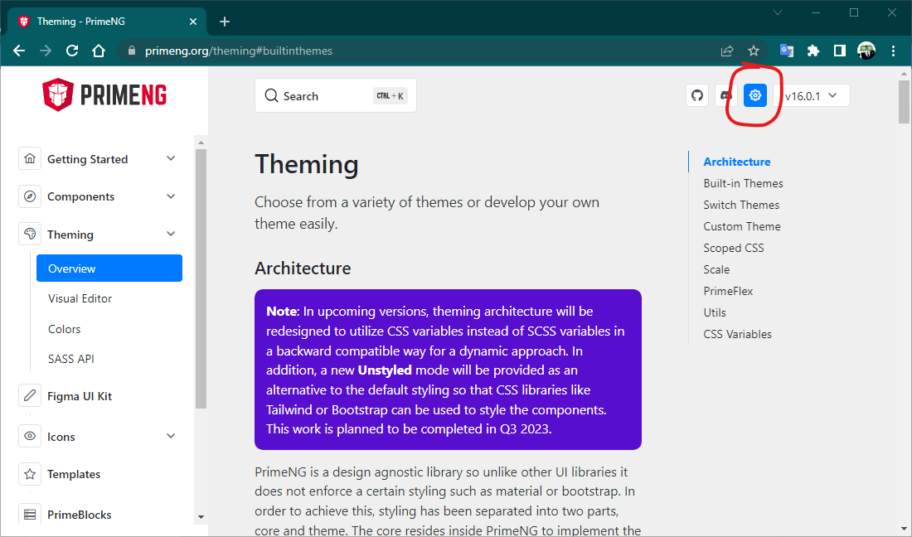
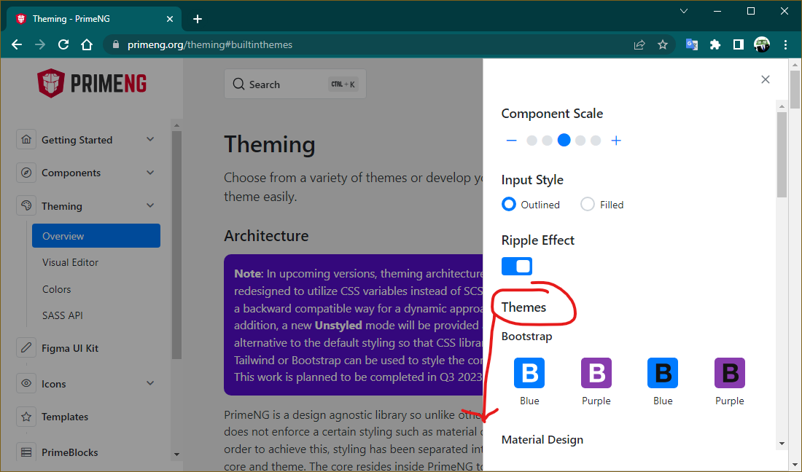
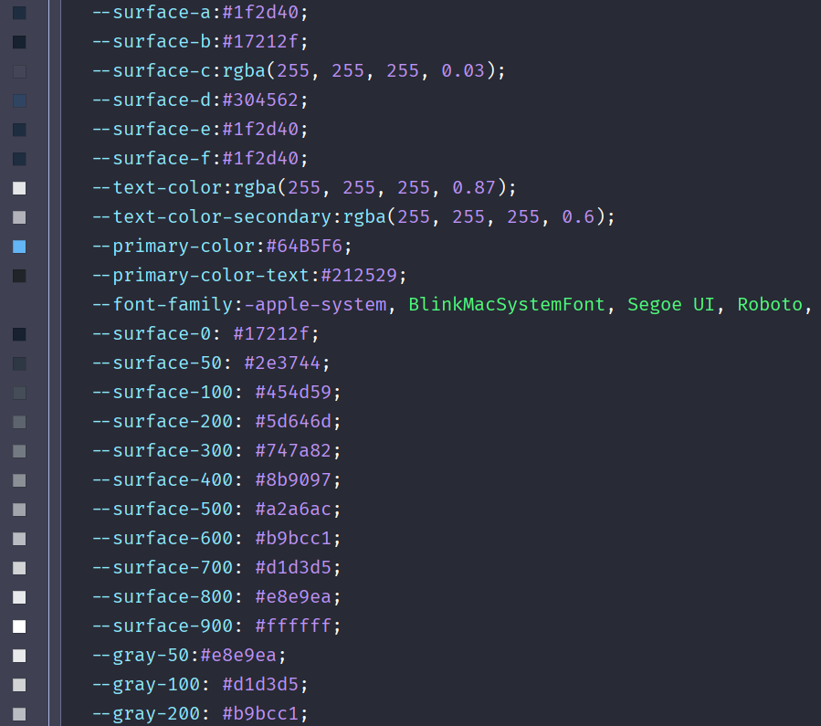
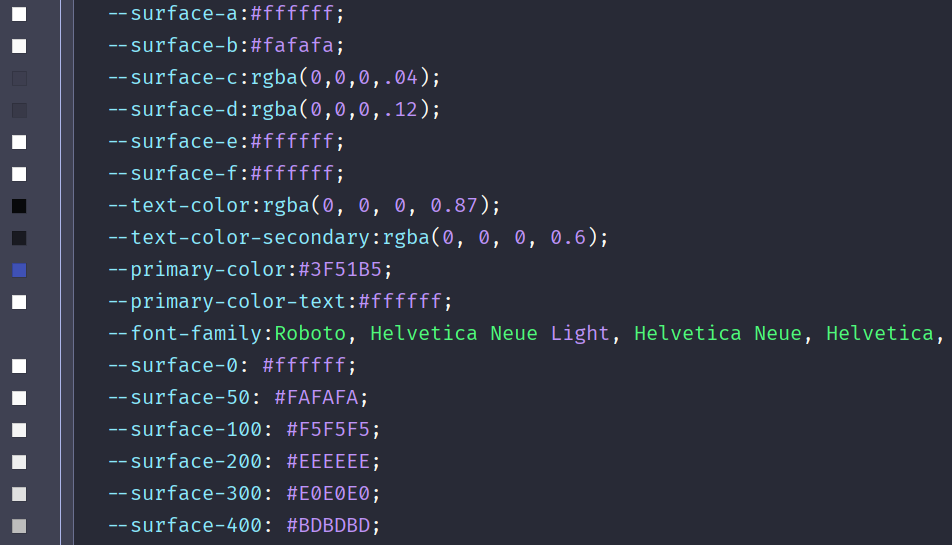
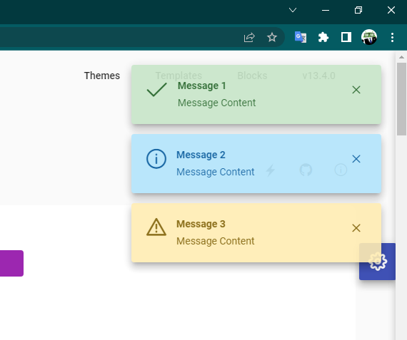
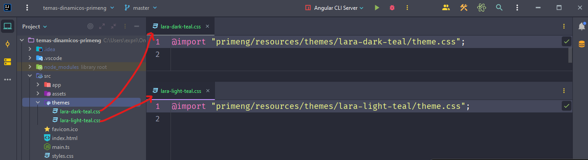
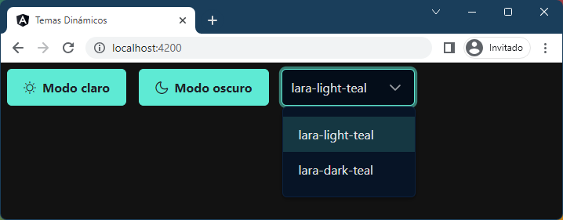
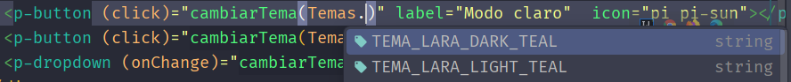

[TOC]


> [!caution]
>
> Este documento necesita una actualización. Está proceso...

# Introducción a Prime Faces

Prime Faces es un conjunto de librerías de componentes prediseñados para la interfaz de usuario. Es de código abierto y gratuito. Posee librerías para Java, Angular, React y Vue. 

Podrás encontrar toda la información y los enlaces a sus respectivas documentaciones en su página oficial: https://www.primefaces.org/.

En este tutorial nos centraremos en la versión para Angular, llamado PrimeNG. https://primeng.org/


## Instalación de  PrimeNG

Para instalar las librerías de PrimeNG en tu aplicación, [siguiendo las instrucciones de la página oficial](https://primeng.org/installation), escribiremos el siguiente comando en la terminal, estando en la ruta raíz de la aplicación:

```bash
npm install primeng --save
npm install primeicons --save
npm install primeflex --save
```

Así instalaremos las librerías de PrimeNG y también los iconos. Así para cuando queramos usarlos los tendremos instalado.

Con [primeflex](https://primeflex.org/) tendremos una librería ligera de css con clases de utilidades para aplicar márgenes, paddings, sistemas de rejilla y muchas más cosas, tal y como estamos acostumbrados con Bootstrap. Por ejemplo, clases ``m-5``, ``py-3``, `<div class="col">`, etc. Se aconseja usarla en lugar de Bootstrap, ya que pueden interferir algunos estilos (tampoco es muy común).

## Configuración (una vez)

### CSS y Selección del tema

Hay que configurar los estilos requeridos por PrimeNG y elegir un tema, de entre los 33 disponibles gratuitos. Para ello abriremos el archivo `angular.json` y en el atributo `styles` le indicaremos los archivos css. 

PrimeNG tiene una colección de temas acordes al estilo de Bootstrap, Material Design (Google) y Fluent (Microsoft), con versiones claras y oscuras para todos los gustos.

```json
"styles": [
    "node_modules/primeng/resources/themes/bootstrap4-dark-purple/theme.css",
	"node_modules/primeng/resources/primeng.min.css",
    "node_modules/primeflex/primeflex.css",
	"node_modules/primeicons/primeicons.css",
    "src/styles.css"
	//...
],
```

- **El primer archivo** css referenciado corresponde al tema elegido, `bootstrap4-dark-purple` en el ejemplo. Deberás elegir uno. 
  1. Elije un tema entre los [temas incluidos](https://primeng.org/theming#builtinthemes). Ahí verás el nombre de la carpeta que deberás cambiar en el código anterior `"node_modules/primeng/resources/themes/{nombre de la carpeta}/theme.css"`.
  2. Si quieres verlos en funcionamiento antes de elegir, puedes aplicar un tema dinámicamente para toda la documentación haciendo click en ⚙, y seleccionando el tema que quieras. 

- 
- 
- En la ruta `node_modules/primeng/resources/themes` de tu proyecto encontrarás todos los temas gratuitos, distribuidos en carpetas y siempre el nombre del archivo será  `theme.css`. 
- **El segundo archivo** css referenciado es el estilo base de PrimeNG. Lo dejaremos tal cual.
- **El tercer archivo** css referenciado son los iconos de PrimeNG. Lo dejaremos tal cual.
- **El cuarto archivo** css referenciado es la librería de PrimeFlex. Lo dejaremos tal cual.
- **El quinto archivo** css referenciado es el de estilos global de la aplicación. Ya debía de estar ahí antes, y lo dejaremos tal cual.
- Si nuestro proyecto usase otro archivo css referenciado aquí, pues deberíamos dejarlo como estaba, respetando el orden correcto para las prioridades de css.

> ⚠ Es posible que tengas que volver a arrancar el proyecto después de hacer cambios en el `angular.json`

> 🎨 En el apartado de [cambio dinámico de temas](# Cambio dinámico de temas) podrás ver como cambiar el tema seleccionado en tiempo de ejecución.

### Estilos globales

En el archivo `theme.css` de todos los temas, se encuentras unas variables de css para indicar un color de fondo, el color de la fuente, así como la fuente y mucho más. 

Ejemplo de las variables css del tema `vela-blue`: 



Ejemplo de las variables css del tema `md-light-indigo`: 



En el archivo `styles.css`, podremos aplicar el color de fondo del tema, de forma que si cambiamos el tema, nuestra aplicación tendrá un color de fondo  acorde al resto de los componentes.

```css
/* styles.css (Estilos globales) */

html, body {
	/* Hay tonos desde la a hasta la f, elegir el más adecuado dentro del tema */
    background-color: var(--surface-a); 
}
```

### Activar animaciones

Muchos componentes usan las animaciones de Angular, por lo que deberemos tenerlas importadas en nuestro módulo donde usemos PrimeNG, ya sea el `app-module.ts` o en un módulo concreto.

Importaremos las animaciones en el módulo que usemos PrimeNG:

```typescript
import {BrowserModule} from '@angular/platform-browser';
import {BrowserAnimationsModule} from '@angular/platform-browser/animations';

@NgModule({
    imports: [
        BrowserModule,
        BrowserAnimationsModule,
        //...
    ],
    //...
})
export class TuAppModulo { }
```

Por defecto vienen instaladas ya y solo necesitamos importarlas pero por si no estuvieran, las podemos instalar así:

```bash
npm install @angular/animations --save
```

### Efecto onda (ripple)

Ripple es una animación opcional para los componentes que la usan, como los botones. Está deshabilitado de forma predeterminada y debe habilitarse globalmente en su componente principal, (ej: `app.component.ts`) inyectando `PrimeNGConfig`.  También se puede habilitar en el componente individual que se desee, aunque se recomienda activarlo globalmente y deshabilitarlo puntualmente cuando sea necesario.

Hay que importar primero el módulo `RippleModule`:

```typescript
import {RippleModule} from "primeng/ripple";
```

Y después inyectar `PrimeNGConfig` y cambiar su propiedad `ripple` a `true`:

```typescript
import { PrimeNGConfig } from 'primeng/api';

@Component({
    selector: 'app-root',
    templateUrl: './app.component.html'
})
export class AppComponent implements OnInit {

    constructor(private primengConfig: PrimeNGConfig) {}

    ngOnInit() {
        this.primengConfig.ripple = true;
    }

}
```

 

## Uso del componente (repetir)

### Importación

El siguiente paso es directamente usar sus componentes. Se deberá importar cada componente de forma individual y así solo tendremos en nuestra aplicación los componentes que realmente necesitamos.

Los componentes de la interfaz de usuario (botones, formularios, menús, etc.) están disponibles como módulos. Los módulos y las apis pueden ser importados de `primeng/{módulo}`. En la documentación de cada componente se indica ruta del `import`.

La lista completa de componentes está en la siguiente url: https://primeng.org/installation. En el menú de la izquierda encontrarás todos los componentes y sus correspondientes enlaces.

Por ejemplo, para insertar los botones de PrimeNG, seguiremos los siguientes pasos:

1. Buscamos el componente `Button`, en la lista de componentes, y nos lleva a https://primeng.org/button. 
2. Una vez en la documentación de `Button`, encontramos una vista previa del componente. Un poco más abajo encontramos en `Documentation`, el import que debemos  hacer para poder empezar a usar el botón.

```typescript
import {ButtonModule} from 'primeng/button';
```

3. Deberemos importar el módulo (que tiene el componente button) en aquel módulo dónde vayamos a usarlo. Si pensamos usarlo en varios componentes repartidos por varios módulos de la aplicación, se puede añadir al `app.module.ts`, 

   

   > 💡 Es buena idea crear un módulo concreto para PrimeNG. Lo explicaremos más adelante. 

### Pegar el HTML

Una vez realizada la importación, en el componente nuestro que queramos, ya podemos usar el componente de PrimeNG que hemos importado, de la forma que nos indique su documentación oficial. Cada componente tendrá su forma de usarlo, de mostrarlo y sus propiedades. Por eso SIEMPRE deberemos consultar la documentación oficial del componente que vayamos a usar.

Siguiendo el ejemplo con los botones, sería:

```html
<button pButton>Soy un botón</button>
<button pButton class="p-button-success">Soy un botón con estilo</button>
<p-button 
          styleClass="p-button-rounded p-button-info" 
          label="También soy un botón" 
          icon="pi pi-check">
</p-button>
```

Y así se verían…


Los botones de PrimeNG pueden usarse de dos formas, como una directiva `pButton` al elemento `<button>` nativo de HTML, o como un elemento `<p-button>` por si solo. 

> 👀📃 Todo esto lo sabemos porque lo hemos visto en la [documentación oficial](https://primeng.org/button) del `button`. No hay otra forma.


## Crear un módulo concreto para PrimeNG

Como cada componente de PrimeNG viene encapsulado en un módulo, deberemos importar aquellos que necesitemos en el módulo del componente que estamos usando. Si queremos usar un botón de Prime en dos módulos distintos, deberemos importarlo en los dos módulos, por lo que puede ser un fastidio tener que hacer tantas importaciones. 

Una solución es importarlo todo en el `app.module.ts` y ya estaría para toda la aplicación, pero esto nos podría generar un módulo principal muy extenso, y además … ¿y si tengo un módulo en el que no uso PrimeNG?

La mejor solución es crear un módulo aparte dedicado exclusivamente a importar todos los módulos/componentes de PrimeNG, y exportar los módulos. De forma que en aquel módulo que necesitemos las cosas de PrimeNG, tan sólo tenemos que importar el módulo dedicado y listo. Ya tendremos todos los componentes declarados listos para usar.

Ejemplo de `primeng.module.ts`:

```typescript
import {NgModule} from '@angular/core';

import {ButtonModule} from 'primeng/button';
import {MenuModule} from "primeng/menu";
import {RippleModule} from "primeng/ripple";
import {ToastModule} from 'primeng/toast';
import {PanelModule} from 'primeng/panel';
import {ProgressBarModule} from 'primeng/progressbar';
import {TableModule} from 'primeng/table';
import {ToolbarModule} from "primeng/toolbar";
import {ConfirmPopupModule} from "primeng/confirmpopup";
import {DialogModule} from "primeng/dialog";
import {InputTextModule} from "primeng/inputtext";

@NgModule({
  declarations: [],
  //No necesitamos imports, solo exportar los módulos para otros módulos

  exports: [
    RippleModule,
    ButtonModule,
    MenuModule,
    ToastModule,
    PanelModule,
    ProgressBarModule,
    TableModule,
    ToolbarModule,
    ConfirmPopupModule,
    DialogModule,
    InputTextModule
  ]
})
export class PrimengModule {}
```

Y ahora en un módulo de usuarios, `usuarios.module.ts` por ejemplo, lo importamos. Ya podríamos usar en el componente `page-usuarios-component` todos los componentes de PrimeNG. **Así está todo más modularizado y ordenado.**

```typescript
import {NgModule} from '@angular/core';
import {CommonModule} from '@angular/common';
import {PageUsuariosComponent} from './page-usuarios/page-usuarios.component';
import {PrimengModule} from "../primeng/primeng.module";

@NgModule({
  declarations: [
    PageUsuariosComponent,
  ],
  exports: [],
  imports: [
    CommonModule,
    PrimengModule,
  ]
})
export class UsuariosModule {
}

```

# Repositorio GitHub

Encontrarás un repositorio con un proyecto base con todos los pasos anteriores creados, listo para clonarlo y empezar a hacer tu proyecto pre-configurado con PrimeNG. 

**https://github.com/borilio/proyecto-base-angular-primeng**

Solo deberás añadir los componentes de PrimeNG que quieras usar, al módulo creado llamado `primeng` y ya podrás usarlos.

En el proyecto ya tienes lo siguiente:

- Proyecto Angular Base, creado con Angular 16.0.4
- Añadida las dependencias de PrimeNG, 16.0.2.
- Añadida las dependencias de PrimeFlex, 3.3.1.
- Añadida las dependencias de PrimeIcons, 6.0.1.
- Usadas las 3 dependencias anteriores en el `angular.json`.
- Seleccionado el tema `lara-dark-indigo`. Puedes cambiarlo en el `angular.json`.
- Creado un módulo llamado `primeng`, listo importarlo en los módulos que crees en tu aplicación.
- Añadido el componente `RippleModule`, y configurado en el `app.component.ts`.
- Añadida las animaciones `BrowserAnimationsModule`, para que funcionen los componentes de PrimeNG.

Si clonas el repositorio, pues ya tienes todo lo anterior hecho y ese trabajo que te ahorras. 

🎁De nada ;).

# Componentes concretos

Veamos con detalle algunos componentes concretos del PrimeNG, ya sea por su uso, o por simplificar la explicación de la documentación oficial:

## Toast

Las **[notificaciones Toast](https://www.primeng.org/toast)** son como notificaciones emergentes que se pueden lanzar desde código y mostrar en un sitio de la pantalla.



Orden para poner un toast:

1. Importar el `ToastModule` en el módulo que usemos PrimeNG. Es posible que hasta que no hagas el paso 2, te desaparezcan algunos componentes de tu página. Relax. Volverán. 

   ```typescript
   import {ToastModule} from 'primeng/toast';
   ```

2. En el componente donde se va usar el toast, poner el `providers: [MessageService]` en el decorador. 

   ```typescript
   import {MessageService} from "primeng/api";
   @Component({
     selector: 'app-mi-componente',
     templateUrl: './mi-componente.component.html',
     styleUrls: ['./mi-componente.component.css'],
     providers: [MessageService]
   })
   export class MiComponente implements OnInit {...}
   ```

3. Inyectar el servicio en el constructor: `constructor(private _mensajeService: MessageService)`

4. ```typescript
   ...
   export class MiComponente implements OnInit {
   
   	constructor(private _mensajeService : MessageService) { }
   	...
   }
   ```

5. Poner en el HTML del componente donde se va a usar el toast: `<p-toast position="top-right | bottom-left..."></p-toast>`. Da igual en qué sitio pongamos el toast. Dependiendo del valor del atributo `position`, se mostrará el toast en dicha posición.

5. Usar el método `.add(mensaje: Message)` del servicio en el componente: `this._mensajeService.add(mensaje)` donde mensaje es un objeto de tipo `Message` que tiene las siguientes propiedades:

   - `severity`: 'success' | 'info' | 'warn' | 'error'

   - `summary`: string que contiene el título del mensaje

   - `detail`: string que contiene el texto del mensaje

   - `icon`: string que contiene el icono de la izquierda del mensaje (si tiene un severity, usará el icono adecuado, no este)

   - `life`: number que indica el tiempo que dura el mensaje en milisegundos

   - `closable`: boolean que indica si el mensaje se puede cerrar o no

   - `key`: string que contiene una clave única para identificar el mensaje (p.ej: para cerrarlo `.close(key)`)

   - `sticky`: boolean que indica si el mensaje se queda fijo en la pantalla
   
```typescript
public logout(): void {
	const mensaje : Message = {
    	severity: 'error',
	    summary: 'Logout',
	    detail: 'Opción no disponible por el momento',
	    icon: PrimeIcons.POWER_OFF,
	    life: 2000
    };
    this._mensajeService.add(mensaje);
}
```


## Ventanas de diálogo

Muestra un contenedor con contenido como una ventana superpuesta. Es muy potente ya que se muestran como ventanas, las cuales se pueden mover, maximizar, etc. 

Como siempre, primero importar el módulo:

```typescript
import {DialogModule} from "primeng/dialog";
```

Y poner el HTML en cualquier ubicación (como los Toast), ya que aparecerán cuando se le indique mediante código:

```html
<!-- MiComponente HTML -->
<p-dialog [(visible)]="mostrarDialogo">
	Contenido
</p-dialog>
<button pButton (click)="mostrar()">Mostrar</button>
```

```typescript
// MiComponente TS
export class MiComponente {
    public mostrarDialogo: boolean = false;

    public mostrar() {
        this.mostrarDialogo = true;
    }
}
```

Por defecto el diálogo está oculto, y estableciendo la propiedad `visible` a true, se muestra. En el ejemplo, usamos el `two-way binding  [()]` para que cuando se pulse el botón se llame a un método `mostrar()`, el cual cambia la propiedad enlazada `mostrarDialogo` a `true`. Cuando queramos ocultarla, pues la ponemos a `false`. 

### Plantillas

Dentro del contenido de la ventana de diálogo, se puede dividir en 3 plantillas opcionales, `header`, `content` y `footer`. 

```html
<p-dialog ...>
    <ng-template pTemplate="header">Cabecera</ng-template>
	<ng-template pTemplate="content">Contenido aquí</ng-template>
	<ng-template pTemplate="footer">Botones aquí</ng-template>
</p-dialog>
```

### Propiedades

Mediante las siguientes propiedades, podemos dotar a nuestras ventanas de diálogo de lo siguiente:

- `header` : Es el título que aparecerá en la cabecera de la ventana.
- `modal` : Indica si es una ventana modal, es decir, que mantenga la ventana en primer plano, bloqueando el resto de controles del fondo de la aplicación, no pudiendo interactuar con nada que no esté en la ventana de diálogo.
- `maximizable` : Indica si nos aparecerá un botón de maximizar la ventana para que se ponga a pantalla completa. Una vez maximizada aparecerá un botón para volver a ponerla del mismo tamaño. 
- `resizable` : Indica si se puede cambiar el tamaño de la ventana de diálogo, moviendo desde una esquina, se podrá cambiar el tamaño de la ventana.

```html
<p-dialog
  [(visible)]="mostrarDialogo"
  header="Título de la ventana"
  [modal]="true"
  [maximizable]="true"
  [resizable]="true">
    Contenido
</p-dialog>
```

> ⚠Si dentro del diálogo, ponemos un contenido que se superponga, por ejemplo, como un [dropdown](https://www.primefaces.org/primeng/dropdown), la superposición no deberá exceder de los límites del tamaño del diálogo, ya que tendríamos un efecto indeseado con barras de desplazamiento que aparecen y no nos dejaría hacer click sobre los elementos del dropdown. Para solventar esto tendríamos que añadir el siguiente código al dropdown.
>
> ````html
> <p-dialog ...>
>     <p-dropdown appendTo="body" ...></p-dropdown>
> </p-dialog>
> ````

### Posicionamiento

Por defecto, el diálogo sale en el centro, pero se puede elegir la posición mediante la propiedad `position`. Sus valores válidos son `top`, `bottom`, `left`, `right`, `top-left`, `top-right`, `bottom-left` y `bottom-right`.

```html
<p-dialog position="top" ...>Contenido</p-dialog>
```


## Confirmación

Se pueden mostrar ventanas de confirmación en formato de ventana emergente (popup) y de diálogo. Para cuando queremos preguntar algo tipo “Si o No”, es más simple una confirmación que montar un una ventana de diálogo (punto anterior) para ello.

### [Popup](https://www.primeng.org/confirmpopup)

Importar el módulo correspondiente:

```typescript
import {ConfirmPopupModule} from 'primeng/confirmpopup';
```

En el HTML, poner un elemento `<p-confirmPopup>` donde quieras (no se verá):

```html
<p-confirmPopup></p-confirmPopup>

<button (click)="confirmarUsuario(usuario, $event)" pButton icon="pi pi-check">Confirmar</button>
```

Como en los toast, deberemos inyectar un servicio llamado `ConfirmationService` y declararlo en la sección de `providers` en el decorador:

```typescript
import {ConfirmationService ...} from "primeng/api";

@Component({
  ...
  providers: [..., ConfirmationService],
})
export class MiComponente implements OnInit {
	...  
	constructor( ..., private _confirmarService: ConfirmationService) { }
}
```

Y hacer la función que queramos que abra el popup, por ejemplo `confirmarUsuario()`. La función recibe un evento. Servirá para identificar el elemento que originó el evento y así PrimeNG colocar el popup sobre él. 

```typescript
public confirmarUsuario(usuario: Usuario, event: Event) {
    this._confirmarService.confirm({
      target: event.target as EventTarget,
      message: `¿Estás seguro de querer eliminar a ${usuario.nombre}?`,
      icon: PrimeIcons.QUESTION_CIRCLE,
      acceptLabel: "Borrar",  
      accept: () => {
        this.eliminarUsuario(usuario); //Este método es el que realmente borra
      },
      reject: () => {
        this._mensajeService.add({
          severity: "info",
          summary: "Cancelado",
          detail: "Operación cancelada. No se ha borrado nada."
        });
      }
    });
  }
```

> 💡En el método `confirmarUsuario()` le estamos enviando un objeto usuario solo para poder mostrar el nombre de usuario en el mensaje de confirmación, y también para pasárselo al método `eliminarUsuario()` y que pueda borrar el usuario, pero enviaremos los argumentos necesarios que necesitemos a nuestras funciones. Podríamos pasarle solo la id del usuario, pero si le pasamos el objeto completo podemos mostrar el nombre, por ejemplo.


### [Diálogo](https://www.primeng.org/confirmdialog)

{{TODO: Explicar el dialogo de confirmación. Mientras, en la documentación oficial viene bastante simple explicado.}}


## [Tablas](https://www.primeng.org/table)

### Básicas

Para crear una tabla básica usando PrimeNG, seguiremos los pasos siguientes:

1. Importar el componente:

   ```typescript
   import {TableModule} from 'primeng/table';
   ```

3. Suponiendo que queremos mostrar el atributo  `public usuarios: Usuario[]` en una tabla, pondríamos el siguiente html:
   ```html
   <p-table [value]="usuarios">
   	<ng-template pTemplate="header">
   		<tr>
   			<th>Id</th>
   			<th>Nombre</th>
   			<th>Email</th>
   		</tr>
   	</ng-template>
   
       <ng-template pTemplate="body" let-usuario>
   		<tr>
   			<td>{{usuario.id}}</td>
   			<td>{{usuario.nombre}}</td>
   			<td>{{usuario.correo}}</td>
   		</tr>
   	</ng-template>
   
   </p-table>
   ```


### Estilos

Modificando los siguientes atributos podemos cambiar el estilo de la tabla:

**Con las líneas de rejilla:**

```html
<p-table ... styleClass="p-datatable-gridlines">...</p-table>
```

**Con líneas cebreadas:**

```html
<p-table ... styleClass="p-datatable-striped">...</p-table>
```

Por defecto, el contenido de las filas se apilarán en columnas si no cabe, pero si preferimos un scroll para que respete el diseño original (como haría el `table-responsive` de bootstrap) se puede hacer lo siguiente:

```html
<p-table ... responsiveLayout="scroll">...</p-table>
```

**Resaltar la fila:**

```html
<p-table ... [rowHover]="true">...</p-table>
```


### [Ordenación de filas](https://www.primeng.org/table/sort)

Se pueden ordenar las filas por el campo que deseemos, tan solo habría que añadir el siguiente código al `header` de la tabla:

Ordenación simple, 1 columna:

```html
<p-table ...>
    <ng-template pTemplate="caption">...</ng-template>
    <ng-template pTemplate="header">
        <tr>
            <th pSortableColumn="id">Id <p-sortIcon field="id"></p-sortIcon></th>
            <th pSortableColumn="nombre">Nombre <p-sortIcon field="nombre"></p-sortIcon></th>
            <th pSortableColumn="correo">Correo <p-sortIcon field="correo"></p-sortIcon>  </th>
            <th>Acciones</th>
        </tr>
    </ng-template>
    <ng-template pTemplate="body">...</ng-template>      
    <ng-template pTemplate="summary">...</ng-template>
</p-table>
```

O con múltiples columnas. Para seleccionar varios campos para ordenar, mantener la tecla <kbd>control</kbd> o <kbd>⌘</kbd> mientras se pulsa sobre una columna, así se añade un siguiente criterio de ordenación (por ejemplo, por nombre y correo).

```html
<p-table ... sortMode="multiple">
	...
</p-table>
```


### [Paginación](https://www.primeng.org/page)

Se puede añadir una paginación de una forma sencilla:

```html
<p-table [value]="usuarios" 
         [paginator]="true" 
         [rows]="10" 
         responsiveLayout="scroll"
         [showCurrentPageReport]="true" 
         currentPageReportTemplate="Mostrando del {first} al {last} de {totalRecords} usuarios" 
         [rowsPerPageOptions]="[10,25,50]">
    ...
</p-table>            
```

# Cambio dinámico de temas

## Pasos

Los temas de PrimeNG hemos visto que hay que seleccionar uno cuando creamos el proyecto. También se pueden cambiar sobre la marcha para que los usuarios puedan elegir su propio tema. 

Partiremos del [repositorio de GitHub](# Repositorio GitHub) para ver todo el todo proceso, aunque puedes hacerlo directamente en tu proyecto. Veamos como hacerlo en unos pocos pasos:

1. Crearemos una carpeta `themes`, en la ruta `src/themes`. Dentro de ella, crearemos un archivo `css` por cada tema que vayamos a cargar. El nombre del archivo `css` tendrá el mismo nombre que el tema. ([Ver temas disponibles](### CSS y Selección del tema)). En nuestro ejemplo vamos a cambiar entre dos temas, `lara-dark-teal` y `lara-light-teal`, así que creamos dos archivos con esos nombres y extensión `css`, dentro de la carpeta `themes`.



2. El contenido de estos archivos será un `@import` a su correspondiente archivo `css` que estará en la carpeta `node_modules`. En el código de abajo, deberás cambiar `cambia-aquí-ruta-del-tema`, por el nombre del tema que corresponda, tal y como se ve en la captura anterior.

```css
@import "primeng/resources/themes/cambia-aquí-ruta-del-tema/theme.css";
```
3. En el `angular.json`, tenemos que cambiar lo que tenemos originalmente por lo siguiente:

> ⚠️ **IMPORTANTE:** Recuerda cambiar el atributo `styles` de la línea 27 aproximadamente. No el de la línea 90 y algo. Ese es para el testing.

```json
"styles": [
    "node_modules/primeng/resources/primeng.min.css",
    "node_modules/primeflex/primeflex.css",
    "node_modules/primeicons/primeicons.css",
    "src/styles.css",
    {
        "bundleName": "lara-light-teal",
        "input": "src/themes/lara-light-teal.css",
        "inject": false
    },
    {
        "bundleName": "lara-dark-dark",
        "input": "src/themes/lara-dark-teal.css",
        "inject": false
    }
],
```
4. Hemos eliminado la línea donde elegíamos el `css` del tema, dejando las referencias a los css de `primeng`, `primeflex`, `primeicons`, y `styles.css` global.
5. La novedad es que le hemos añadido objetos que representan temas. Tantos temas como queramos añadir a la aplicación. Cada tema tiene 3 atributos: `bundleName` es el nombre del tema, `input`, que es la ruta del tema e `inject` indicará si el estilo se inyectará el DOM o no. 🧙‍♂️Un mago dice que hay que ponerlo en `false`.
6. En este punto, no tenemos un tema elegido para nuestra aplicación. Tan solo hemos definido todos los disponibles. Lo siguiente será elegir el tema por defecto con el que arrancará la aplicación. Para ello tenemos que añadir la siguiente línea al archivo `index.html`, dentro de la etiqueta `<head>`. Eso elegirá el tema llamado `lara-light-teal`.

```html
<link id="app-theme" rel="stylesheet" type="text/css" href="lara-light-teal.css"/>
```

> ⚠️ No te preocupes si te da un *warning* de que no reconoce esa ruta. Es que realmente no existe. Pero funcionará.

7. Ahora ya podrías arrancar el proyecto y se debería de ver con el tema `lara-light-teal`. 
8. Antes de seguir avanzando, para comprobar que todo va bien, prueba a modificar manualmente el atributo `href` anterior y ponle otro tema que hayas configurado. Debería arrancar el proyecto con el tema que le hayas indicado en el `index.html`.
9. Ahora que ya hemos visto que todo lo que tenemos que hacer es cambiar la propiedad `href` del `index.html`, vamos a hacer un servicio que cambie de forma dinámica dicho atributo. Así que le creamos un servicio con el siguiente contenido:

```typescript
import {Inject, Injectable} from '@angular/core';
import {DOCUMENT} from "@angular/common";

@Injectable({
  providedIn: 'root'
})
export class ThemeService {

  constructor(@Inject(DOCUMENT) private document: Document) {}

  public cambiarTema(tema: string) {
    // Guardamos en una variable el elemento link del index.html
    let themeLink : HTMLLinkElement = this.document.getElementById('app-theme') as HTMLLinkElement;

    // Y si existe, modifica el href al tema indicado + .css
    if (themeLink) {
      themeLink.href = tema + '.css';
    }
  }
}

```

10. Con una llamada al método `cambiarTema()`, pasándole como argumento el nombre del tema, podremos cambiar "en caliente" el tema de la aplicación, viéndose el cambio al instante.

11. Para usar el servicio, deberemos inyectarlo. Nosotros lo inyectaremos al `app.component.ts`, y haremos un método para consumir el servicio.

    ```typescript
    export class AppComponent implements OnInit{
    
        constructor(private temaService: TemasService) {}
    
        public cambiarTema(tema: string) {
            // Llamamos al método cambiarTema() del servicio
            this.temaService.cambiarTema(tema);
        }
    }
    ```

12. Para hacer llamadas a ese servicio, usaremos dos botones en el `app.component.html` que enviarán como argumento a la función sendos temas como un string:

```html
<p-button (click)="cambiarTema('lara-light-teal')" 
          label="Modo claro" 
          icon="pi pi-sun">
</p-button>
<p-button (click)="cambiarTema('lara-dark-teal')" 
          label="Modo oscuro" 
          icon="pi pi-moon">
</p-button>
```

10. El servicio recibirá como argumento el string `lara-light-teal` o `lara-dark-teal` (o lo que se le envíe), y pondrá ese valor en el `index.html`, aplicando así el tema seleccionado en tiempo de ejecución.

<div style="text-align: center">
    
</div>


## Mejoras

Hemos visto los pasos básicos para poder aplicar distintos temas. Nosotros lo hemos probado con dos temas. Podemos hacerlo con todos los [temas disponibles en PrimeNG](https://primeng.org/theming#builtinthemes). 

### Dropdown

En lugar de hacerlo con botones, se puede hacer con un `dropdown`, donde se colocan todos los temas disponibles.

```typescript
// tu-componente.component.ts
public temas: string[] = ['lara-light-teal', 'lara-dark-teal'];
public temaSeleccionado: string = "";
```

```html
<!-- tu-componente.component.html -->
<p-dropdown 
            (onChange)="cambiarTema(temaSeleccionado)" 
            [(ngModel)]="temaSeleccionado" 
            [options]="temas">
</p-dropdown>
```

> 💡Recuerda que para usar el `[(ngModel)]` deberás importar el `FormsModule`.



Puedes hacerlo con botones, *switches*, *dropdowns*, lo que tu quieras. Solo debes consumir el servicio y listo.

### Constantes

Tal y como hace PrimeIcons con las clases de los [iconos disponibles](https://primeng.org/icons#constants), podemos crear una clase (la colocas donde quieras) que tenga solo constantes estáticas, listas para usarlas más limpiamente desde código, sin tener que sabernos los nombres de los temas que tengamos disponibles.

Creamos la clase donde quieras:

```typescript
// temas.ts
export class Temas {
    public static readonly LARA_LIGHT_TEAL: string = "lara-light-teal";
    public static readonly LARA_DARK_TEAL: string = "lara-dark-teal";
    //... definiendo así todos los nombres de los temas disponibles
}
```

Para usar la clase, solo tendremos que importarla y si queremos usarla en el HTML, tendremos que tenerla como atributo (como siempre):

```typescript
// component.ts
import {Temas} from "./services/temas"; // Sustituye por tu ruta
export class TuComponente {
    // otros atributos...
    public readonly Temas = Temas;     

    constructor (...) {}
}
```

```html
<!-- component.html -->
<p-button (click)="cambiarTema(Temas.LARA_LIGHT_TEAL)" 
          label="Modo claro"  
          icon="pi pi-sun">
</p-button>
<p-button (click)="cambiarTema(Temas.LARA_DARK_TEAL)" 
          label="Modo oscuro" 
          icon="pi pi-moon">
</p-button>
```

La gran ventaja es que usando la clase, cuando escribamos `Temas.`, el IDE nos ayudará mostrándonos la lista de todas las constantes disponibles.



## Repositorio GitHub

Puedes encontrar todo el código del ejemplo para crear temas dinámicos en la siguiente url:

**https://github.com/borilio/temas-dinamicos-primeng**
